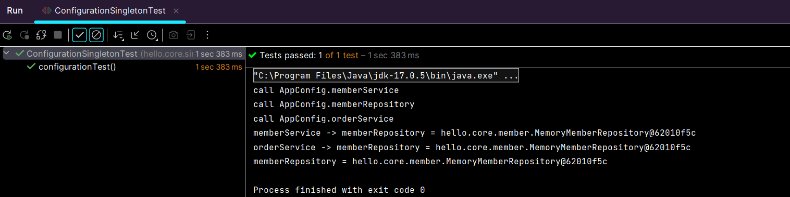

# 🐾🐾객체 지향 설계와 스프링🐾🐾

# 스프링이란?

## 스프링 생태계

**스프링** : 여러 가지 기술들의 모음

- 필수 : *스프링 프레임워크, 스프링 부트
- 선택 : 스프링 데이터, 스프링 세션, 스프링 시큐리티, 스프링 Rest Docs, 스프링 배치, 스프링 클라우드

관련 자료 검색 : [spring.io](http://spring.io) → Projects → Overview

## ⭐⭐⭐ 스프링 프레임워크

- **핵심 기술** : 스프링 DI 컨테이너, AOP, 이벤트, 기타
- 웹 기술 : 스프링 MVC, 스프링 WebFlux
- 데이터 접근 기술 : 트랜잭션, JDBC, ORM 지원, XML 지원
- 기술 통합 : 캐시, 이메일, 원격접근, 스케줄링
- 테스트 : 스프링 기반 테스트 지원
- 언어 : 코틀린, 그루비
- 최근에는 스프링 부트를 통해 스프링 프레임워크의 기술들을 편리하게 사용

## 스프링 부트

- 스프링을 편리하게 사용할 수 있도록 지원, 최근에는 기본으로 사용
- 단독으로 실행할 수 있는 스프링 애플리케이션을 쉽게 생성
- Tomcat 같은 웹 서버를 내장해서 별도의 웹 서버를 설치하지 않아도 됨
- 손쉬운 빌드 구성을 위한 starter 종속성 제공
- 스프링과 3rd parth(외부) 라이브러리 자동 구성
- 메트릭, 상태 확인, 외부 구성 같은 프로덕션 준비 기능 제공 (모니터링)
- 관례에 의한 간결한 설정

## 스프링 단어?

- 스프링이라는 단어는 문맥에 따라 다르게 사용된다
    - 스프링 DI 컨테이너 기술
    - 스프링 프레임워크
    - 스프링 부트, 스프링 프레임워크 등을 모두 포함한 스프링 생태계

## 스프링의 핵심

- 스프링은 자바 언어 기반의 프레임워크
- 자바 언어의 가장 큰 특징 - **객체 지향 언어**
- 스프링은 객체 지향 언어가 가진 강력한 특징을 살려내는 프레임워크
- 스프링은 **좋은 객체 지향** 애플리케이션을 개발할 수 있게 도와주는 프레임워크

<!------------------------------------------------------------>
<!------------------------------------------------------------>
<!------------------------------------------------------------>

# 객체 지향 프로그래밍

## 객체 지향 특징

- 추상화
- 캡슐화
- 상속
- **다형성**

## 객체 지향 프로그래밍

- 컴퓨터 프로그램을 여러 개의 독립된 단위, **객체**들의 **모임**으로 파악하는 것
- 각각의 객체는 메세지를 주고받고, 데이터를 처리할 수 있음 (**협력**)
- 프로그램을 **유연**하고 **변경**이 용이하게 만드는 것 → 대규모 소프트웨어 개발에 이용

    
    유연하고, 변경이 용이?

    - 레고 블럭 조립하듯이
    - 키보드, 마우스 갈아 끼우듯이
    - 컴퓨터 부품 갈아 끼우듯이
    - 컴포넌트를 쉽고 유연하게 변경하면서 개발할 수 있는 방법

    → 다형성 (Polymorphism)

# 다형성

## 다형성의 실세계 비유

- 실세계와 객체 지향을 1:1 로 매칭 X → 그래도 실세계의 비유로 이해하기에는 좋음
- **역할**과 **구현**으로 세상을 구분
- 예시
    - 운전자 - 자동차
    - 공연 무대
    - 키보드, 마우스, 세상의 표준 인터페이스들
    - 정렬 알고리즘
    - 할인 정책 로직


➡️ 자동차가 바뀌어도 운전자는 운전 가능

➡️ 자동차 무한 확장 가능

➡️ 클라이언트에 영향을 주지 않고 새로운 기능 제공 가능


➡️ 배우는 대체 가능

➡️ 유연하고 변경 용이

## 역할과 구현을 분리

- 장점
    - 세상이 **단순**해지고, **유연**해지며 **변경**이 편리
    - **클라이언트**는 대상의 역할(인터페이스)만 알면 됨
    - **클라이언트**는 구현 대상의 **내부 구조를 몰라**도 됨
    - **클라이언트**는 구현 대상의 **내부 구조가 변경**되어도 영향을 받지 않음
    - **클라이언트**는 구현 **대상 자체를 변경**해도 영향을 받지 않음


### 자바 언어

- 자바 언어의 다형성을 활용
    - 역할 = 인터페이스
    - 구현 = 인터페이스를 구현한 클래스, 구현 객체
- 객체를 설계할 때 **역할**과 **구현**을 명확히 분리
- 객체 설계시 역할(인터페이스)를 먼저 부여 후, 그 역할을 수행하는 구현 객체 만들기

## 자바 언어의 다형성

- **오버라이딩**
- 다형성으로 인터페이스를 구현한 객체를 실행 시점에 유연하게 변경 가능
- 클래스 상속 관계도 다형성, 오버라이딩 적용 가능


➡️ 클라이언트는 MemberRepository 의존

```java
// 1
public class MemberService {
	private MemberRepository memberRepository = new MemmoryMemberRepository();
}

// 2
public class MemberService {
	private MemberRepository memberRepository = new JdbcMemberRepository();
}
```


## 다형성의 본질

- 인터페이스를 구현한 객체 인스턴스를 **실행 시점**에 **유연**하게 **변경** 가능
- **협력** : 객체 사이의 관계
- **클라이언트를 변경하지 않고, 서버의 구현 기능을 유연하게 변경 가능**

## 역할과 구현을 분리

### 정리

- 유연하고, 변경이 용이
- 확장 가능한 설계 (무한 확장)
- 클라이언트에 영향을 주지 않는 변경 가능

### 한계

- 역할(인터페이스)이 변하면, 클라이언트 & 서버에 변경 발생

## 스프링과 객체 지향

- ⭐**다형성**
- 스프링은 다형성을 극대화해서 이용할 수 있게 도와줌
- 제어의 역전(IoC), 의존관계 주입(DI) : 다형성을 활용해 역할과 구현을 편리하게 다룰 수 있도록 지원
- 스프링을 사용하면 구현을 편리하게 변경 가능

<!------------------------------------------------------------>
<!------------------------------------------------------------>
<!------------------------------------------------------------>

# 좋은 객체 지향 설계의 5가지 원칙 (SOLID)

- 가끔 면접에서 나옴 👀

## SOLID
> 클린 코드로 유명한 로버트 마틴이 좋은 객체 지향 설계의 5가지 원칙을 정리

- SRP (Single Responsibility Principle) : 단일 책임 원칙
- OCP (Open/Closed Principle): 개방-폐쇄 원칙
- LSP (Liskov Substitution Principle) : 리스코프 치환 원칙
- ISP (Interface Segregation Principle) : 인터페이스 분리 원칙
- DIP (Dependency Inversion Principle) : 의존관계 역전 원칙

## SRP 단일 책임 원칙
> Single Responsibility Principle

- 한 클래스는 하나의 책임만 가져야 한다
- 기준 : **변경**
  - 변경이 있을 때 파급 효과가 적으면 단일 책임 원칙을 잘 따른 것
- 예) UI 변경, 객체의 생성과 사용을 분리

## ⭐⭐⭐ OCP 개방-폐쇄 원칙
> Open/Closed Principle

- 소프트웨어 요소는 **확장에는 열려** 있으나 **변경에는 닫혀** 있어야 한다
- **다형성** 활용
- 인터페이스를 구현한 새로운 클래스를 하나 만들어서 새로운 기능을 구현

```java
public class MemberService {
	// private MemberRepository memberRepository = new MemoryMemberRepository();
	private MemberRepository memberRepository = new JdbcMemberRepository();
}
```

### 문제점

- MemberService 클라이언트가 구현 클래스를 직접 선택
  - MemberRepository m = new MemoryMemberRepository(); ← 기존 코드
  - MemberRepository m = new JdbcMemberRepository(); ← 변경 코드
- **구현 객체를 변경하려면 클라이언트 코드 변경해야 함**
- **다형성을 사용했지만 OCP 원칙 불만족**
- 해결책 : 객체를 생성하고, 연관관계를 맺어주는 별도의 조립, 설정자가 필요하다

## LSP 리스코프 치환 원칙
> Liskov Substitution Principle

- 프로그램의 객체는 프로그램의 정확성을 깨뜨리지 않으면서 하위 타입의 인스턴스로 바꿀 수 있어야 한다
- 다형성에서 하위 클래스는 인터페이스 규약을 다 지켜야 한다는 것
- 예) 자동차 인터페이스의 엑셀은 앞으로 가는 기능, 뒤로 가게 구현하면 LSP 위반, 느리더라도 앞으로 가야함

## ISP 인터페이스 분리 원칙
> Interface Segregation Principle

- 특정 클라이언트를 위한 인터페이스 여러 개가 범용 인터페이스 하나보다 낫다
- 자동차 인터페이스 → 운전 인터페이스, 정비 인터페이스로 분리
- 사용자 클라이언트 → 운전자 클라이언트, 정비사 클라이언트로 분리
- 분리하면 정비 인터페이스 자체가 변해도 운전자 클라이언트에 영향을 주지 않음
- 인터페이스가 명확해지고, 대체 가능성이 향상

## ⭐⭐⭐ DIP 의존관계 역전 원칙
> Dependency Inversion Principle

- “추상화에 의존해야지, 구체화에 의존하면 안된다”
- 구현 클래스에 의존하지 말고, 인터페이스에 의존하라는 뜻
- MemberService 는 인터페이스에 의존하지만, 구현 클래스도 동시 의존
- MemberService 클라이언트가 구현 클래스를 직접 선택
  - MemberRepository m = new MemoryMemberRepository(); → **DIP 위반**

## 정리

- 객체 지향의 핵심은 다형성
- **다형성 만으로는 OCP, DIP 를 지킬 수 없음**

<!------------------------------------------------------------>
<!------------------------------------------------------------>
<!------------------------------------------------------------>

# 객체 지향 설계와 스프링

- **스프링은 다음 기술로 다형성 + OCP, DIP 를 가능하게 지원**
  - DI (Dependency Injection) : 의존관계, 의존성 주입
  - DI 컨테이너 제공
- **클라이언트 코드의 변경 없이 기능 확장**
- 쉽게 부품을 교체하듯이 개발

## 정리

- 모든 설계에 **역할**과 **구현**을 분리
- 이상적으로는 모든 설계에 인터페이스를 부여하자

### 실무 고민

- 인터페이스 도입 시 추상화 비용 발생
- 기능을 확장할 가능성이 없다면, 구체 클래스를 직접 사용하고, 향후 꼭 필요할 때 리팩터링하여 인터페이스 도입


<!------------------------------------------------------------>
<!------------------------------------------------------------>
<!------------------------------------------------------------>

# 🐾🐾스프링 핵심 원리 이해1 - 예제 만들기🐾🐾

# 프로젝트 생성

- 스프링 없이 순수 자바로 구현

- 사전 준비물
  - Oracle JDK 의 Java 11 설치
  - IDE : IntelliJ 또는 Eclipse 설치

## [스프링 부트 스타터 사이트](https://start.spring.io)로 이동해서 스프링 프로젝트 생성


    💡 **주의 ! 스프링 부트 3.0**
    → 스프링 부트 3.0 을 선택하게 되면 다음 부분 확인하기
    1. Java 17 이상 사용
    2. javax 패키지 이름을 jakarta 로 변경해야 함

    패키지 이름 변경 예시
    - JPA 애노테이션 :
    javax.persistence.Entity → jakarta.persistence.Entity
    - 스프링에서 자주 사용하는 @PostConstruct 애노테이션 :
    javax.annotation.PostConstruct → jakarta.annotation.PostConstruct
    - 스프링에서 자주 사용하는 검증 애노테이션
    javax. validation → jakarta.validation

    자세한 내용
    https://bit.ly/springboot3


- 프로젝트 선택
  - Project : Gradle - Groovy Project
  - Language : Java
  - Spring Boot : 3.1.4 (SNAPSHOT/M3 는 아직 정식 release 아님)
  - Project Metadata
    - Group : hello
    - Artifact : core
    - Packaging : Jar
    - Java : 17
  - Dependencies : 선택 안함 → core library 만 가지고 간단하게 생성됨


- 프로젝트 열기 : build.gradle → open
- build.gradle setting

```java
plugins {
	id 'java'
	id 'org.springframework.boot' version '3.1.4'
	id 'io.spring.dependency-management' version '1.1.3'
}

group = 'hello'
version = '0.0.1-SNAPSHOT'

java {
	sourceCompatibility = '17'
}

repositories {
	mavenCentral()
}

dependencies {
	implementation 'org.springframework.boot:spring-boot-starter'
	testImplementation 'org.springframework.boot:spring-boot-starter-test'
}

tasks.named('test') {
	useJUnitPlatform()
}
```

## 동작 확인하기(기본 메인 클래스 실행) : src/main/java/hello.core 의 CoreApplication Run 해보기


Gradle 대신 IntelliJ로 자바 직접 실행하기 → 실행 속도가 더 빠르다

- File - Settings - Build, Execution, Deployment - Build Tools - Gradle - Gradle projects
  - Build and run using : Gradle → IntelliJ IDEA 변경
  - Run tests using : Gradle → IntelliJ IDEA 변경


<!------------------------------------------------------------>
<!------------------------------------------------------------>
<!------------------------------------------------------------>

# 비즈니스 요구사항과 설계

- 회원
  - 회원 가입, 조회
  - 회원 등급 : 일반, VIP
  - 회원 데이터: 자체 DB 구축, 외부 시스템 연동 가능성 (미확정)
- 주문과 할인 정책
  - 회원이 상품 주문
  - 회원 등급에 따른 할인 정책
  - 고정 금액 할인 : 모든 VIP 1000원 할인 (변경 가능)
  - 할인 정책 변경 가능성, 할인을 하지 않을 수도 있음 (미확정)

→ 고정되지 않은 요구사항 : 객체 지향 설계 방법 사용하기

→ 구현체를 바꿀 수 있는 인터페이스 설계

<!------------------------------------------------------------>
<!------------------------------------------------------------>
<!------------------------------------------------------------>

# 회원 도메인 설계

- 회원 도메인 요구사항
  - 회원 가입, 조회
  - 회원 등급 : 일반, VIP
  - 회원 데이터: 자체 DB 구축, 외부 시스템 연동 가능성 (미확정)


- 회원 도메인 협력 관계


- 회원 클래스 다이어그램


➡️ 인터페이스 : MemberService

➡️ 구현체 : MemberServiceImpl

➡️ MemberRepository = 회원 저장소

- 회원 객체 다이어그램 (객체 간 메모리 참조)


MemberServiceImpl = 회원 서비스

<!------------------------------------------------------------>
<!------------------------------------------------------------>
<!------------------------------------------------------------>

# 회원 도메인 개발

- 만들 것

  


1. member 패키지 생성
2. member 패키지에 Grade 이름의 Enum 생성

```java
package hello.core.member;

public enum Grade {
    // 회원 등급
    BASIC,
    VIP
}
```

3. member 패키지에 Member 이름의 Class 생성

```java
package hello.core.member;

public class Member {
    private Long id;
    private String name;
    private Grade grade;

    // Alt + Insert -> Constructor, Getter&Setter

    public Member(Long id, String name, Grade grade) {
        this.id = id;
        this.name = name;
        this.grade = grade;
    }

    public Long getId() {
        return id;
    }

    public void setId(Long id) {
        this.id = id;
    }

    public String getName() {
        return name;
    }

    public void setName(String name) {
        this.name = name;
    }

    public Grade getGrade() {
        return grade;
    }

    public void setGrade(Grade grade) {
        this.grade = grade;
    }
}
```

4. member 패키지에 MemberRepository 이름의 Interface 생성

```java
package hello.core.member;

public interface MemberRepository {
    void save(Member member);

    Member findById(Long memberId);
}
```

5. member 패키지에 MemoryMemberRepository 이름의 Class 생성 (MemberRepository 구현체)

```java
package hello.core.member;

import java.util.HashMap;
import java.util.Map;

public class MemoryMemberRepository implements MemberRepository{

    // 실무에서는 동시성 이슈를 고려해 ConcurrentHashMap 사용
    private static Map<Long, Member> store = new HashMap<>();

    @Override
    public void save(Member member) {
        store.put(member.getId(), member);
    }

    @Override
    public Member findById(Long memberId) {
        return store.get(memberId);
    }
}
```

6. member 패키지에 MemberService 이름의 Interface 생성

```java
package hello.core.member;

public interface MemberService {
    // 회원 가입
    void join(Member member);

    // 회원 조회
    Member findMember(Long memberId);
}
```

7. member 패키지에 MemberServiceImpl 이름의 Class 생성 (MemberService 구현체)

```java
package hello.core.member;

public class MemberServiceImpl implements MemberService{

    private final MemberRepository memberRepository = new MemoryMemberRepository();

    @Override
    public void join(Member member) {
        memberRepository.save(member);
    }

    @Override
    public Member findMember(Long memberId) {
        return memberRepository.findById(memberId);
    }
}
```

<!------------------------------------------------------------>
<!------------------------------------------------------------>
<!------------------------------------------------------------>

# 회원 도메인 실행과 테스트

1. main/java/hello.core 패키지에 MemberApp 이름의 Class 생성

```java
package hello.core;

import hello.core.member.Grade;
import hello.core.member.Member;
import hello.core.member.MemberService;
import hello.core.member.MemberServiceImpl;

public class MemberApp {
    // psvm
    public static void main(String[] args) {
        MemberService memberService = new MemberServiceImpl();
        Member member = new Member(1L, "memberA", Grade.VIP); // ctrl + alt + v
        memberService.join(member);

        Member findMember = memberService.findMember(1L);
        System.out.println("new member = " + member.getName());
        System.out.println("findMember = " + findMember.getName());

    }
}
```

2. test/java/hello.core 패키지에 member 이름의 Package 생성
3. 만든 member 패키지에 MemberServiceTest 이름의 Class 생성

```java
package hello.core.member;

import org.assertj.core.api.Assertions;
import org.junit.jupiter.api.Test;

public class MemberServiceTest {

    MemberService memberService = new MemberServiceImpl();

    @Test
    void join() {
        // given
        Member member = new Member(1L, "memberA", Grade.VIP);

        // when
        memberService.join(member);
        Member findMember = memberService.findMember(1L);

        // then
        Assertions.assertThat(member).isEqualTo(findMember);

    }
}
```


→ 테스트 성공 !

💡 문제점 → 인터페이스 뿐만이 아니라 구현체도 직접 호출하고 있음

<!------------------------------------------------------------>
<!------------------------------------------------------------>
<!------------------------------------------------------------>

# 주문과 할인 도메인 설계

- 주문과 할인 정책
  - 회원이 상품 주문
  - 회원 등급에 따른 할인 정책
  - 고정 금액 할인 : 모든 VIP 1000원 할인 (변경 가능)
  - 할인 정책 변경 가능성, 할인을 하지 않을 수도 있음 (미확정)


- 주문 도메인 협력, 역할, 책임


1. **주문 생성** : 클라이언트는 주문 서비스에 주문 생성 요청
2. **회원 조회** : 주문 서비스는 회원 저장소에서 회원을 조회 (할인을 위해 회원 등급 필요)
3. **할인 적용** : 주문 서비스는 회원 등급에 따라 할인 적용
4. **주문 결과 반환** : 주문 서비스는 할인 결과를 포함한 주문 결과 반환


- 주문 도메인 전체


➡️ **역할과 구현을 분리**해서 자유롭게 구현 객체를 조립할 수 있도록 설계

➡️ 회원 저장소, 할인 정책 유연하게 변경 가능

- 주문 도메인 클래스 다이어그램


- 주문 도메인 객체 다이어그램1


➡️ 회원을 메모리에서 조회하고, 정액 할인 정책(고정 금액)을 지원해도 주문 서비스를 변경하지 않아도 됨

➡️ 역할들의 협력 관계 재사용 가능

- 주문 도메인 객체 다이어그램2


➡️ 회원을 메모리가 아닌 실제 DB 에서 조회하고, 정률 할인 정책(주문 금액에 따라 % 할인)을 지원해도 주문 서비스를 변경하지 않아도 됨

➡️ 역할들의 협력 관계 재사용 가능

<!------------------------------------------------------------>
<!------------------------------------------------------------>
<!------------------------------------------------------------>

# 주문과 할인 도메인 개발

1. hello.core 패키지에 discount 이름의 Package 생성
2. 만든 discount 패키지에 DiscountPolicy 이름의 Interface 생성

```java
package hello.core.discount;

import hello.core.member.Member;

public interface DiscountPolicy {

    // return 할인 대상 금액
    int discount(Member member, int price);
}
```

3. discount 패키지에 FixDiscountPolicy 이름의 Class 생성 (DiscountPolicy 구현체)

```java
package hello.core.discount;

import hello.core.member.Grade;
import hello.core.member.Member;

public class FixDiscountPolicy implements DiscountPolicy{

    private int discountFixAmount = 1000; // 1000원 할인

    @Override
    public int discount(Member member, int price) {
        if (member.getGrade() == Grade.VIP) { // Enum 비교 ==
            return discountFixAmount;
        } else {
            return 0;
        }
    }
}
```

4. hello.core 패키지에 order 이름의 Package 생성
5. 만든 order 패키지에 Order 이름의 Class 생성

```java
package hello.core.order;

public class Order {
    private Long memberId;
    private String itemName;
    private int itemPrice;
    private int discountPrice;

    public Order(Long memberId, String itemName, int itemPrice, int discountPrice) {
        this.memberId = memberId;
        this.itemName = itemName;
        this.itemPrice = itemPrice;
        this.discountPrice = discountPrice;
    }

    public int calculatePrice() {
        return itemPrice - discountPrice;
    }

    public Long getMemberId() {
        return memberId;
    }

    public void setMemberId(Long memberId) {
        this.memberId = memberId;
    }

    public String getItemName() {
        return itemName;
    }

    public void setItemName(String itemName) {
        this.itemName = itemName;
    }

    public int getItemPrice() {
        return itemPrice;
    }

    public void setItemPrice(int itemPrice) {
        this.itemPrice = itemPrice;
    }

    public int getDiscountPrice() {
        return discountPrice;
    }

    public void setDiscountPrice(int discountPrice) {
        this.discountPrice = discountPrice;
    }

    @Override
    public String toString() {
        return "Order{" +
                "memberId=" + memberId +
                ", itemName='" + itemName + '\'' +
                ", itemPrice=" + itemPrice +
                ", discountPrice=" + discountPrice +
                '}';
    }
}
```

6. order 패키지에 OrderService 이름의 Interface 생성

```java
package hello.core.order;

public interface OrderService {
    Order createOrder(Long memberId, String itemName, int itemPrice);

}
```

7. order 패키지에 OrderServiceImpl 이름의 Class 생성

```java
package hello.core.order;

import hello.core.member.Member;
import hello.core.discount.DiscountPolicy;
import hello.core.discount.FixDiscountPolicy;
import hello.core.member.MemberRepository;
import hello.core.member.MemoryMemberRepository;

public class OrderServiceImpl implements OrderService{

    private final MemberRepository memberRepository = new MemoryMemberRepository();
    private final DiscountPolicy discountPolicy = new FixDiscountPolicy();

    @Override
    public Order createOrder(Long memberId, String itemName, int itemPrice) {
        Member member = memberRepository.findById(memberId);
        int discountPrice = discountPolicy.discount(member, itemPrice);

        return new Order(memberId, itemName, itemPrice, discountPrice);
    }
}
```

<!------------------------------------------------------------>
<!------------------------------------------------------------>
<!------------------------------------------------------------>

# 주문과 할인 도메인 실행과 테스트

1. main/java/hello.core 에 OrderApp 이름의 Class 생성

```java
package hello.core;

import hello.core.member.Grade;
import hello.core.member.Member;
import hello.core.member.MemberService;
import hello.core.member.MemberServiceImpl;
import hello.core.order.Order;
import hello.core.order.OrderService;
import hello.core.order.OrderServiceImpl;

public class OrderApp {
    public static void main(String[] args) {
        MemberService memberService = new MemberServiceImpl();
        OrderService orderService = new OrderServiceImpl();

        Long memberId = 1L;
        Member member = new Member(memberId, "memberA", Grade.VIP);
        memberService.join(member);

        Order order = orderService.createOrder(memberId, "itemA", 10000);

        System.out.println("order = " + order);
        System.out.println("order.calculatePrice = " + order.calculatePrice());
    }
}
```

- Run


2. test/java/hello.core 에 order 이름의 Package 생성
3. 만든 order 패키지에 OrderServiceTest 이름의 Class 생성

```java
package hello.core.order;

import hello.core.member.Grade;
import hello.core.member.Member;
import hello.core.member.MemberService;
import hello.core.member.MemberServiceImpl;
import org.assertj.core.api.Assertions;
import org.junit.jupiter.api.Test;

public class OrderServiceTest {

    MemberService memberService = new MemberServiceImpl();
    OrderService orderService = new OrderServiceImpl();

    @Test
    void createOrder() {
        Long memberId = 1L;
        Member member = new Member(memberId, "memberA", Grade.VIP);
        memberService.join(member);

        Order order = orderService.createOrder(memberId, "itemA", 10000);
        Assertions.assertThat(order.getDiscountPrice()).isEqualTo(1000);
    }
}
```

- Run


→ 성공 !

<!------------------------------------------------------------>
<!------------------------------------------------------------>
<!------------------------------------------------------------>

# 🐾🐾스프링 핵심 원리 이해2 - 객체 지향 원리 적용🐾🐾

# 새로운 할인 정책 개발

### 새로운 할인 정책을 확장해보자

- 고정 할인 → 정률 할인 정책

1. discount 패키지에 RateDiscountPolicy 이름의 Class 생성 (DiscountPolicy 구현체)

```java
package hello.core.discount;

import hello.core.member.Grade;
import hello.core.member.Member;

public class RateDiscountPolicy implements DiscountPolicy{

    // ctrl + shift + t : 테스트 만들기
    private int discountPercent = 10;

    @Override
    public int discount(Member member, int price) {
        if (member.getGrade() == Grade.VIP) {
            return price * discountPercent / 100;
        } else {
            return 0;
        }
    }
}
```

2. test/java/hello.core/discount 에 RateDiscountPolicyTest 이름의 Class 생성

```java
package hello.core.discount;

import hello.core.member.Grade;
import hello.core.member.Member;
import org.assertj.core.api.Assertions;
import org.junit.jupiter.api.DisplayName;
import org.junit.jupiter.api.Test;

import static org.junit.jupiter.api.Assertions.*;

class RateDiscountPolicyTest {

    RateDiscountPolicy discountPolicy = new RateDiscountPolicy();

    @Test
    @DisplayName("VIP 는 10% 할인이 적용되어야 한다")
    void vip_o() {
        // given
        Member member = new Member(1L, "memberVIP", Grade.VIP);

        // when
        int discount = discountPolicy.discount(member, 10000);

        // then
        Assertions.assertThat(discount).isEqualTo(1000);
    }

    @Test
    @DisplayName("VIP 가 아니면 할인이 적용되지 않아야 한다")
    void vip_x() {
        // given
        Member member = new Member(2L, "memberBASIC", Grade.BASIC);

        // when
        int discount = discountPolicy.discount(member, 10000);

        // then
        Assertions.assertThat(discount).isEqualTo(0);
    }
}
```

- Run


→ 성공!

<!------------------------------------------------------------>
<!------------------------------------------------------------>
<!------------------------------------------------------------>

# 새로운 할인 정책 적용과 문제점

- 방금 추가한 할인 정책 적용하기

→ OrderServiceImpl 코드 수정

```java
...
public class OrderServiceImpl implements OrderService{

    private final MemberRepository memberRepository = new MemoryMemberRepository();
    // private final DiscountPolicy discountPolicy = new FixDiscountPolicy();
    private final DiscountPolicy discountPolicy = new RateDiscountPolicy();

    ...
}
```

### 문제점

- 역할과 구현 분리 → OK
- 다형성 활용 & 인터페이스와 구현 객체 분리 → OK
- OCP, DIP 객체지향 설계 원칙 준수 → X
  - DIP : 구체(구현) 클래스에 의존
    - 추상(인터페이스) 의존 : DiscountPolicy
    - 구체(구현) 클래스 : FixDiscountPolicy, RateDiscountPolicy
  - OCP : 기능 확장, 변경으로 클라이언트 코드에 영향

- 기대했던 의존 관계


→ DiscountPolicy 인터페이스에만 의존하기

- 실제 의존 관계


→ 클라이언트 OrderServiceImpl 은 DiscountPolicy 인터페이스 뿐만 아니라 FixDiscountPolicy 인 구체 클래스도 함께 의존 (**DIP 위반**)

- 정책 변경 시


→ FixDiscountPolicy 를 RateDiscountPolicy 로 변경하는 순간 OrderServiceImpl 의 소스 코드가 변경됨 (**OCP 위반**)

### 문제 해결 방법

- 인터페이스에만 의존하도록 설계 변경하기

→ 코드 변경

```java
...
public class OrderServiceImpl implements OrderService{

    private final MemberRepository memberRepository = new MemoryMemberRepository();
    // private final DiscountPolicy discountPolicy = new FixDiscountPolicy();
    // private final DiscountPolicy discountPolicy = new RateDiscountPolicy();
    private DiscountPolicy discountPolicy;

    ...
}
```

➡️ 실행 시 NPE (Null Pointer Exception) 발생

- 문제 해결을 위해서는 누군가가 클라이언트인 OrderServiceImpl 에 DiscountPolicy 의 구현 객체를 대신 생성하고 주입해주어야 함

<!------------------------------------------------------------>
<!------------------------------------------------------------>
<!------------------------------------------------------------>

# ⭐ 관심사의 분리

→ 기획자 만들기

### App Config 등장

- 애플리케이션의 전체 동작 방식을 구성하기 위해, 구현 객체를 생성하고, 연결하는 책임을 가지는 별도의 설정 클래스

1. hello.core 패키지에 AppConfig 이름을 가진 Class 생성
- 생성자 주입

```java
package hello.core;

import hello.core.discount.FixDiscountPolicy;
import hello.core.member.MemberService;
import hello.core.member.MemberServiceImpl;
import hello.core.member.MemoryMemberRepository;
import hello.core.order.OrderService;
import hello.core.order.OrderServiceImpl;

public class AppConfig {
    // 생성자 주입
    public MemberService memberService() {
        return new MemberServiceImpl(new MemoryMemberRepository());
    }

    public OrderService orderService() {
        return new OrderServiceImpl(new MemoryMemberRepository(), new FixDiscountPolicy());
    }
}
```

- AppConfig 는 애플리케이션의 실제 동작에 필요한 “**구현 객체를 생성**”
  - MemberServiceImpl
  - MemoryMemberRepository
  - OrderServiceImpl
  - FixDiscountPolicy
- AppConfig 는 생성한 객체 인스턴스의 참조(레퍼런스)를 “**생성자를 통해서 주입(연결)**”
  - MemberServiceImpl → MemoryMemberRepository
  - OrderServiceImpl → MemoryMemberRepository, FixDiscountPolicy

2. MemberServiceImpl 코드 수정

```java
...
public class MemberServiceImpl implements MemberService{

    private final MemberRepository memberRepository;

    public MemberServiceImpl(MemberRepository memberRepository) {
        this.memberRepository = memberRepository;
    }

    ...
}
```

- 설계 변경으로 MemberServiceImpl 은 MemoryMemberRepository 를 의존하지 않음 ➡️ MemberRepository 인터페이스만 의존 (DIP 만족)
- MemberServiceImpl 는 생성자를 통해 어떤 구현 객체가 들어올지 알 수 없음 (외부 - AppConfig 에서 결정)
- MemberServiceImpl 는 **의존관계에 대한 고민은 외부**에 맡기고 **실행에만 집중**


- 클래스 다이어그램


→ 객체의 생성과 연결은 AppConfig 담당

→ DIP 완성 : MemberServiceImpl 은 MemberRepository 인 추상에만 의존

→ 관심사의 분리 : 객체를 생성하고 연결하는 역할과 실행하는 역할이 명확히 분리됨

- 회원 객체 인스턴스 다이어그램


→ AppConfig 객체는 memoryMemberRepository 객체를 생성하고, 그 참조값을 memberServiceImpl 을 생성하면서 생성자로 전달

→ 의존 관계 주입(DI - Dependency Injection) : 클라이언트인 memberServiceImpl 입장에서 의존 관계를 외부에서 주입해주는 것 같이 보임

3. OrderServiceImpl 코드 수정

```java
...
public class OrderServiceImpl implements OrderService{

    private final MemberRepository memberRepository;
    private final DiscountPolicy discountPolicy;

    public OrderServiceImpl(MemberRepository memberRepository, DiscountPolicy discountPolicy) {
        this.memberRepository = memberRepository;
        this.discountPolicy = discountPolicy;
    }

    ...
}
```

- 설계 변경으로 OrderServiceImpl 은 FixDiscountPolicy 를 의존하지 않음 ➡️ DiscountPolicy 인터페이스만 의존 (DIP 만족)
- OrderServiceImpl 는 생성자를 통해 어떤 구현 객체가 들어올지 알 수 없음 (외부 - AppConfig 에서 결정)
- OrderServiceImpl 은 이제부터 실행에만 집중
- OrderServiceImpl 에는 MemoryMemberRepository, FixDiscountPolicy 객체의 의존관계가 주입됨

### AppConfig 실행

1. MemberApp 코드 수정하기

```java
...
public class MemberApp {
    public static void main(String[] args) {
        AppConfig appConfig = new AppConfig();
        MemberService memberService = appConfig.memberService();
        // MemberService memberService = new MemberServiceImpl();
        
        ...
    }
}
```

2. OrderApp 코드 수정하기

```java
...
public class OrderApp {
    public static void main(String[] args) {
        
        AppConfig appConfig = new AppConfig();
        MemberService memberService = appConfig.memberService();
        OrderService orderService = appConfig.orderService();
        // MemberService memberService = new MemberServiceImpl();
        // OrderService orderService = new OrderServiceImpl(memberRepository, discountPolicy);

        ...
    }
}
```

3. MemberServiceTest 코드 수정하기

```java
...
public class MemberServiceTest {

    MemberService memberService;

    // 각 테스트 실행 전 호출된다
    @BeforeEach
    public void beforeEach() {
        AppConfig appConfig = new AppConfig();
        memberService = appConfig.memberService();
    }

    ...
    }
}
```

4. OrderServiceTest 코드 수정하기

```java
...
public class OrderServiceTest {

    MemberService memberService;
    OrderService orderService;

    @BeforeEach
    public void beforeEach() {
        AppConfig appConfig = new AppConfig();
        memberService = appConfig.memberService();
        orderService = appConfig.orderService();
    }

    ...
}
```

- Run


→ 성공 !

- AppConfig 를 통해 관심사 분리
- AppConfig 는 구체 클래스를 선택 → 전체 구성 책임(애플리케이션 동작 방식)
- OrderServiceImpl 은 기능을 실행하는 책임만

<!------------------------------------------------------------>
<!------------------------------------------------------------>
<!------------------------------------------------------------>

# AppConfig 리팩터링

- 현재 AppConfig : **중복** 발생, **역할**에 따른 **구현** 불명확

➡️ 역할을 드러나게 하는 것이 중요

1. AppConfig 코드 수정하기

```java
...
public class AppConfig {
    // 생성자 주입
    public MemberService memberService() {
        // ctrl + alt + m 으로 변경
        return new MemberServiceImpl(memberRepository());
    }

    private MemoryMemberRepository memberRepository() {
        return new MemoryMemberRepository();
    }

    public OrderService orderService() {
        return new OrderServiceImpl(memberRepository(), discountPolicy());
    }

    private DiscountPolicy discountPolicy() {
        return new FixDiscountPolicy();
    }
}
```

- new MemoryMemberRepository() 중복이 제거 → MemoryMemberRepository 를 다른 구현체로 변경 시 한 부분만 변경하면 됨
- AppConfig 역할과 구현 클래스 명확 ➡️ 애플리케이션 전체 구성 빠르게 파악 가능

<!------------------------------------------------------------>
<!------------------------------------------------------------>
<!------------------------------------------------------------>

# 새로운 구조와 할인 정책 적용

- 정액 할인 정책 ➡️ 정률 할인 정책 변경하기
- FixDiscountPolicy → RateDiscountPolicy

➡️ AppConfig 등장 : 애플리케이션이 크게 사용 영역과, 객체를 생성하고 구성하는 영역으로 분리됨

- 사용, 구성의 분리


- 할인 정책의 변경


➡️ FixDiscountPolicy → RateDiscountPolicy 변경 : 구성 영역에만 영향, 사용 영역은 영향 X

1. AppConfig 코드 변경하기

```java
...
public class AppConfig {
    ...
    private DiscountPolicy discountPolicy() {
        // return new FixDiscountPolicy();
        return new RateDiscountPolicy();
    }
}
```

- AppConfig 할인 정책 역할 구현 담당 : FixDiscountPolicy → RateDiscountPolicy
- 할인 정책을 변경해도, 애플리케이션의 구성 역할을 담당하는 AppConfig 만 변경 (**사용 영역**의 어떤 코드도 변경 X)
- **구성 영역**은 변경됨

<!------------------------------------------------------------>
<!------------------------------------------------------------>
<!------------------------------------------------------------>

# 전체 흐름 정리

### 새로운 할인 정책 개발

- 다형성 덕분에 새로운 정률 할인 정책 코드를 추가로 개발하는 것은 문제 없음

### 새로운 할인 정책 적용과 문제점

- 새로 개발한 정률 할인 정책을 적용 시 “**클라이언트 코드**"인 주문 서비스 구현체도 함께 변경 해야 함
- 주문 서비스 클라이언트가 인터페이스인 DiscountPolicy 뿐만 아니라, 구체 클래스인 FixDiscountPolicy 도 함께 의존 → **DIP 위반**

### 관심사의 분리

- 기존에는 클라이언트가 의존하는 서버 구현 객체를 직접 생성, 실행
- 기획자인 AppConfig 등장
- AppConfig 는 애플리케이션의 전체 동작 방식을 구성하기 위해, **구현 객체를 생성**하고, **연결**하는 책임
- 이제부터 클라이언트 객체는 자신의 역할을 실행하는 것만 집중, 권한이 줄어듦 (책임이 명확해짐)

### AppConfig 리팩터링

- 구성 정보에서 역할과 구현을 명확하게 분리
- 역할이 잘 드러남
- 중복 제거

### 새로운 구조와 할인 정책 적용

- 정책 할인 정책 → 정률 할인 정책으로 변경
- AppConfig의 등장으로 애플리케이션이 크게 사용 영역과, 객체를 생성하고 구성하는 영역으로 분리됨
- 할인 정책을 변경해도 AppConfig 가 있는 구성 영역만 변경, 사용 영역은 변경 x

<!------------------------------------------------------------>
<!------------------------------------------------------------>
<!------------------------------------------------------------>

# 좋은 객체 지향 설계의 5가지 원칙의 적용

- 여기서는 3가지 SRP, DIP, OCP 가 적용되어 있음

### SRP 단일 책임 원칙

> 한 클래스는 하나의 책임만 가져야 한다

- 클라이언트 객체는 직접 구현 객체를 생성하고, 연결하고, 실행하는 다양한 책임을 가지고 있음
- SRP 단일 책임 원칙을 따르면서 관심사 분리
- 구현 객체를 생성하고 연결하는 책임은 AppConfig 가 담당
- 클라이언트 객체는 실행하는 책임만 담당

### DIP 의존관계 역전 원칙

> 프로그래머는 “추상화에 의존해야지, 구체화에 의존하면 안된다”
의존성 주입은 이 원칙을 따르는 방법 중 하나다

- 기존 클라이언트 코드 : DiscountPolicy 인터페이스 + FixDiscountPolicy 구체화 클래스 의존
- 클라이언트 코드가 DiscountPolicy 추상화 인터페이스에만 의존하도록 코드 변경
- 하지만 클라이언트 코드는 인터페이스만으로는 실행 불가
- AppConfig 가 FixDiscountPolicy 객체 인스턴스를 클라이언트 코드 대신 생성한 후 클라이언트 코드에 의존 관계 주입

### OCP

> 소프트웨어 요소는 확장에는 열려 있으나 변경에는 닫혀 있어야 한다

- 다형성 사용하고 클라이언트가 DIP 를 지킴
- 애플리케이션을 사용 영역과 구성 영역으로 나눔
- AppConfig 가 의존관계를 FixDiscountPolicy → RateDiscountPolicy 로 변경해서 클라이언트 코드에 주입하므로 클라이언트 코드는 변경하지 않아도 됨
- **소프트웨어 요소를 새롭게 확장해도 사용 영역의 변경은 닫혀 있음**

<!------------------------------------------------------------>
<!------------------------------------------------------------>
<!------------------------------------------------------------>

# IoC, DI, 그리고 컨테이너

### 제어의 역전 IoC (Inversion of Control)

> 프로그램의 제어 흐름을 직접 제어하는 것이 아닌 외부에서 관리하는 것

- 기존 프로그램 : 클라이언트 구현 객체가 스스로 필요한 서버 구현 객체를 생성하고, 연결하고 실행 ( 구현 객체가 프로그램의 제어 흐름을 스스로 조종 )
- AppConfig 등장 이후 : 구현 객체는 자신의 로직을 실행하는 역할만 담당 ( 프로그램의 제어 흐름은 AppConfig 담당 )
  - ex. OrderServiceImpl : 필요한 인터페이스들을 호출하지만 어떤 구현 객체들이 실행될지 모른다
- AppConfig
  - 프로그램 제어 흐름에 대한 권한
  - OrderServiceImpl 생성
  - OrderService 인터페이스의 다른 구현 객체 생성 및 실행

- 프레임워크 vs. 라이브러리
  - 프레임워크 : 내가 작성한 코드를 제어하고, 대신 실행 (ex. JUnit)
  - 라이브러리 : 내가 작성한 코드가 직접 제어의 흐름을 담당


### 의존 관계 주입 DI (Dependency Injection)

- OrderServiceImpl : DiscountPolicy 인터페이스에 의존, 어떤 구현 객체가 사용될지는 모름
- 의존 관계 : 정적인 클래스 의존 관계 or 실행 시점에 결정되는 동적인 객체(인스턴스) 의존 관계

- 정적인 클래스 의존 관계
  - 클래스가 사용하는 import 코드만 보고 의존관계 쉽게 파악 가능 (애플리케이션을 실행하지 않아도 분석 가능)
  - OrderServiceImpl -(의존)→ MemberRepository, DiscountPolicy


- 동적인 객체 인스턴스 의존 관계
  - 애플리케이션 실행 시점에서 실제 생성된 객체 인스턴스의 참조가 연결된 의존 관계
  - 의존 관계 주입 : 애플리케이션 실행 시점에 외부에서 실제 구현 객체를 생성하고 클라이언트에 전달하여, 클라이언트와 서버의 실제 의존 관계가 연결되는 것
  - 객체 인스턴스 생성 후, 그 참조값을 전달해서 연결
  - 의존관계 주입 사용 시
    - 클라이언트 코드 변경 X → 클라이언트가 호출하는 대상의 타입 인스턴스 변경
    - ⭐ 정적인 클래스 의존 관계 변경 X →동적인 객체 인스턴스 의존 관계 쉽게 변경


### IoC 컨테이너, DI 컨테이너

- AppConfig 처럼 객체를 생성하고 관리하면서 의존 관계를 연결해주는 것
- 의존 관계 주입에 초점을 맞추어 최근에는 주로 DI 컨테이너라 함
- 또는 어샘블러, 오브젝트 팩토리 등으로 불림

<!------------------------------------------------------------>
<!------------------------------------------------------------>
<!------------------------------------------------------------>

# 스프링으로 전환하기

1. AppConfig 코드 변경하기

```java
...
import org.springframework.context.annotation.Bean;
import org.springframework.context.annotation.Configuration;

@Configuration
public class AppConfig {

    @Bean
    public MemberService memberService() {...}

    @Bean
    public MemoryMemberRepository memberRepository() {...}

    @Bean
    public OrderService orderService() {...}

    @Bean
    public DiscountPolicy discountPolicy() {...}
}
```

2. MemberApp 코드 변경하기

```java
...
import org.springframework.context.ApplicationContext;
import org.springframework.context.annotation.AnnotationConfigApplicationContext;

public class MemberApp {
    public static void main(String[] args) {
        // AppConfig appConfig = new AppConfig();
        // MemberService memberService = appConfig.memberService();

        ApplicationContext applicationContext = new AnnotationConfigApplicationContext(AppConfig.class);
        MemberService memberService = applicationContext.getBean("memberService", MemberService.class);

        ...
    }
}
```

- Run


3. OrderApp 코드 변경하기

```java
...
import org.springframework.context.ApplicationContext;
import org.springframework.context.annotation.AnnotationConfigApplicationContext;

public class OrderApp {
    public static void main(String[] args) {

        // AppConfig appConfig = new AppConfig();
        // MemberService memberService = appConfig.memberService();
        // OrderService orderService = appConfig.orderService();

        ApplicationContext applicationContext = new AnnotationConfigApplicationContext(AppConfig.class);
        MemberService memberService = applicationContext.getBean("memberService", MemberService.class);
        OrderService orderService = applicationContext.getBean("orderService", OrderService.class);

        ...
    }
}
```

- Run


### 스프링 컨테이너

- ApplicationContext = 스프링 컨테이너
- @Configuration 이 붙은 AppConfig 를 설정(구성) 정보로 사용
- @Bean 이 적힌 메서드를 모두 호출해 반환된 객체를 스프링 컨테이너에 등록 → 스프링 빈
- 스프링 빈 이름 : @Bean 이 붙은 메서드 명 (ex. memberService, orderService)
- 스프링 빈 찾기 : applicationContext.getBean() 메서드 사용

<!------------------------------------------------------------>
<!------------------------------------------------------------>
<!------------------------------------------------------------>

# 🐾🐾스프링 컨테이너와 스프링 빈🐾🐾

# 스프링 컨테이너 생성

☑️ 컨테이너 : 사용하는 객체들을 담고 있음

- 스프링 컨테이너가 생성되는 과정

```java
ApplicationContext applicationContext = new AnnotationConfigApplicationContext(AppConfig.class);
```

→ ApplicationContext : 인터페이스, 스프링 컨테이너

→ 스프링 컨테이너 만드는 방법 : XML 기반, 애노테이션 기반 자바 설정 클래스

→ AppConfig 사용했던 방식 : 애노테이션 기반 자바 설정 클래스

- 자바 설정 클래스 기반 스프링 컨테이너(ApplicationContext) 만들기
  - 구현체 : new AnnotationConfigApplicationContext(AppConfig.class);

> 참고 : 정확히는 스프링 컨테이너를 부를 때 BeanFactory, ApplicationContext 로 구분해서 이야기한다. BeanFactory 를 직접 사용하는 경우는 거의 없으며, 일반적으로 ApplicationContext 를 스프링 컨테이너라 한다.
>

## 스프링 컨테이너 생성 과정

### 1. 스프링 컨테이너 생성


- 스프링 컨테이너 생성 시 구성 정보 지정 : AppConfig.class

### 2. 스프링 빈 등록


- 스프링 컨테이너는 파라미터로 넘어온 설정 클래스 정보를 이용해 스프링 빈 등록
- 빈 이름 = 메서드 이름
- 빈 이름 직접 부여 가능 (ex. @Bean(name=”memberService2”))

> 주의 : 빈 이름은 항상 다른 이름을 부여해야 한다. 같은 이름 부여 시, 다른 빈이 무시되거나, 기존 빈을 덮어버리거나, 설정에 따라 오류가 발생한다.
>

### 3. 스프링 빈 의존관계 설정 - 준비


### 4. 스프링 빈 의존관계 설정 - 완료


- 스프링 컨테이너는 설정 정보를 참고하여 의존관계 주입 (DI)

> 참고 : 스프링은 빈을 생성하고, 의존관계를 주입하는 단계가 나누어져 있다. 그런데 이렇게 자바 코드로 스프링 빈을 등록하면 생성자를 호출하면서 의존관계 주입도 한 번에 처리된다. (이해를 위한 설계)
>

> 정리 : 스프링 컨테이너를 생성하고, 설정(구성) 정보를 참고해 스프링 빈을 등록하고, 의존관계를 설정했다.
>

<!------------------------------------------------------------>
<!------------------------------------------------------------>
<!------------------------------------------------------------>

# 컨테이너에 등록된 모든 빈 조회

- 스프링 컨테이너에 실제로 스프링 빈이 등록되었는지 확인하기

1. test/java/hello.core 에 beanfind 이름의 Package 생성
2. 만든 beanfind 패키지에 ApplicationContextInfoTest 이름의 Class 생성

### 모든 빈 출력하기

➡️ 실행 시 스프링에 등록된 모든 빈 정보 출력 가능

➡️ ac.getBeanDefinitionNames() : 스프링에 등록된 모든 빈 이름 조회

➡️ ac.getBean() : 빈 이름으로 빈 객체(인스턴스) 조회

```java
package hello.core.beanfind;

import hello.core.AppConfig;
import org.junit.jupiter.api.DisplayName;
import org.junit.jupiter.api.Test;
import org.springframework.context.annotation.AnnotationConfigApplicationContext;

public class ApplicationContextInfoTest {

    AnnotationConfigApplicationContext ac = new AnnotationConfigApplicationContext(AppConfig.class);

    @Test
    @DisplayName("모든 빈 출력하기")
    void findAllBean() {
        String[] beanDefinitionNames = ac.getBeanDefinitionNames();
        // iter : 리스트/배열 for문 자동 생성
        for (String beanDefinitionName : beanDefinitionNames) {
            Object bean = ac.getBean(beanDefinitionName);
            System.out.println("name = " + beanDefinitionName + " object = " + bean);
        }
    }
}
```

- 출력 결과


### 직접 만든 애플리케이션 빈만 출력하기

➡️ 내가 등록한 빈만 출력 (스프링이 내부에서 사용하는 빈을 제외)

➡️ getRole() : 스프링이 내부에서 사용하는 빈 구분 (ROLE_APPLICATION/ROLE_INFRASTRUCTURE)

```java
...
public class ApplicationContextInfoTest {

    ...

    @Test
    @DisplayName("애플리케이션 빈 출력하기")
    void findApplicationBean() {
        String[] beanDefinitionNames = ac.getBeanDefinitionNames();
        for (String beanDefinitionName : beanDefinitionNames) {
            // BeanDefinition : 빈에 대한 메타데이터
            BeanDefinition beanDefinition = ac.getBeanDefinition(beanDefinitionName);

            // ROLE_APPLICATION : 내가 등록한 애플리케이션 or 외부 라이브러리
            // ROLE_INFRASTRUCTURE : 스프링이 내부에서 사용하는 빈
            if (beanDefinition.getRole() == beanDefinition.ROLE_APPLICATION) {
                Object bean = ac.getBean(beanDefinitionName);
                System.out.println("name = " + beanDefinitionName + " object = " + bean);
            }
        }
    }
}
```

- 출력 결과


<!------------------------------------------------------------>
<!------------------------------------------------------------>
<!------------------------------------------------------------>

# 스프링 빈 조회 - 기본

- 스프링 컨테이너에서 스프링 빈을 찾는 가장 기본적인 조회 방법

☑️ ac.getBean(빈이름, 타입)

☑️ ac.getBean(타입)

💡 조회 대상 스프링 빈이 없으면 예외 발생

- ‘NoSuchBeanDefinitionException : No bean named ‘xxxx’ available’

1. test/java/hello.core/beanfind 패키지에 ApplicationContextBasicFindTest 이름의 Class 생성

```java
package hello.core.beanfind;

import hello.core.AppConfig;
import hello.core.member.MemberService;
import hello.core.member.MemberServiceImpl;
import org.junit.jupiter.api.DisplayName;
import org.junit.jupiter.api.Test;
import org.springframework.beans.factory.NoSuchBeanDefinitionException;
import org.springframework.context.annotation.AnnotationConfigApplicationContext;

import static org.assertj.core.api.Assertions.assertThat;
import static org.junit.jupiter.api.Assertions.assertThrows;

public class ApplicationContextBasicFindTest {

    // Ctrl + E (Window) : 이전 코드로 바로가기
    // Command + E (Linux)
    AnnotationConfigApplicationContext ac = new AnnotationConfigApplicationContext(AppConfig.class);

    @Test
    @DisplayName("빈 이름으로 조회")
    void findBeanByName() {
        MemberService memberService = ac.getBean("memberService", MemberService.class);

        // 검증 - Assertions (org.junit)
        assertThat(memberService).isInstanceOf(MemberServiceImpl.class);
    }

    @Test
    @DisplayName("이름 없이 타입으로만 조회")
    void findBeanByType() {
        MemberService memberService = ac.getBean(MemberService.class);
        assertThat(memberService).isInstanceOf(MemberServiceImpl.class);
    }

    @Test
    @DisplayName("구체 타입으로 조회")
    void findBeanByName2() {
        // 인터페이스의 구현체로 직접 조회 - 좋지 않은 방법
        MemberService memberService = ac.getBean("memberService", MemberServiceImpl.class);
        assertThat(memberService).isInstanceOf(MemberServiceImpl.class);
    }

    // 실패 테스트 만들기
    @Test
    @DisplayName("빈 이름으로 조회X")
    void findBeanByNameX() {
        // ac.getBean("xxxx", MemberService.class);
        assertThrows(NoSuchBeanDefinitionException.class,
                () -> ac.getBean("xxxx", MemberService.class));
    }
}
```

- 테스트 결과


→ 성공 !

<!------------------------------------------------------------>
<!------------------------------------------------------------>
<!------------------------------------------------------------>

# 스프링 빈 조회 - 동일한 타입이 둘 이상

- 타입으로 조회 시 같은 타입의 스프링 빈이 둘 이상이면 오류 발생 → 빈 이름 지정
- ac.getBeansOfType() : 해당 타입의 모든 빈 조회 가능

1. test/java/hello.core/beanfind 패키지에 ApplicationContextSameBeanFindTest 이름의 Class 생성

```java
package hello.core.beanfind;

import hello.core.member.MemberRepository;
import hello.core.member.MemoryMemberRepository;
import org.junit.jupiter.api.DisplayName;
import org.junit.jupiter.api.Test;
import org.springframework.beans.factory.NoUniqueBeanDefinitionException;
import org.springframework.context.annotation.AnnotationConfigApplicationContext;
import org.springframework.context.annotation.Bean;
import org.springframework.context.annotation.Configuration;

import java.util.Map;

import static org.assertj.core.api.Assertions.assertThat;
import static org.junit.jupiter.api.Assertions.assertThrows;

public class ApplicationContextSameBeanFindTest {

    AnnotationConfigApplicationContext ac = new AnnotationConfigApplicationContext(SameBeanConfig.class);

    @Test
    @DisplayName("타입으로 조회 시 같은 타입이 둘 이상이면 중복 오류 발생")
    void findBeanByTypeDuplicate() {
        assertThrows(NoUniqueBeanDefinitionException.class,
                () -> ac.getBean(MemberRepository.class));
    }

    @Test
    @DisplayName("타입으로 조회 시 같은 타입이 둘 이상이면 빈 이름을 지정")
    void findBeanByName() {
        MemberRepository memberRepository = ac.getBean("memberRepository1", MemberRepository.class);
        assertThat(memberRepository).isInstanceOf(MemberRepository.class);
    }

    @Test
    @DisplayName("특정 타입 모두 조회")
    void findAllBeanByType() {
        Map<String, MemberRepository> beansOfType = ac.getBeansOfType(MemberRepository.class);
        for (String key : beansOfType.keySet()) {
            System.out.println("key = " + key + " value = " + beansOfType.get(key));
        }
        System.out.println("beansOfType = " + beansOfType);
        assertThat(beansOfType.size()).isEqualTo(2);
    }

    // static class 선언 : ApplicationContextSameBeanFindTest 안에서만 사용할 클래스라는 의미
    @Configuration
    static class SameBeanConfig {

        @Bean
        public MemberRepository memberRepository1() {
            return new MemoryMemberRepository();
        }

        @Bean
        public MemberRepository memberRepository2() {
            return new MemoryMemberRepository();
        }

    }
}
```

- 테스트 결과


→ 성공 !

<!------------------------------------------------------------>
<!------------------------------------------------------------>
<!------------------------------------------------------------>

# ⭐⭐⭐ 스프링 빈 조회 - 상속관계

- 부모 타입 조회 시, 자식 타입도 함께 조회됨
- 모든 자바 객체의 최고 부모인 Object 타입으로 조회 시, 모든 스프링 빈 조회 가능

1. test/java/hello.core/beanfind 패키지에 ApplicationContextExtendsFindTest 이름의 Class 생성

```java
package hello.core.beanfind;

import hello.core.discount.DiscountPolicy;
import hello.core.discount.FixDiscountPolicy;
import hello.core.discount.RateDiscountPolicy;
import org.junit.jupiter.api.DisplayName;
import org.junit.jupiter.api.Test;
import org.springframework.beans.factory.NoUniqueBeanDefinitionException;
import org.springframework.context.annotation.AnnotationConfigApplicationContext;
import org.springframework.context.annotation.Bean;
import org.springframework.context.annotation.Configuration;

import java.util.Map;

import static org.assertj.core.api.Assertions.assertThat;
import static org.junit.jupiter.api.Assertions.assertThrows;

public class ApplicationContextExtendsFindTest {

    AnnotationConfigApplicationContext ac = new AnnotationConfigApplicationContext(TestConfig.class);

    @Test
    @DisplayName("부모 타입으로 조회 시 자식이 둘 이상 있으면, 중복 오류 발생")
    void findBeanByParentTypeDuplicate() {
        assertThrows(NoUniqueBeanDefinitionException.class,
                () -> ac.getBean(DiscountPolicy.class));
    }

    @Test
    @DisplayName("부모 타입으로 조회 시 자식이 둘 이상 있으면, 빈 이름 지정")
    void findBeanByParentTypeBeanName() {
        DiscountPolicy rateDiscountPolicy = ac.getBean("rateDiscountPolicy", DiscountPolicy.class);
        assertThat(rateDiscountPolicy).isInstanceOf(RateDiscountPolicy.class);
    }

    @Test
    @DisplayName("특정 하위 타입으로 조회")
    void findBeanBySubType() {
        RateDiscountPolicy bean = ac.getBean(RateDiscountPolicy.class);
        assertThat(bean).isInstanceOf(RateDiscountPolicy.class);
    }

    @Test
    @DisplayName("부모 타입으로 모두 조회")
    void findAllBeanByParentType() {
        Map<String, DiscountPolicy> beansOfType = ac.getBeansOfType(DiscountPolicy.class);
        assertThat(beansOfType.size()).isEqualTo(2);
        for (String key : beansOfType.keySet()) {
            System.out.println("key = " + key + "value = " + beansOfType.get(key));
        }
    }

    @Test
    @DisplayName("부모 타입으로 모두 조회 - Object")
    void findAllBeanByObjectType() {
        Map<String, Object> beansOfType = ac.getBeansOfType(Object.class);
        for (String key : beansOfType.keySet()) {
            System.out.println("key = " + key + "value = " + beansOfType.get(key));
        }
    }

    @Configuration
    static class TestConfig {
        @Bean
        public DiscountPolicy rateDiscountPolicy() {
            return new RateDiscountPolicy();
        }

        @Bean
        public DiscountPolicy fixDiscountPolicy() {
            return new FixDiscountPolicy();
        }
    }
}
```

- 테스트 결과


→ 성공 !

<!------------------------------------------------------------>
<!------------------------------------------------------------>
<!------------------------------------------------------------>

# BeanFactory 와 ApplicationContext


## BeanFactory

- 스프링 컨테이너의 최상위 인터페이스
- 스프링 빈을 관리하고 조회하는 역할
- getBean() 제공
- 지금까지 사용했던 대부분의 기능은 BeanFactory 가 제공하는 기능

## ApplicationContext

- BeanFactory 의 기능을 모두 상속받아 제공 (BeanFactory 기능 + ɑ)

### ApplicationContext 가 제공하는 부가기능


- **MessageSource** : 메시지소스를 활용한 국제화 기능 (ex. 한국에서 들어오면 한국어, 영어권에서 들어오면 영어로 출력)
- **EnvironmentCapable** : 환경변수 (로컬, 개발, 운영 등을 구분해서 처리)
- **ApplicationEventPublisher** : 애플리케이션 이벤트 (이벤트 발행&구독 모델 편리하게 지원)
- **ResourceLoader** : 편리한 리소스 조회 (파일, 클래스패스, 외부 등에서 리소스를 편리하게 조회)

> **정리**
> - ApplicationContext 는 BeanFactory 의 기능을 상속받는다
> - ApplicationContext 는 빈 관리 기능 + 편리한 부가 기능을 제공한다
> - BeanFactory 를 직접 사용할 일은 거의 없다 (부가 기능이 포함된 ApplicationContext 사용)
> - BeanFactory 나 ApplicationContext 를 스프링 컨테이너라 한다
>

<!------------------------------------------------------------>
<!------------------------------------------------------------>
<!------------------------------------------------------------>

# 다양한 설정 형식 지원 - 자바 코드, XML

- 스프링 컨테이너는 다양한 형식의 설정 정보를 받아들일 수 있게 유연하게 설계되어 있음
  - 자바 코드, XML, Groovy …


## 애노테이션 기반 자바 코드 설정 사용

- 지금까지 했던 것
- new AnnotationConfigApplicationContext(AppConfig.class)
- AnnotationConfigApplicationContext 클래스를 사용하여 자바 코드로 된 설정 정보를 넘김

## XML 설정 사용

- 최근에는 잘 사용하지 않음 (스프링 부트 영향)
- 컴파일 없이 빈 설정 정보를 변경할 수 있는 장점
- GenericXmlApplicationContext 클래스를 사용하여 xml 설정 정보를 넘김

1. main/resources 에 appConfig.xml 파일 생성

```xml
<?xml version="1.0" encoding="UTF-8"?>
<beans xmlns="http://www.springframework.org/schema/beans"
       xmlns:xsi="http://www.w3.org/2001/XMLSchema-instance"
       xsi:schemaLocation="http://www.springframework.org/schema/beans http://www.springframework.org/schema/beans/spring-beans.xsd">

    <bean id="memberService" class="hello.core.member.MemberServiceImpl">
        <constructor-arg name="memberRepository" ref="memberRepository" />
    </bean>

    <bean id="memberRepository" class="hello.core.member.MemoryMemberRepository" />

    <bean id="orderService" class="hello.core.order.OrderServiceImpl">
        <constructor-arg name="memberRepository" ref="memberRepository" />
        <constructor-arg name="discountPolicy" ref="discountPolicy" />
    </bean>

    <bean id="discountPolicy" class="hello.core.discount.RateDiscountPolicy" />

</beans>
```

➡️ xml 기반의 appConfig.xml 스프링 설정 정보 ≒ 자바 코드로 된 [AppConfig.java](http://AppConfig.java) 설정 정보

2. test/java/hello.core 에 xml 이름의 Package 생성
3. 만든 xml 패키지에 XmlAppContext 이름의 Class 생성

```java
package hello.core.xml;

import hello.core.member.MemberService;
import org.junit.jupiter.api.Test;
import org.springframework.context.ApplicationContext;
import org.springframework.context.support.GenericXmlApplicationContext;

import static org.assertj.core.api.Assertions.assertThat;

public class XmlAppContext {

    @Test
    void xmlAppContext() {
        ApplicationContext ac = new GenericXmlApplicationContext("appConfig.xml");
        MemberService memberService = ac.getBean("memberService", MemberService.class);
        assertThat(memberService).isInstanceOf(MemberService.class);
    }
}
```

- 테스트 결과


→ 성공 !

<!------------------------------------------------------------>
<!------------------------------------------------------------>
<!------------------------------------------------------------>

# 스프링 빈 설정 메타 정보 - BeanDefinition

- Bean 정보에 대한 추상화 (Bean 설정 메타 정보) : BeanDefinition
  - @Bean, <bean> 당 각각 하나씩 메타 정보가 생성됨
- 스프링 컨테이너는 메타 정보를 기반으로 스프링 빈 생성


- 코드 레벨로 확장


➡️ AnnotationConfigApplicationContext 는 AnnotatedBeanDefinitionReder 를 사용해 AppConfig.class 를 읽고 BeanDefinition 생성

➡️ GenericXmlApplicationContext 는 XmlBeanDefinitionReader 를 사용해 appConfig.xml 를 읽고 BeanDefinition 생성

➡️ 새로운 형식의 설정 정보가 추가될 시, ~BeanDefinitionReader 를 만들어서 BeanDefinition 생성

## BeanDefinition 살펴보기

1. test/java/hellocore 에 beandefinition 이름의 Package 생성
2. 만든 beandefinition 패키지에 BeanDefinitionTest 이름의 Class 생성

```java
package hello.core.beandefinition;

import hello.core.AppConfig;
import org.junit.jupiter.api.DisplayName;
import org.junit.jupiter.api.Test;
import org.springframework.beans.factory.config.BeanDefinition;
import org.springframework.context.annotation.AnnotationConfigApplicationContext;

public class BeanDefinitionTest {

   AnnotationConfigApplicationContext ac = new AnnotationConfigApplicationContext(AppConfig.class);

   @Test
   @DisplayName("빈 설정 메타 정보 확인")
   void findApplicationBean() {
       String[] beanDefinitionNames = ac.getBeanDefinitionNames();
       for (String beanDefinitionName : beanDefinitionNames) {
           BeanDefinition beanDefinition = ac.getBeanDefinition(beanDefinitionName);

           if (beanDefinition.getRole() == BeanDefinition.ROLE_APPLICATION) {
               System.out.println("beanDefinitionName = " + beanDefinitionName +
                       " beanDefinition = " + beanDefinition);
           }
       }
   }
}
```

- 테스트 결과


→ 성공 !

> **정리**
> - BeanDefinition 을 직접 생성해 스프링 컨테이너에 등록할 수 있다. 하지만 실무에서 직접 정의하거나 사용할 일은 거의 없다.
> - BeanDefinition 에 대해 너무 깊이 있게 이해하기 보다, 스프링이 다양한 형태의 설정 정보를 BeanDefinition 으로 추상화하여 사용한다는 것 정도만 이해하면 된다.
>

<!------------------------------------------------------------>
<!------------------------------------------------------------>
<!------------------------------------------------------------>

# 🐾🐾싱글톤 컨테이너🐾🐾

# 웹 애플리케이션과 싱글톤

- 스프링 : 기업용 온라인 서비스 기술을 지원하기 위해 탄생
- 대부분의 스프링 애플리케이션 → 웹 애플리케이션 (웹이 아닌 애플리케이션도 개발 가능)
- 웹 애플리케이션 : 보통 여러 고객이 동시에 요청


동시 요청

1. test/java/hello.core 에 singleton 이름의 Package 생성
2. 만든 singleton 패키지에 SingletonTest 이름의 Class 생성

```java
package hello.core.singleton;

import hello.core.AppConfig;
import hello.core.member.MemberService;
import org.assertj.core.api.Assertions;
import org.junit.jupiter.api.DisplayName;
import org.junit.jupiter.api.Test;

public class SingletonTest {

    @Test
    @DisplayName("스프링 없는 순수한 DI 컨테이너")
    void pureContainer() {
        AppConfig appConfig = new AppConfig();

        // 1. 조회 : 호출할 때마다 객체 생성
        MemberService memberService1 = appConfig.memberService();

        // 2. 조회 : 호출할 때마다 객체 생성
        MemberService memberService2 = appConfig.memberService();

        // 참조값이 다른 것을 확인
        System.out.println("memberService1 = " + memberService1);
        System.out.println("memberService2 = " + memberService2);

        // memberService1 ≠ memberService2
        Assertions.assertThat(memberService1).isNotSameAs(memberService2);
    }
}
```

- 테스트 결과


→ 참조값이 다른 것을 확인할 수 있다

✅ AppConfig (스프링 없는 순수한 DI 컨테이너) : 요청을 할 때 마다 객체 새로 생성 → 메모리 낭비가 심함

✅ 싱글톤 패턴 : 해당 객체를 1개만 생성한 후 공유

<!------------------------------------------------------------>
<!------------------------------------------------------------>
<!------------------------------------------------------------>

# 싱글톤 패턴

- 클래스의 인스턴스가 딱 1개만 생성되는 것을 보장하는 디자인 패턴
- private 생성자 사용 (외부에서 임의로 new 키워드 사용 방지) → 객체 인스턴스 2개 이상 생성 방지

1. test/java/hello.core/singleton 패키지에 SingletonService 이름의 Class 생성

```java
package hello.core.singleton;

public class SingletonService {

    private static final SingletonService instance = new SingletonService();

    public static SingletonService getInstance() {
        return instance;
    }
    
    private SingletonService() {}

    public void logic() {
        System.out.println("싱글톤 객체 로직 호출");
    }
}
```

- private 으로 new 키워드를 막아둠
- 호출할 때마다 같은 객체 인스턴스 반환

2. test/java/hello.core/singleton/SingletonTest 에 코드 추가

```java
...

import static org.assertj.core.api.Assertions.assertThat;

public class SingletonTest {

    ...

    @Test
    @DisplayName("싱글톤 패턴을 적용한 객체 사용")
    void singletonServiceTest() {
        SingletonService singletonService1 = SingletonService.getInstance();
        SingletonService singletonService2 = SingletonService.getInstance();

        System.out.println("singletonService1 = " + singletonService1);
        System.out.println("singletonService2 = " + singletonService2);

        assertThat(singletonService1).isSameAs(singletonService2);
    }
}
```

- 테스트 결과


→ 같은 객체가 생성된 것을 확인할 수 있다

### 싱글톤 패턴 문제점

- 싱글톤 패턴을 구현하는 코드가 많음
- 클라이언트가 구체 클래스에 의존 → DIP, OCP 위반
- 테스트가 어려움
- 내부 속성을 변경하거나 초기화 하기 어려움
- private 생성자 → 자식 클래스 만들기 어려움
- 유연성이 떨어짐
- 안티패턴이라 불림

<!------------------------------------------------------------>
<!------------------------------------------------------------>
<!------------------------------------------------------------>

# 싱글톤 컨테이너

- 스프링 컨테이너는 싱글톤 패턴을 적용하지 않아도, 객체 인스턴스를 싱글톤(1개만 생성)으로 관리
- 스프링 컨테이너 : 싱글톤 컨테이너 역할
  - 싱글톤 레지스트리 : 싱글톤 객체를 생성하고 관리하는 기능
- 스프링 컨테이너 → 싱글톤 패턴 단점 해결
  - 싱글톤 패턴을 위한 지저분한 코드 X
  - DIP, OCP, 테스트, private 생성자로부터 자유롭게 싱글톤 사용

1. test/java/hello.core/SingletonTest 에 코드 추가

```java
...
public class SingletonTest {

    ...

    @Test
    @DisplayName("스프링 컨테이너와 싱글톤")
    void springContainer() {
        // AppConfig appConfig = new AppConfig();
        ApplicationContext ac = new AnnotationConfigApplicationContext(AppConfig.class);

        // 1. 조회 : 호출할 때마다 객체 생성
        MemberService memberService1 = ac.getBean("memberService", MemberService.class);

        // 2. 조회 : 호출할 때마다 객체 생성
        MemberService memberService2 = ac.getBean("memberService", MemberService.class);

        // 참조값이 같은 것을 확인
        System.out.println("memberService1 = " + memberService1);
        System.out.println("memberService2 = " + memberService2);

        // memberService1 = memberService2
        assertThat(memberService1).isSameAs(memberService2);
    }
}
```

- 테스트 결과


### 싱글톤 컨테이너 적용 후


➡️ 이미 만들어진 객체 공유 : 효율적인 재사용

<!------------------------------------------------------------>
<!------------------------------------------------------------>
<!------------------------------------------------------------>

# ⭐ 싱글톤 방식의 주의점

- 싱글톤 객체는 상태를 유지(stateful)하도록 설계해서는 안됨 (여러 클라이언트가 같은 객체 인스턴스를 공유하기 때문)
- 무상태(stateless)로 설계
  - 특정 클라이언트에 의존적인 필드가 있어선 안됨
  - 특정 클라이언트가 값을 변경할 수 있는 필드가 있어선 안됨 (가급적 읽기만 가능)
  - 필드 대신 자바에서 공유되지 않는 지역변수, 파라미터, ThreadLocal 등 사용
- 스프링 빈 필드에 공유 값 설정 시 장애 발생 가능

## 문제 상황

1. test/java/hello.core/singleton 패키지에 StatefulService 이름의 Class 생성

```java
package hello.core.singleton;

public class StatefulService {

    // 상태를 유지하는 필드
    private int price;

    public void order(String name, int price) {
        System.out.println("name = " + name + "price = " + price);

        // 문제가 되는 부분 !!
        this.price = price;
    }

    public int getPrice() {
        return price;
    }
}
```

2. test/java/hello.core/singleton 패키지에 StatefulServiceTest 이름의 Class 생성 (Windows : Ctrl + Shift + t, Linux : Command + Shift + t)

```java
package hello.core.singleton;

import org.junit.jupiter.api.Assertions;
import org.junit.jupiter.api.Test;
import org.springframework.context.ApplicationContext;
import org.springframework.context.annotation.AnnotationConfigApplicationContext;
import org.springframework.context.annotation.Bean;

import static org.assertj.core.api.Assertions.assertThat;
import static org.junit.jupiter.api.Assertions.*;

class StatefulServiceTest {

    @Test
    void statefulServiceSingleton() {
        ApplicationContext ac = new AnnotationConfigApplicationContext(TestConfig.class);
        StatefulService statefulService1 = ac.getBean(StatefulService.class);
        StatefulService statefulService2 = ac.getBean(StatefulService.class);

        // Thread A : A 사용자 10000원 주문
        statefulService1.order("userA", 10000);

        // Thread B : B 사용자 20000원 주문
        statefulService2.order("userB", 20000);

        // Thread A : A 사용자 주문 금액 조회
        int price = statefulService1.getPrice();
        System.out.println("A price = " + price);

        assertThat(statefulService1.getPrice()).isEqualTo(20000);
    }

    static class TestConfig {
        @Bean
        public StatefulService statefulService() {
            return new StatefulService();
        }
    }

}
```

- 테스트 결과


→ Thread A 사용자는 10000원을 기대했지만, 20000원 출력 !

☑️ StatefulService 의 price 필드는 공유 필드인데, 특정 클라이언트가 값을 변경

## 해결

1. StatefulService 코드 변경

```java
package hello.core.singleton;

public class StatefulService {

    // 상태를 유지하는 필드
    // private int price;

    public int order(String name, int price) {
        System.out.println("name = " + name + "price = " + price);

        // 문제가 되는 부분 !!
        // this.price = price;

        return price;
    }

//    public int getPrice() {
//        return price;
//    }
}
```

2. StatefulServiceTest 코드 변경

```java
...

class StatefulServiceTest {

    @Test
    void statefulServiceSingleton() {
        ApplicationContext ac = new AnnotationConfigApplicationContext(TestConfig.class);
        StatefulService statefulService1 = ac.getBean(StatefulService.class);
        StatefulService statefulService2 = ac.getBean(StatefulService.class);

        // Thread A : A 사용자 10000원 주문
        int userAPrice = statefulService1.order("userA", 10000);

        // Thread B : B 사용자 20000원 주문
        int userBPrice = statefulService2.order("userB", 20000);

        // Thread A : A 사용자 주문 금액 조회
        // int price = statefulService1.getPrice();
        System.out.println("A price = " + userAPrice);

        // assertThat(statefulService1.getPrice()).isEqualTo(20000);
    }

    ...
}
```

- 테스트 결과


→ 해결

✅ 스프링 빈은 항상 무상태(stateless)로 설계 !!

<!------------------------------------------------------------>
<!------------------------------------------------------------>
<!------------------------------------------------------------>

# @Configuration 과 싱글톤

## 의문점

- AppConfig

```java
...

@Configuration
public class AppConfig {

    // @Bean memberService -> new MemoryMemberRepository()
    // @Bean orderService -> new MemoryMemberRepository()

    @Bean
    public MemberService memberService() {
        return new MemberServiceImpl(memberRepository());
    }

    @Bean
    public MemoryMemberRepository memberRepository() {
        return new MemoryMemberRepository();
    }

    @Bean
    public OrderService orderService() {
        return new OrderServiceImpl(memberRepository(), discountPolicy());
    }

    ...
}
```

➡️ MemoryMemberRepository 가 2번 호출되면서 싱글톤이 깨지는 건 아닌가 ?

### 테스트 해보기

1. MemberServiceImpl 에 테스트 코드 추가

```java
...

public class MemberServiceImpl implements MemberService{

    ...

    // 테스트 용도
    public MemberRepository getMemberRepository() {
        return memberRepository;
    }
}
```

2. OrderServiceImpl 에 테스트 코드 추가

```java
...

public class OrderServiceImpl implements OrderService{

    ...

    // 테스트 용도
    public MemberRepository getMemberRepository() {
        return memberRepository;
    }
}
```

3. test/java/hello.core/singleton 패키지에 ConfigurationSingletonTest 이름의 Class 생성

```java
package hello.core.singleton;

import hello.core.AppConfig;
import hello.core.member.MemberRepository;
import hello.core.member.MemberServiceImpl;
import hello.core.order.OrderServiceImpl;
import org.assertj.core.api.Assertions;
import org.junit.jupiter.api.Test;
import org.springframework.context.ApplicationContext;
import org.springframework.context.annotation.AnnotationConfigApplicationContext;

public class ConfigurationSingletonTest {

    @Test
    void configurationTest() {
        ApplicationContext ac = new AnnotationConfigApplicationContext(AppConfig.class);

        MemberServiceImpl memberService = ac.getBean("memberService", MemberServiceImpl.class);
        OrderServiceImpl orderService = ac.getBean("orderService", OrderServiceImpl.class);
        MemberRepository memberRepository = ac.getBean("memberRepository", MemberRepository.class);

        MemberRepository memberRepository1 = memberService.getMemberRepository();
        MemberRepository memberRepository2 = orderService.getMemberRepository();

        System.out.println("memberService -> memberRepository = " + memberRepository1);
        System.out.println("orderService -> memberRepository = " + memberRepository2);
        System.out.println("memberRepository = " + memberRepository);

        Assertions.assertThat(memberService.getMemberRepository()).isSameAs(memberRepository);
        Assertions.assertThat(orderService.getMemberRepository()).isSameAs(memberRepository);
    }
}
```

- 테스트 결과


→ 같은 인스턴스가 조회된다

### AppConfig 에서 호출 로그 확인하기

```java
...
@Configuration
public class AppConfig {

    @Bean
    public MemberService memberService() {
        // soutm
        System.out.println("call AppConfig.memberService");
        return new MemberServiceImpl(memberRepository());
    }

    @Bean
    public MemoryMemberRepository memberRepository() {
        System.out.println("call AppConfig.memberRepository");
        return new MemoryMemberRepository();
    }

    @Bean
    public OrderService orderService() {
        System.out.println("call AppConfig.orderService");
        return new OrderServiceImpl(memberRepository(), discountPolicy());
    }

    ...
}
```

- 테스트 결과



→ 3번의 call 발생 : memberService, memberRepository, orderService

☑️ 예상 call 호출 (순서는 보장 X)

→ call AppConfig.memberService

→ call AppConfig.memberRepository

→ call AppConfig.memberRepository

→ call AppConfig.orderService

→ call AppConfig.memberRepository

✅ 실제 call 호출

→ call AppConfig.memberService

→ call AppConfig.memberRepository

→ call AppConfig.orderService

<!------------------------------------------------------------>
<!------------------------------------------------------------>
<!------------------------------------------------------------>

# @Configuration 과 바이트코드 조작의 마법

- 스프링은 클래스의 바이트코드를 조작하는 라이브러리 사용
- 비밀은 @Configuration 을 적용한 AppConfig 에 !!!

1. ConfigurationSingletonTest 에 코드 추가

```java
...
public class ConfigurationSingletonTest {

    ...

    @Test
    void configurationDeep() {
        ApplicationContext ac = new AnnotationConfigApplicationContext(AppConfig.class);
        AppConfig bean = ac.getBean(AppConfig.class);

        System.out.println("bean = " + bean.getClass());
    }
}
```

- 테스트 결과


→ 내가 만든 클래스가 아니라 스프링이 CGLIB 라는 바이트코드 조작 라이브러리를 사용해 AppConfig 클래스를 상속받은 임의의 다른 클래스를 만들고, 그 다른 클래스를 스프링 빈으로 등록한 것

### AppConfig@CGLIB


→ 임의의 다른 클래스가 싱글톤이 보장되도록 해줌

- 예상 코드

```java
@Bean
public MemberRepository memberRepository() {
	if (memoryMemberRepository 가 이미 스프링 컨테이너에 등록되어 있으면) {
		return 스프링 컨테이너에서 찾아서 반환;
	} else { // 스프링 컨테이너에 없으면
		기존 로직을 호출해서 MemoryMemberRepository 를 생성하고 스프링 컨테이너에 등록
		return 반환
	}
}
```

### @Configuration 삭제했을 경우

- @Configuration 을 적용하지 않고, @Bean 만 적용

1. AppConfig 에서 @Configuration 삭제

```java
...
// @Configuration
public class AppConfig {

    ...
}
```

- 테스트 결과


→ AppConfig 가 CGLIB 기술 없이 순수한 AppConfig 로 스프링 빈에 등록된 것을 확인

☑️ 각자 다른 MemoryMemberRepository 인스턴스를 가지고 있다

> **정리**
> - @Bean 만 사용해도 스프링 빈으로 등록되지만, 싱글톤은 보장하지 않는다
> - 항상 @Configuration 사용하기
>

<!------------------------------------------------------------>
<!------------------------------------------------------------>
<!------------------------------------------------------------>

# 🐾🐾컴포넌트 스캔🐾🐾

# 컴포넌트 스캔과 의존관계 자동 주입 시작하기

- 컴포넌트 스캔 : 설정 정보 없이 자동으로 스프링 빈을 등록
- @Autowired : 의존관계 자동 주입

1. main/java/hello.core 에 AutoAppConfig 이름의 Class 생성

```java
package hello.core;

import org.springframework.context.annotation.ComponentScan;
import org.springframework.context.annotation.Configuration;
import org.springframework.context.annotation.FilterType;

@Configuration
@ComponentScan(
        // AppConfig 설정 정보 제외하기
        excludeFilters = @ComponentScan.Filter(type = FilterType.ANNOTATION, classes = Configuration.class)
)
public class AutoAppConfig { }
```

- @ComponentScan : @Component 애노테이션이 붙은 클래스를 스캔해서 스프링 빈으로 등록

2. 구현체(MemoryMemberRepository, RateDiscountPolicy, MemberServiceImp, OrderServiceImpl)에 @Component, @Autowired 애노테이션 붙이기
- MemoryMemberRepository

```java
...
import org.springframework.stereotype.Component;

@Component
public class MemoryMemberRepository implements MemberRepository{

    ...
}
```

- RateDiscountPolicy

```java
...
import org.springframework.stereotype.Component;

@Component
public class RateDiscountPolicy implements DiscountPolicy{

    ...
}
```

- MemberServiceImpl

```java
...
import org.springframework.beans.factory.annotation.Autowired;
import org.springframework.stereotype.Component;

@Component
public class MemberServiceImpl implements MemberService{

    ...
    @Autowired // 자동 의존관계 주입
    public MemberServiceImpl(MemberRepository memberRepository) { ... }

    ...
}
```

- OrderServiceImpl

```java
...
import org.springframework.beans.factory.annotation.Autowired;
import org.springframework.stereotype.Component;

@Component
public class OrderServiceImpl implements OrderService{

    ...
    @Autowired
    public OrderServiceImpl(MemberRepository memberRepository, DiscountPolicy discountPolicy) { ... }

    ...
}
```

3. test/java/hello.core 에 scan 이름의 Package 생성
4. 만든 scan 패키지에 AutoAppConfigTest 이름의 Class 생성

```java
package hello.core.scan;

import hello.core.AutoAppConfig;
import hello.core.member.MemberService;
import org.junit.jupiter.api.Test;
import org.springframework.context.annotation.AnnotationConfigApplicationContext;

import static org.assertj.core.api.Assertions.assertThat;

public class AutoAppConfigTest {

    @Test
    void basicScan() {
        AnnotationConfigApplicationContext ac = new AnnotationConfigApplicationContext(AutoAppConfig.class);

        MemberService memberService = ac.getBean(MemberService.class);
        assertThat(memberService).isInstanceOf(MemberService.class);
    }
}
```

- 테스트 결과


→ 잘 동작한다

### @ComponentScan


- @ComponentScan 은 @Component 가 붙은 모든 클래스를 스프링 빈으로 등록
- 스프링 빈의 기본 이름 : 클래스명 - 맨 앞글자만 소문자 사용
  - ex) MemberServiceImpl → memberServiceImpl
  - 빈 이름 직접 지정 : @Component(”memberService2”)

### @Autowired


- 생성자에 @Autowired 지정 시, 스프링 컨테이너가 자동으로 해당 스프링 빈 찾은 후 주입
- 기본 조회 전략 : 타입이 같은 빈을 찾아 주입


- 생성자에 파라미터가 많아도 자동 주입

<!------------------------------------------------------------>
<!------------------------------------------------------------>
<!------------------------------------------------------------>

# 탐색 위치와 기본 스캔 대상

## 탐색할 패키지의 시작 위치 지정

- AutoAppConfig

```java
...
@Configuration
@ComponentScan(
        // 탐색할 패키지 시작 위치 지정하기
        basePackages = "hello.core.member",
        // 지정한 클래스의 패키지를 탐색 시작 위치로 지정하기
        basePackageClasses = AutoAppConfig.class,
        ...
)
public class AutoAppConfig { }
```

→ basePackages : 탐색할 패키지의 시작 위치 지정, 하위 패키지 모두 탐색

→ basePackageClasses : 지정하지 않을 시 @ComponentScan 이 붙은 설정 정보 클래스의 패키지가 시작 위치

> ✅ **권장하는 방법**
>
> 패키지 위치를 지정하지 않고, 설정 정보 클래스의 위치를 프로젝트 최상단에 두는 것 (스프링 부트가 기본으로 제공하는 방법)
>

### 컴포넌트 스캔 기본 대상

- @Component : 컴포넌트 스캔에서 사용
- @Controller : 스프링 MVC 컨트롤러에서 사용
- @Service : 스프링 비즈니스 로직에서 사용 → 비즈니스 계층 인식
- @Repository : 스프링 데이터 접근 계층에서 사용 →데이터 계층의 예외를 스프링 예외로 변환
- @Configuration : 스프링 설정 정보에서 사용 → 스프링 빈이 싱글톤을 유지하도록 추가 처리

> ⭐ **참고 ⭐**
>
> 애노테이션에는 상속관계라는 것이 없다. 애노테이션이 특정 애노테이션을 들고 있는 것을 인식할 수 있는 것은 자바 언어가 지원하는 기능은 아니고, 스프링이 지원하는 기능이다.
>

> **참고**
>
> useDefaultFilters 옵션은 기본으로 켜져있는데, 이 옵션을 끄면 기본 스캔 대상들이 제외된다.
>

<!------------------------------------------------------------>
<!------------------------------------------------------------>
<!------------------------------------------------------------>

# 필터

- includeFilters : 컴포넌트 스캔 대상을 추가로 지정
- excludeFilters : 컴포넌트 스캔에서 제외할 대상 지정

1. test/java/hello.core/scan 에 filter 이름의 Package 생성
2. 만든 filter 패키지에 MyIncludeComponent 이름의 Annotation 생성

```java
package hello.core.scan.filter;

import java.lang.annotation.*;

@Target(ElementType.TYPE)
@Retention(RetentionPolicy.RUNTIME)
@Documented
public @interface MyIncludeComponent { }
```

→ 컴포넌트 스캔 대상에 추가할 애노테이션

3. filter 패키지에 MyExcludeComponent 이름의 Annotation 생성

```java
package hello.core.scan.filter;

import java.lang.annotation.*;

@Target(ElementType.TYPE)
@Retention(RetentionPolicy.RUNTIME)
@Documented
public @interface MyExcludeComponent { }
```

→ 컴포넌트 스캔 대상에서 제외할 애노테이션

4. filter 패키지에 BeanA, BeanB 이름의 Class 생성
- BeanA

```java
package hello.core.scan.filter;

@MyIncludeComponent
public class BeanA { }
```

→ 컴포넌트 스캔 대상에 추가할 클래스 (@MyIncludeComponent 적용)

- BeanB

```java
package hello.core.scan.filter;

@MyExcludeComponent // 컴포넌트 스캔 대상에서 제외
public class BeanB { }
```

→ 컴포넌트 스캔 대상에서 제외할 클래스 (@MyExcludeComponent 적용)

5. filter 패키지에 ComponentFilterAppConfigTest 이름의 Class 생성

```java
package hello.core.scan.filter;

import org.junit.jupiter.api.Test;
import org.springframework.beans.factory.NoSuchBeanDefinitionException;
import org.springframework.context.ApplicationContext;
import org.springframework.context.annotation.AnnotationConfigApplicationContext;
import org.springframework.context.annotation.ComponentScan;
import org.springframework.context.annotation.Configuration;
import org.springframework.context.annotation.FilterType;

import static org.assertj.core.api.Assertions.assertThat;
import static org.junit.jupiter.api.Assertions.assertThrows;

public class ComponentFilterAppConfigTest {

    @Test
    void filterScan() {
        ApplicationContext ac = new AnnotationConfigApplicationContext(ComponentFilterAppConfig.class);
        BeanA beanA = ac.getBean("beanA", BeanA.class);
        assertThat(beanA).isNotNull();

        assertThrows(
                NoSuchBeanDefinitionException.class,
                () -> ac.getBean("beanB", BeanB.class)
        );
    }

    @Configuration
    @ComponentScan(
            includeFilters = @ComponentScan.Filter(type = FilterType.ANNOTATION, classes = MyIncludeComponent.class),
            excludeFilters = @ComponentScan.Filter(type = FilterType.ANNOTATION, classes = MyExcludeComponent.class)
    )
    static class ComponentFilterAppConfig {}
}
```

➡️ includeFilters 에 MyIncludeComponent 애노테이션을 추가해서 BeanA 가 스프링 빈에 등록됨

➡️ excludeFilters 에 MyExcludeComponent 애노테이션을 추가해서 BeanB 는 스프링 빈에 등록되지 않음

- 테스트 결과


→ 성공 !

### FilterType 옵션

- ANNOTATION : 기본값, 애노테이션을 인식해서 동작 (생략 가능)
- ASSIGNABLE_TYPE : 지정한 타입과 자식 타입을 인식해서 동작
- ASPECT J : AspectJ 패턴 사용
- REGEX : 정규 표현식
- CUSTOM : TypeFilter 이라는 인터페이스 구현해서 처리

> **참고**
>
> @Component 면 충분하기 때문에, includeFilters 를 사용할 일은 거의 없다. excludeFilters 는 간혹 사용하지만 많지는 않다. 최근 스프링 부트는 컴포넌트 스캔을 기본으로 제공하는데, 옵션을 변경하면서 사용하기보단 스프링의 기본 설정에 맞추어 사용하는 것을 권장한다.
>

<!------------------------------------------------------------>
<!------------------------------------------------------------>
<!------------------------------------------------------------>

# 중복 등록과 충돌

- 컴포넌트 스캔에서 같은 빈 이름을 등록하면 어떻게 될까?
  - 자동 빈 등록 vs. 자동 빈 등록
  - 수동 빈 등록 vs. 자동 빈 등록

## 자동 빈 등록 vs. 자동 빈 등록

- ConflictingBeanDefinitionException 예외 발생

## 수동 빈 등록 vs. 자동 빈 등록

- 수동 빈 등록이 우선권을 가짐 → 수동 빈이 자동 빈을 오버라이딩
- 최근 스프링 부트에서는 수동 빈 등록과 자동 빈 등록이 충돌나면 오류가 발생하도록 기본 값을 바꿈

<!------------------------------------------------------------>
<!------------------------------------------------------------>
<!------------------------------------------------------------>

# 🐾🐾의존관계 자동 주입🐾🐾

# 다양한 의존관계 주입 방법

## 생성자 주입

- 생성자를 통해 의존 관계를 주입 받는 방법
- 지금까지 진행했던 방식

ex) OrderServiceImpl

```java
...
@Component
public class OrderServiceImpl implements OrderService{

    private final MemberRepository memberRepository;
    private final DiscountPolicy discountPolicy;

    @Autowired
    public OrderServiceImpl(MemberRepository memberRepository, DiscountPolicy discountPolicy) {
        this.memberRepository = memberRepository;
        this.discountPolicy = discountPolicy;
    }

    ...
}
```

- ⭐ 특징
  - 생성자 호출 시점에 딱 1번만 호출
  - “**불변**, **필수**” 의존 관계에 사용
    - 불변 : 코드가 바뀌지 않음
    - 필수 : final 변수 → 대응하는 값이 있어야 함
- ⭐ 생성자가 1개만 있으면 @Autowired 를 생략해도 의존 관계 자동 주입 (스프링 빈에만 해당)

## 수정자 주입 (setter)

- setter 필드 값을 변경하는 수정자 메서드를 통해 의존 관계를 주입하는 방법

ex) OrderServiceImpl

```java
...
@Component
public class OrderServiceImpl implements OrderService{

    private MemberRepository memberRepository;
    private DiscountPolicy discountPolicy;

    @Autowired
		public void setMemberRepository(MemberRepository memberRepository) {
			this.memberRepository = memberRepository
		}

		@Autowired
		public void setDiscountPolicy(DiscountPolicy discountPolicy) {
			this.discountPolicy = discountPolicy;
		}
	
		...
}
```

- 특징
  - “**선택**, **변경**” 가능성이 있는 의존 관계에 사용
    - 선택 : @Autowired(required = false)
    - 변경 : 외부에서 호출 시

> 참고 : @Autowired 의 기본 동작은 주입할 대상이 없으면 오류가 발생한다. 주입할 대상이 없어도 동작하게 하려면 @Autowired(required = false) 로 지정한다.
>

> 참고 : 자바빈 프로퍼티, 자바에서는 필드의 값을 직접 변경하지 않고, setXxx, getXxx 라는 메서드를 통해 값을 읽거나 수정
>

## 필드 주입

- 필드에 바로 주입하는 방법

ex) OrderServiceImpl

```java
...
@Component
public class OrderServiceImpl implements OrderService{

    @Autowired private MemberRepository memberRepository;
    @Autowired private DiscountPolicy discountPolicy;

    ...
}
```

- 코드가 간결하지만, 외부에서 변경 불가능 → 테스트하기 힘듦
- DI 컨테이너가 없으면 안됨
- 사용하는 경우
  - 애플리케이션의 실제 코드와 관계 없는 테스트 코드
  - @Configuration : 스프링 설정 목적

> 참고 : @Autowired 는 @SprintBootTest 처럼 스프링 컨테이너를 테스트에 통합한 경우에만 사용 가능하다.
>

## 일반 메서드 주입

- 일반 메서드를 통해 의존 관계 주입

ex) OrderServiceImpl

```java
...
@Component
public class OrderServiceImpl implements OrderService{

    private MemberRepository memberRepository;
    private DiscountPolicy discountPolicy;

    @Autowired
    public void init(MemberRepository memberRepository, DiscountPolicy discountPolicy) {
			this.memberRepository = memberRepository;
			this.discountPolicy = discountPolicy;
		}

		...
}
```

- 특징
  - 한 번에 여러 필드를 주입 받을 수 있음
  - 일반적으로 잘 사용하지 않음

> 참고 : 의존 관계 자동 주입은 스프링 컨테이너가 관리하는 스프링 빈이어야 동작한다.
>

<!------------------------------------------------------------>
<!------------------------------------------------------------>
<!------------------------------------------------------------>

# 옵션 처리

### 문제 상황

- 주입할 스프링 빈이 없어도 동작해야 할 때가 있음
- @Autowired 만 사용 시 ‘required’ 옵션의 기본 값이 ‘true’ 로 되어 있어, 자동 주입 대상이 없으면 오류 발생

### 자동 주입 대상을 옵션으로 처리하는 방법

1. test/java/hello.core 에 autowired 이름의 Package 생성
2. 생성한 패키지에 AutowiredTest 이름의 Class 생성

```java
package hello.core.autowired;

import hello.core.member.Member;
import org.junit.jupiter.api.Test;
import org.springframework.beans.factory.annotation.Autowired;
import org.springframework.context.ApplicationContext;
import org.springframework.context.annotation.AnnotationConfigApplicationContext;
import org.springframework.lang.Nullable;

import java.util.Optional;

public class AutowiredTest {

    @Test
    void AutowiredOption() {
        ApplicationContext ac = new AnnotationConfigApplicationContext(TestBean.class);
    }

    static class TestBean {

        // 1. 호출 안됨
        @Autowired(required = false) // required 기본값은 true
        public void setNoBean1(Member noBean1) {
            System.out.println("noBean1 = " + noBean1);
        }

        // 2. null 호출
        @Autowired
        public void setNoBean2(@Nullable Member noBean2) {
            System.out.println("noBean2 = " + noBean2);
        }

        // 3. Optional.empty 호출
        @Autowired
        public void setNoBean3(Optional<Member> noBean3) {
            System.out.println("noBean3 = " + noBean3);
        }
    }
}
```

1️⃣ @Autowired(required = false) : 자동 주입할 대상이 없으면 수정자 메서드 자체가 호출 안됨

2️⃣ org.springframework.lang.@Nullable : 자동 주입할 대상이 없으면 null 이 입력됨

3️⃣ Optional<> : 자동 주입할 대상이 없으면 Optional.empty 가 입력됨

- 테스트 결과


→ Member 은 스프링 빈이 아님

→ setNoBean1() 은 @Autowired(required=false) 이므로 호출 자체가 안됨

> **참고**
>
> @Nullable, Optional 은 스프링 전반에 걸쳐 지원된다. 예를 들어, 생성자 자동 주입에서 특정 필드에만 사용해도 된다
>

<!------------------------------------------------------------>
<!------------------------------------------------------------>
<!------------------------------------------------------------>

# 생성자 주입을 선택해라!

> 💡 과거에는 수정자 주입과 필드 주입을 많이 사용했지만, 최근에는 스프링을 포함한 DI 프레임워크 대부분이 생성자 주입을 권장한다.


## 불변

- 대부분의 의존 관계 주입은 한 번 일어나면 애플리케이션 종료 시점까지 변경할 일이 없음 (오히려 불변해야 함)
- 수정자 주입 사용 시, setXxx 메서드를 public 으로 열어두어야 함
  - 변경하면 안되는 메서드를 열어두는 것은 좋은 설계 방법이 아님
- 생성자 주입 사용 시, 객체를 생성할 때 1번만 호출되므로 불변하게 설계 가능

## 누락

### <문제 상황>

➡️ 수정자 의존 관계인 경우

- OrderServiceImpl

```java
...
@Component
public class OrderServiceImpl implements OrderService{

    private MemberRepository memberRepository;
    private DiscountPolicy discountPolicy;

    @Autowired
    public void setMemberRepository(MemberRepository memberRepository) {
			this.memberRepository = memberRepository;
		}

		@Autowired
		public void setDiscountPolicy(DiscountPolicy discountPolicy) {
			this.discountPolicy = discountPolicy;
		}

    ...
}
```

- OrderServiceImplTest

```java
package hello.core.order;

import hello.core.discount.FixDiscountPolicy;
import hello.core.member.Grade;
import hello.core.member.Member;
import hello.core.member.MemoryMemberRepository;
import org.junit.jupiter.api.Test;

import static org.junit.jupiter.api.Assertions.*;

class OrderServiceImplTest {

    @Test
    void createOrder() {
        OrderServiceImpl orderService = new OrderServiceImpl();
        Order order = orderService.createOrder(1L, "itemA", 10000);
    }

}
```

- 테스트 결과

→ NPE (Null Point Exception) 발생 : memberRepository, discountPolicy 모두 의존 관계 주입 누락됨

### <해결 방법>

➡️ 생성자 주입 사용 & final 키워드

- OrderServiceImpl

```java
...
@Component
public class OrderServiceImpl implements OrderService{

    private final MemberRepository memberRepository;
    private final DiscountPolicy discountPolicy;

    @Autowired
    public OrderServiceImpl(MemberRepository memberRepository, DiscountPolicy discountPolicy) {
        this.memberRepository = memberRepository;
        this.discountPolicy = discountPolicy;
    }

    ...
}
```

→ 생성자 주입 사용 시 필드에 final 키워드 사용 가능 (생성자에 값이 설정되지 않을 시 오류를 컴파일 시점에 막아줌)

- OrderServiceImplTest

```java
...
class OrderServiceImplTest {

    @Test
    void createOrder() {
        MemoryMemberRepository memberRepository = new MemoryMemberRepository();
        memberRepository.save(new Member(1L, "name", Grade.VIP));

        OrderServiceImpl orderService = new OrderServiceImpl(new MemoryMemberRepository(), new FixDiscountPolicy());
        Order order = orderService.createOrder(1L, "itemA", 10000);

        org.assertj.core.api.Assertions.assertThat(order.getDiscountPrice()).isEqualTo(1000);
    }

}
```

- 테스트 결과


> **참고**
> 
> 수정자 주입을 포함한 나머지 주입 방식은 모두 생성자 이후에 호출되므로, 필드에 final 키워드를 사용할 수 없다. 오직 생성자 주입 방식만 final 키워드를 사용할 수 있다.
>

## 정리

- 생성자 주입 방식 : 프레임워크에 의존하지 않고, 순수한 자바 언어의 특징을 잘 살리는 방법
- 기본 : 생성자 주입
- 필수 값이 아닌 경우 : 수정자 주입
- 항상 생성자 주입 선택 후 옵션 필요 시 수정자 주입 선택하기!
  - 필드 주입은 권장하지 않음

<!------------------------------------------------------------>
<!------------------------------------------------------------>
<!------------------------------------------------------------>

# 롬복과 최신 트랜드

### 롬복 적용하기

- build.gradle 에 lombok 설정 추가하기 & gradle refresh

```java
...

//lombok 설정 추가 시작
configurations {
	compileOnly {
		extendsFrom annotationProcessor
	}
}
//lombok 설정 추가 끝

...

dependencies {
...

	//lombok 라이브러리 추가 시작
 	compileOnly 'org.projectlombok:lombok'
 	annotationProcessor 'org.projectlombok:lombok'

	testCompileOnly 'org.projectlombok:lombok'
 	testAnnotationProcessor 'org.projectlombok:lombok'
 	//lombok 라이브러리 추가 끝

...
}

...
```

- lombok 플러그인 설치하기


- Annotation Processors 활성화하기


- 테스트

```java
package hello.core;

import lombok.Getter;
import lombok.Setter;
import lombok.ToString;

@Getter
@Setter
@ToString
public class HelloLombok {

    private String name;
    private int age;

    public static void main(String[] args) {
        HelloLombok helloLombok = new HelloLombok();
        // Setter
        helloLombok.setName("alsrud");
        // Getter
        String name = helloLombok.getName();
        System.out.println("name = " + name);
        // ToString
        System.out.println("helloLombok = " + helloLombok);
    }
}
```


### 코드 최적화하기 - OrderServiceImpl

- 기존 코드

```java
...
@Component
public class OrderServiceImpl implements OrderService{

    private final MemberRepository memberRepository;
    private final DiscountPolicy discountPolicy;

    @Autowired // 생성자 1개일 땐 생략 가능
    public OrderServiceImpl(MemberRepository memberRepository, DiscountPolicy discountPolicy) {
        this.memberRepository = memberRepository;
        this.discountPolicy = discountPolicy;
    }

    ...
}
```

- 변경된 코드

```java
...
import lombok.RequiredArgsConstructor;

@Component
@RequiredArgsConstructor
public class OrderServiceImpl implements OrderService{

    private final MemberRepository memberRepository;
    private final DiscountPolicy discountPolicy;

    // lombok 의 @RequiredArgsConstructor 가 자동으로 만들어줌
//    @Autowired
//    public OrderServiceImpl(MemberRepository memberRepository, DiscountPolicy discountPolicy) {
//        this.memberRepository = memberRepository;
//        this.discountPolicy = discountPolicy;
//    }

    ...
}
```

➡️ 롬복 라이브러리가 제공하는 @RequiredArgsConstructor 기능 사용 시, final 이 붙은 필드를 모아 생성자 자동 생성

> **정리**
> 
> 최근에는 생성자를 딱 1개 두고, @Autowired 를 생략하는 방법을 주로 사용한다. 여기에 Lombok 라이브러리의 @RequiredArgsConstructor 을 함께 사용하면, 기능은 모두 제공하면서 코드는 깔끔하게 사용할 수 있다.
>

<!------------------------------------------------------------>
<!------------------------------------------------------------>
<!------------------------------------------------------------>

# 조회 빈이 2개 이상 - 문제

- @Autowired 는 타입(Type)으로 조회
  - 타입으로 조회 시 선택된 빈이 2개 이상일 때 문제 발생

- 현재 : RateDiscountPolicy 에만 @Component 적용되어 있음

```java
...
@Component
public class RateDiscountPolicy implements DiscountPolicy{

    ...
}
```

- FixDiscountPolicy → @Component 애노테이션 추가

```java
...

@Component
public class FixDiscountPolicy implements DiscountPolicy{

    ...
}
```

➡️ RateDiscountPolicy & FixDiscountPolicy 모두 @Component 가 적용된 상태

- AutoAppConfigTest → 의존 관계 자동 주입 실행 시 오류 발생 (NoUniqueBeanDefinitionException)

<!------------------------------------------------------------>
<!------------------------------------------------------------>
<!------------------------------------------------------------>

# @Autowired 필드 명, @Qualifier, @Primary

- 조회 대상 빈이 2개 이상일 때 해결 방법
  - @Autowired 필드 명 매칭
  - @Qualifier → @Qualifier 끼리 매칭 → 빈 이름 매칭
  - @Primary 사용

## @Autowired 필드 명 매칭

- @Autowired 는 타입 매칭을 시도하고, 이때 여러 빈이 있으면 필드 이름, 파라미터 이름으로 빈 이름을 추가 매칭

- 기존 코드 - OrderServiceImpl

```java
...
@Component
public class OrderServiceImpl implements OrderService{

    private final MemberRepository memberRepository;
    private final DiscountPolicy discountPolicy;

    @Autowired
    public OrderServiceImpl(MemberRepository memberRepository, DiscountPolicy discountPolicy) {
        this.memberRepository = memberRepository;
        this.discountPolicy = discountPolicy;
    }

    ...
}
```

- 변경된 코드

```java
...
@Component
public class OrderServiceImpl implements OrderService{

    private final MemberRepository memberRepository;
    private final DiscountPolicy rateDiscountPolicy;

    @Autowired
    public OrderServiceImpl(MemberRepository memberRepository, DiscountPolicy rateDiscountPolicy) {
        this.memberRepository = memberRepository;
        this.discountPolicy = rateDiscountPolicy;
    }

    ...
}
```

→ 필드 명을 빈 이름으로 변경 : rateDiscountPolicy

- @Autowired 매칭 정리
  1. 타입 매칭
  2. 타입 매칭의 결과가 2개 이상일 때 필드 명, 파라미터 명으로 빈 이름 매칭

## @Qualifier 사용

- @Qualifier 는 추가 구분자를 붙이는 방법 (빈 이름 변경X)

- 빈 등록 시 @Qualifier 추가 : RateDiscountPolicy & FixDiscountPolicy

```java
//RateDiscountPolicy
...
@Component
@Qualifier("mainDiscountPolicy")
public class RateDiscountPolicy implements DiscountPolicy{

    ...
}

//FixDiscountPolicy
...
@Component
@Qualifier("fixDiscountPolicy")
public class FixDiscountPolicy implements DiscountPolicy{

    ...
}
```

- 생성자 자동 주입 : OrderServiceImpl

```java
...
@Component
public class OrderServiceImpl implements OrderService{

    private final MemberRepository memberRepository;
    private final DiscountPolicy discountPolicy;

    @Autowired
    public OrderServiceImpl(MemberRepository memberRepository, @Qualifier("mainDiscountPolicy") DiscountPolicy discountPolicy) {
        this.memberRepository = memberRepository;
        this.discountPolicy = discountPolicy;
    }

    ...
}
```

- @Qualifier 정리
  1. @Qualifier 끼리 매칭
  2. 빈 이름 매칭
  3. NoSuchBeanDefinitionException 예외 발생

## @Primary 사용

- @Primary 는 우선 순위를 정하는 방법
- @Autowired 시 여러 빈이 매칭되면 @Primary 가 우선권을 가짐

- 우선권 부여 : rateDiscountPolicy

```java
//RateDiscountPolicy
...
@Component
@Primary
public class RateDiscountPolicy implements DiscountPolicy{

    ...
}

//FixDiscountPolicy
...
@Component
public class FixDiscountPolicy implements DiscountPolicy{

    ...
}

//OrderServiceImpl
...
@Component
public class OrderServiceImpl implements OrderService{

    ...
    @Autowired
    public OrderServiceImpl(MemberRepository memberRepository, DiscountPolicy discountPolicy) {
        this.memberRepository = memberRepository;
        this.discountPolicy = discountPolicy;
    }

    ...
}
```

> **@Primary vs. @Qualifier**
> 
> - @Qualifier 단점 : 주입 받을 때 모든 코드에 @Qualifier 를 붙여주어야 함
> - 메인 데이터베이스의 커넥션을 획득하는 스프링 빈 : @Primary 적용하여 @Qualifier 지정 없이 편리하게 조회
> - 서브 데이터베이스의 커넥션을 획득하는 스프링 빈 : @Qualifier 지정하여 명시적으로 획득
> - 우선 순위 : @Primary(기본값) < @Qualifier(상세한 동작)
>

<!------------------------------------------------------------>
<!------------------------------------------------------------>
<!------------------------------------------------------------>

# 애노테이션 직접 만들기

### 문제 상황

- @Qualifier(”mainDiscountPolicy”) 방식으로 문자 작성 시 컴파일 과정 중 타입 체크가 안됨

### 해결 방법

1. main/java/hello.core 에 annotation 이름의 Package 생성
2. 생성한 패키지에 MainDiscountPolicy 이름의 Annotation 생성

```java
package hello.core.annotation;

import org.springframework.beans.factory.annotation.Qualifier;
import java.lang.annotation.*;

@Target({ElementType.FIELD, ElementType.METHOD, ElementType.PARAMETER,
        ElementType.TYPE, ElementType.ANNOTATION_TYPE})
@Retention(RetentionPolicy.RUNTIME)
@Documented
@Qualifier("mainDiscountPolicy")
public @interface MainDiscountPolicy {
}
```

3. 생성한 애노테이션 RateDiscountPolicy 코드에 추가

```java
...

@Component
@MainDiscountPolicy
public class RateDiscountPolicy implements DiscountPolicy{

    ...
}
```

4. 생성한 애노테이션 OrderServiceImpl 코드에 추가

```java
...

@Component
public class OrderServiceImpl implements OrderService{

    private final MemberRepository memberRepository;
    private final DiscountPolicy discountPolicy;

    @Autowired
    public OrderServiceImpl(MemberRepository memberRepository, @MainDiscountPolicy DiscountPolicy discountPolicy) {
        this.memberRepository = memberRepository;
        this.discountPolicy = discountPolicy;
    }

    ...
}
```

> **참고**
>
> 애노테이션에는 상속의 개념이 없다. 여러 애노테이션을 모아 사용하는 기능은 스프링이 지원해주는 기능이다. @Qualifier 뿐만 아니라 다른 애노테이션들도 함께 조합하여 사용할 수 있다. @Autowired 재정의도 가능하다. 하지만, 뚜렷한 목적 없이 무분별하게 재정의 하는 것은 유지 보수에 혼란을 가중할 수 있다.
>

<!------------------------------------------------------------>
<!------------------------------------------------------------>
<!------------------------------------------------------------>

# 조회한 빈이 모두 필요할 때, List, Map

- 해당 타입의 스프링 빈이 모두 필요한 경우 발생
  - ex) 클라이언트가 할인의 종류(rate, fix)를 선택하는 경우

1. test/java/hello.core/autowired 에 AllBeanTest 이름의 Class 생성

```java
package hello.core.autowired;

import hello.core.AutoAppConfig;
import hello.core.discount.DiscountPolicy;
import hello.core.member.Grade;
import hello.core.member.Member;
import org.junit.jupiter.api.Test;
import org.springframework.beans.factory.annotation.Autowired;
import org.springframework.context.ApplicationContext;
import org.springframework.context.annotation.AnnotationConfigApplicationContext;

import java.util.List;
import java.util.Map;

import static org.assertj.core.api.Assertions.assertThat;

public class AllBeanTest {

    @Test
    void findAllBean() {
        ApplicationContext ac = new AnnotationConfigApplicationContext(AutoAppConfig.class, DiscountService.class);

        DiscountService discountService = ac.getBean(DiscountService.class);
        Member member = new Member(1L, "userA", Grade.VIP);
        int discountPrice = discountService.discount(member, 10000, "fixDiscountPolicy");

        assertThat(discountService).isInstanceOf(DiscountService.class);
        assertThat(discountPrice).isEqualTo(1000);

        int rateDiscountPrice = discountService.discount(member, 20000, "rateDiscountPolicy");
        assertThat(rateDiscountPrice).isEqualTo(2000);
    }

    static class DiscountService {
        private final Map<String, DiscountPolicy> policyMap;
        private final List<DiscountPolicy> policies;

        @Autowired
        public DiscountService(Map<String, DiscountPolicy> policyMap, List<DiscountPolicy> policies) {
            this.policyMap = policyMap;
            this.policies = policies;
            System.out.println("policyMap = " + policyMap);
            System.out.println("policies = " + policies);
        }

        public int discount(Member member, int price, String discountCode) {
            DiscountPolicy discountPolicy = policyMap.get(discountCode);
            return discountPolicy.discount(member, price);
        }
    }
}
```

- 테스트 결과


### 로직 분석

- DiscountService : Map 으로 모든 DiscountPolicy 를 주입 받음 (fixDiscountPolicy, rateDiscountPolicy)
- discount() : discountCode 로 “fixDiscountPolicy” 가 넘어오면 map 에서 fixDiscountPolicy 스프링 빈을 찾아 실행 (”rateDiscountPolicy” → rateDiscountPolicy 스프링 빈 실행)

### 주입 분석

- Map<String, DiscountPolicy> : map 의 key 에 스프링 빈의 이름을 넣어주고, 그 값으로 DiscountPolicy 타입으로 조회한 모든 스프링 빈 담아줌
- List<DiscountPolicy> : DiscountPolicy 타입으로 조회한 모든 스프링 빈 담아줌
- 해당하는 타입의 스프링 빈이 없을 시, 빈 컬렉션이나 Map 주입  
  
> **참고 - 스프링 컨테이너를 생성하면서 스프링 빈 등록하기**
>
> 스프링 컨테이너는 생성자에 클래스 정보를 받는다. 여기에 클래스 정보를 넘기면 해당 클래스가 스프링 빈으로 자동 등록된다.  
> ex) new AnnotationConfigApplicationContext(AutoAppConfig.class, DiscountService.class);  
> → new AnnotationConfigApplicationContext() 를 통해 스프링 컨테이너 생성  
> → AutoAppConfig.class, DiscountService.class 를 파라미터로 넘기면서 해당 클래스를 자동으로 스프링 빈으로 등록
>
> 정리 : 스프링 컨테이너를 생성하면서, 해당 컨테이너에 AutoAppConfig, DiscountService 를 스프링 빈으로 자동 등록
>

<!------------------------------------------------------------>
<!------------------------------------------------------------>
<!------------------------------------------------------------>

# 자동, 수동의 올바른 실무 운영 기준

### 편리한 자동 기능을 기본으로 사용하기

- @Component, @Controller, @Service, @Repository 일반적인 애플리케이션 로직 자동 스캔 기능 지원
- 컴포넌트 스캔을 기본으로 사용
- 자동 빈 사용 → OCP, DIP 지킬 수 있음

### 수동 빈 등록을 사용하는 시점

- 애플리케이션에 광범위하게 영향을 미치는 기술 지원 객체는 수동 빈으로 등록하여 설정 정보에 바로 나타나게 하는 것이 유지보수 하기 좋음

> 애플리케이션은 크게 업무 로직과 기술 지원 로직으로 나눌 수 있다.

**업무 로직 빈**
- 웹을 지원하는 컨트롤러, 핵심 비즈니스 로직이 있는 서비스, 데이터 계층의 로직을 처리하는 리포지토리 등
- 보통 비즈니스 요구사항 개발 시 추가되거나 변경됨
- 자동 기능 권장

**기술 지원 빈
-** 기술적인 문제나 공통 관심사(AOP)를 처리할 때 주로 사용
- 데이터베이스 연결 & 공통 로그 처리처럼 업무 로직을 지원하기 위한 하부 기술이나 공통 기술들
- 수동 빈 등록 권장
>

### 비즈니스 로직 중 다형성을 활용하는 시점

- 수동 빈으로 등록하거나, 자동일 때에는 **특정 패키지에 같이 묶어** 두기

ex) DiscountPolicyConfig

```java
@Configuration
public class DiscountPolicyConfig {
	@Bean
	public DiscountPolicy rateDiscountPolicy() {
		return new RateDiscountPolicy();
	}
	@Bean
	public DiscountPolicy fixDiscountPolicy() {
		return new FixDiscountPolicy();
	}
}
```

→ 빈 이름 & 어떤 빈들이 주입될지 파악 가능

✔️ 스프링과 스프링 부트가 자동으로 등록하는 수많은 빈들은 예외

✔️ 스프링 부트가 아니라 내가 직접 기술 지원 객체를 스프링 빈으로 등록한다면 수동으로 등록해 명확하게 드러내기

<!------------------------------------------------------------>
<!------------------------------------------------------------>
<!------------------------------------------------------------>

# 🐾🐾🐾 빈 생명주기 콜백 🐾🐾🐾

# 빈 생명주기 콜백 시작

- 데이터베이스 커넥션 풀이나 네트워크 소켓처럼 애플리케이션 시작 시점에 필요한 연결을 미리 해두고, 애플리케이션 종료 시점에 연결을 모두 종료하는 작업 진행 시, **객체의 초기화**와 **종료 작업**이 필요

### 문제 상황

- 상황 가정
  - 간단하게 외부 네트워크에 미리 연결하는 객체를 하나 생성
  - 실제 네트워크 연결X, 단순 문자 출력
  - NetworkClient : 애플리케이션 시작 시점에 connect() 호출로 연결, 종료 시점에 disconnect() 호출로 연결 해제

1. test/java/hello.core 에 lifecycle 이름의 Package 생성
2. 생성한 패키지에 NetworkClient 이름의 Class 생성

```java
package hello.core.lifecycle;

public class NetworkClient {

    private String url;

    public NetworkClient() {
        System.out.println("생성자 호출, url = " + url);
        connect();
        call("초기화 연결 메세지");
    }

    public void setUrl(String url) {
        this.url = url;
    }

    // 서비스 시작 시 호출
    public void connect() {
        System.out.println("connect: " + url);
    }

    public void call(String message) {
        System.out.println("call: " + url + " message: " + message);
    }

    // 서비스 종료 시 호출
    public void disconnect() {
        System.out.println("close: " + url);
    }
}
```

3. lifecycle 패키지에 BeanLifeCycleTest 이름의 Class 생성

```java
package hello.core.lifecycle;

import org.junit.jupiter.api.Test;
import org.springframework.context.ApplicationContext;
import org.springframework.context.ConfigurableApplicationContext;
import org.springframework.context.annotation.AnnotationConfigApplicationContext;
import org.springframework.context.annotation.Bean;
import org.springframework.context.annotation.Configuration;

public class BeanLifeCycleTest {

    @Test
    public void lifeCycleTest() {
        ConfigurableApplicationContext ac = new AnnotationConfigApplicationContext(LifeCycleConfig.class);
        NetworkClient client = ac.getBean(NetworkClient.class);
        ac.close();
    }

    @Configuration
    static class LifeCycleConfig {
        @Bean
        public NetworkClient networkClient() {
            NetworkClient networkClient = new NetworkClient();
            networkClient.setUrl("http://hello-spring.dev");
            return networkClient;
        }
    }
}
```

- 테스트 결과


→ 객체 생성 후 수정자 주입으로 url 이 null 로 출력됨

### 스프링 빈 라이프사이클

1. 객체 생성
2. 의존 관계 주입

### 스프링 빈 이벤트 라이프사이클

1. 스프링 컨테이너 생성
2. 스프링 빈 생성
3. 의존 관계 주입
4. 초기화 콜백 (빈이 생성되고, 빈의 의존 관계 주입이 완료 후 호출)
5. 사용
6. 소멸 전 콜백 (빈이 소멸되기 직전 호출)
7. 스프링 종료

> **참고 - 객체의 생성과 초기화 분리하기**
>
> - 생성자는 필수 정보(파라미터)를 받고, 메모리를 할당하여 객체를 생성하는 책임을 가진다. 반면에 초기화는 생성된 값들을 활용해 외부 커넥션을 연결하는 무거운 동작을 수행한다.
> - 따라서 생성자 안에서 무거운 초기화 작업을 함께 하는 것보다 객체를 생성하는 부분과 초기화하는 부분을 명확하게 나누는 것이 유지보수 관점에서 좋다.
> - 물론 초기화 작업이 내부 값들만 약간 변경하는 정도로 단순한 경우에는 생성자에서 한 번에 처리하는 것이 나을 수 있다.
>

### 스프링이 빈 생명주기 콜백을 지원하는 방법 3가지

1. 인터페이스 (InitializingBean, DisposableBean)
2. 설정 정보에 초기화 메서드, 종료 메서드 지정
3. @PostConstruct, @PreDestroy 애노테이션 지원

<!------------------------------------------------------------>
<!------------------------------------------------------------>
<!------------------------------------------------------------>

# 인터페이스 InitializingBean, DisposableBean

- NetworkClient 에서 InitializingBean, DisposableBean 구현하기

✅ InitializingBean : afterPropertiesSet() 메서드로 초기화 지원

✅ DisposableBean : destroy() 메서드로 소멸 지원

```java
package hello.core.lifecycle;

import org.springframework.beans.factory.DisposableBean;
import org.springframework.beans.factory.InitializingBean;

public class NetworkClient implements InitializingBean, DisposableBean {

    ...

    @Override
    public void afterPropertiesSet() throws Exception {
        System.out.println("NetworkClient.afterPropertiesSet");
        connect();
        call("초기화 연결 메세지");
    }

    @Override
    public void destroy() throws Exception {
        System.out.println("NetworkClient.destroy");
        disconnect();
    }
}
```

- 테스트 결과


→ 초기화 메서드 주입 완료 후 적절하게 호출

→ 스프링 컨테이너 종료 후 소멸 메서드 호출

### 초기화, 소멸 인터페이스 단점

- 스프링 전용 인터페이스 의존
- 이름 변경 불가
- 외부 라이브러리에 적용 불가 (코드를 고칠 수 없음)

> **참고**
>
> 인터페이스를 사용하는 초기화, 종료 방법은 스프링 초창기 나온 방법들로, 지금은 거의 사용하지 않는다.
>

<!------------------------------------------------------------>
<!------------------------------------------------------------>
<!------------------------------------------------------------>

# 빈 등록 초기화, 소멸 메서드

- NetworkClient 코드 변경

```java
package hello.core.lifecycle;

public class NetworkClient {

    ...

    public void init() {
        System.out.println("NetworkClient.afterPropertiesSet");
        connect();
        call("초기화 연결 메세지");
    }

    public void close() {
        System.out.println("NetworkClient.destroy");
        disconnect();
    }
}
```

- BeanLifeCycleTest 코드 변경

```java
...

public class BeanLifeCycleTest {

    ...

    @Configuration
    static class LifeCycleConfig {
        @Bean(initMethod = "init", destroyMethod = "close")
        public NetworkClient networkClient() {
            ...
        }
    }
}
```

- 테스트 결과


### 설정 정보 사용 특징

- 메서드 이름을 자유롭게 설정 가능
- 스프링 빈이 스프링 코드에 의존하지 않음
- 설정 정보를 사용하기 때문에 코드를 고칠 수 없는 외부 라이브러리에도 초기화, 종료 메서드 적용 가능

### 종료 메서드 추론 : @Bean 의 destroyMethod

- 라이브러리는 대부분 close, shutdown 이름의 종료 메서드 사용
- @Bean 의 destroyMethod 기본값 : (inferred)
    - close, shutdown 이름의 메서드 자동 호출 (종료 메서드 추론 후 호출)
    - 따라서 직접 스프링 빈으로 등록 시 종료 메서드를 따로 지정해주지 않아도 됨
- 추론 기능 사용하지 않으려면 destroyMethod = “ “ 처럼 빈 공백 지정

<!------------------------------------------------------------>
<!------------------------------------------------------------>
<!------------------------------------------------------------>

# 애노테이션 @PostConstruct, @PreDestroy

- 이 방법 쓰기 😊

- NetworkClient 코드에 애노테이션 추가

```java
package hello.core.lifecycle;

import jakarta.annotation.PostConstruct;
import jakarta.annotation.PreDestroy;

public class NetworkClient {

    ...

    @PostConstruct
    public void init() {
        ...
    }

    @PreDestroy
    public void close() {
        ...
    }
}
```

- BeanLifeCycleTest 코드 변경

```java
...
public class BeanLifeCycleTest {

    ...

    @Configuration
    static class LifeCycleConfig {
        @Bean
        public NetworkClient networkClient() {
            ...
        }
    }
}
```

- 테스트 결과


→ @PostConstruct, @PreDestroy 애노테이션 사용 시 가장 편리하게 초기화와 종료 실행 가능

### @PostConstruct, @PreDestroy 애노테이션 특징

- 최신 스프링에서 가장 권장하는 방법
- 매우 편리
- javax.annotation.PostConstruct : 자바 표준 패키지 → 스프링이 아닌 다른 컨테이너에서도 동작
- 컴포넌트 스캔과 잘 어울림
- 유일한 단점 : 외부 라이브러리 적용 불가
    - 외부 라이브러리 초기화, 종료 시 @Bean 기능 사용

> **정리**
>
> - @PostConstruct, @PreDestroy 애노테이션을 사용하자 !!
> - 코드를 고칠 수 없는 외부 라이브러리를 초기화, 종료해야 하면 @Bean 의 initMethod, destroyMethod 를 사용하자
>

<!------------------------------------------------------------>
<!------------------------------------------------------------>
<!------------------------------------------------------------>

# 🐾🐾🐾 빈 스코프 🐾🐾🐾

# 빈 스코프란?

- 스프링 빈은 스프링 컨테이너의 시작과 함께 생성되어 종료될 때까지 유지
    - 스프링 빈이 기본적으로 싱글톤 스코프로 생성되기 때문
        - 스코프 : 빈이 존재할 수 있는 범위

### 스프링이 지원하는 스코프

- **싱글톤** : 기본 스코프, 스프링 컨테이너의 시작과 종료까지 유지되는 가장 넓은 범위의 스코프
- **프로토타입** : 스프링 컨테이너가 프로토타입 빈의 생성과 의존 관계 주입까지만 관여하고, 더는 관리하지 않는 매우 짧은 범위의 스코프
- **웹 관련 스코프**
    - **request** : 웹 요청이 들어오고 나갈 때까지 유지되는 스코프
    - **session** : 웹 세션이 생성되고 종료될 때까지 유지되는 스코프
    - **application** : 웹의 서블릿 컨텍스트와 같은 범위로 유지되는 스코프


### 빈 스코프 지정하는 방법

- 컴포넌트 스캔 자동 등록

```java
@Scope("prototype")
```

- 수동 등록
```java
@Scope("prototype")
@Bean
PrototypeBean HelloBean() {
	return new HelloBean();
}
```

<!------------------------------------------------------------>
<!------------------------------------------------------------>
<!------------------------------------------------------------>

# 프로토타입 스코프

- 스프링 컨테이너에서 **프로토타입 스코프** 조회 시, 스프링 컨테이너는 *항상 새로운 인스턴스*를 생성 후 반환
    - cf) 스프링 컨테이너가 **싱글톤 스코프**의 빈 조회 시, *항상 같은 인스턴스*의 스프링 빈 반환

### 싱글톤 빈 요청


1. 스프링 컨테이너에 싱글톤 스코프의 빈 요청
2. 스프링 컨테이너는 본인이 관리하는 스프링 빈 반환
3. 이후 같은 요청이 와도, 같은 객체 인스턴스의 스프링 빈 반환

### 프로토타입 빈 요청


1. 스프링 컨테이너에 프로토타입 스코프의 빈 요청
2. 스프링 컨테이너는 이 시점에 프로토타입 빈을 생성하고, 필요한 의존 관계 주입


3. 스프링 컨테이너는 생성한 프로토타입 빈을 클라이언트에 반환
4. 이후 같은 요청이 오면, 항상 새로운 프로토타입 빈을 생성 후 반환

> **정리**
>
> 핵심은 **스프링 컨테이너가 프로토타입 빈을 생성하고, 의존 관계 주입, 초기화까지만 처리한다는 것**이다. 클라이언트에 빈을 반환한 후, 스프링 컨테이너는 생성한 프로토타입 빈을 관리하지 않는다. 프로토타입 빈을 관리할 책임은 프로토타입 빈을 받은 클라이언트에 있다. 그래서 @PreDestroy 같은 **종료 메서드가 호출되지 않는다**.
>

## 실습

### 싱글톤 스코프 빈 조회

1. test/java/hello.core 에 scope 이름의 Package 생성
2. 생성한 패키지에 SingletonTest 이름의 Class 생성

```java
package hello.core.scope;

import jakarta.annotation.PostConstruct;
import jakarta.annotation.PreDestroy;
import org.junit.jupiter.api.Test;
import org.springframework.context.annotation.AnnotationConfigApplicationContext;
import org.springframework.context.annotation.Scope;

import static org.assertj.core.api.Assertions.assertThat;

public class SingletonTest {

    @Test
    void singletonBeanFind() {
        AnnotationConfigApplicationContext ac = new AnnotationConfigApplicationContext(SingletonBean.class);

        SingletonBean singletonBean1 = ac.getBean(SingletonBean.class);
        SingletonBean singletonBean2 = ac.getBean(SingletonBean.class);
        System.out.println("singletonBean1 = " + singletonBean1);
        System.out.println("singletonBean2 = " + singletonBean2);
        assertThat(singletonBean1).isSameAs(singletonBean2);

        ac.close();
    }

    @Scope("singleton")
    static class SingletonBean {
        @PostConstruct
        public void init() {
            System.out.println("SingletonBean.init");
        }

        @PreDestroy
        public void destroy() {
            System.out.println("SingletonBean.destroy");
        }
    }
}
```

- 테스트 결과


→ 빈 초기화 메서드 실행

→ 같은 인스턴스 빈 조회

→ 종료 메서드 정상 호출

### 프로토타입 스코프 빈 조회

1. scope 패키지에 PrototypeTest 이름의 Class 생성

```java
package hello.core.scope;

import jakarta.annotation.PostConstruct;
import jakarta.annotation.PreDestroy;
import org.junit.jupiter.api.Test;
import org.springframework.context.annotation.AnnotationConfigApplicationContext;
import org.springframework.context.annotation.Scope;

import static org.assertj.core.api.Assertions.assertThat;

public class PrototypeTest {

    @Test
    void prototypeBeanFind() {
        AnnotationConfigApplicationContext ac = new AnnotationConfigApplicationContext(PrototypeBean.class);

        System.out.println("find prototypeBean1");
        PrototypeBean prototypeBean1 = ac.getBean(PrototypeBean.class);
        System.out.println("find prototypeBean2");
        PrototypeBean prototypeBean2 = ac.getBean(PrototypeBean.class);
        System.out.println("prototypeBean1 = " + prototypeBean1);
        System.out.println("prototypeBean2 = " + prototypeBean2);
        assertThat(prototypeBean1).isNotSameAs(prototypeBean2);

        ac.close();
    }

    @Scope("prototype")
    static class PrototypeBean {
        @PostConstruct
        public void init() {
            System.out.println("PrototypeBean.init");
        }

        @PreDestroy
        public void destroy() {
            System.out.println("PrototypeBean.destroy");
        }
    }
}
```

- 테스트 결과


→ 싱글톤 빈은 스프링 컨테이너 생성 시점에 초기화 메서드가 실행되지만, 프로토타입 스코프의 빈은 스프링 컨테이너에서 빈을 조회할 때 생성되고, 초기화 메서드 실행

→ 프로토타입 빈을 2번 조회했으므로 완전히 다른 스프링 빈이 생성되고, 초기화도 2번 실행된 것을 확인

→ 종료 메서드 실행 안됨

> **프로토타입 빈의 특징 정리**
>
> - 스프링 컨테이너에 요청할 때마다 새로 생성된다
> - 스프링 컨테이너는 프로토타입 빈의 생성과 의존 관계 주입, 초기화까지만 관여한다
> - 종료 메서드는 호출되지 않는다
> - 프로토타입 빈은 프로토타입 빈을 조회한 클라이언트가 조회해야 한다. 종료 메서드에 대한 호출 역시 클라이언트가 직접 해야 한다
>

<!------------------------------------------------------------>
<!------------------------------------------------------------>
<!------------------------------------------------------------>

# 프로토타입 스코프 - 싱글톤 빈과 함께 사용 시 문제점

- 스프링 컨테이너에 프로토타입 스코프의 빈을 요청하면 항상 새로운 객체 인스턴스 생성 후 반환
- 하지만 싱글톤 빈과 함께 사용 시, 문제 발생 가능

## 스프링 컨테이너에 프로토타입 빈 직접 요청하기

- case1 - 클라이언트 A


1. 클라이언트A 가 스프링 컨테이너에 프로토타입 빈 요청
2. 스프링 컨테이너는 프로토타입 빈을 새로 생성해 반환(x01), 해당 빈의 count 필드 값은 0
3. 클라이언트는 조회한 프로토타입 빈에 addCount() 를 호출하면서 count 필드 값 +1

→ 프로토타입 빈(x01)의 count 필드 값 : 1

- case2 - 클라이언트 B 추가


4. 클라이언트B 가 스프링 컨테이너에 프로토타입 빈 요청
5. 스프링 컨테이너는 프로토타입 빈을 새로 생성 후 반환(x02), 해당 빈의 count 필드 값은 0
6. 클라이언트는 조회한 프로토타입 빈에 addCount() 를 호출하면서 count 필드 값 +1

→ 프로토타입 빈(x02)의 count 필드 값 : 1

## 싱글톤 빈에서 프로토타입 빈 사용하기

- 싱글톤 빈(clientBean)이 의존 관계 주입을 통해 프로토타입 빈을 주입받아 사용하는 예시

- case1 - 클라이언트 A


1. ‘clientBean’ 이 스프링 컨테이너 생성 시점에 의존 관계 자동 주입 사용 → 주입 시점에 스프링 컨테이너에 프로토타입 빈 요청
2. 스프링 컨테이너는 프로토타입 빈 생성 후 ‘clientBean’ 에 반환 (프로토타입 빈 관리는 이제 clientBean 클라이언트로 넘어옴), 프로토타입 빈의 count 필드 값은 0

→ ‘clientBean’ 은 프로토타입 빈을 내부 필드에 보관 (정확히는 참조값 보관)


3. 클라이언트A 가 ‘clientBean.logic()’ 호출 (clientBean 은 싱글톤이므로 항상 같은 객체 반환)
4. ‘clientBean’ 은 prototypeBean 의 addCount() 를 호출해 프로토타입 빈의 count 증가시킴, count 값은 1

- case2 - 클라이언트 B 추가


5. 클라이언트B 가 ‘clientBean.logic()’ 호출 (clientBean이 싱글톤이므로 클라이언트A 가 호출했던 객체와 같은 객체 반환)
6. ‘clientBean’ 은 prototypeBean 의 addCount() 호출 후 프로토타입 빈의 count 증가시킴, count 값은 2

### 코드로 확인하기

- scope 패키지에 SingletonWithPrototypeTest1 이름의 Class 생성

```java
package hello.core.scope;

import jakarta.annotation.PostConstruct;
import jakarta.annotation.PreDestroy;
import org.junit.jupiter.api.Test;
import org.springframework.beans.factory.annotation.Autowired;
import org.springframework.context.annotation.AnnotationConfigApplicationContext;
import org.springframework.context.annotation.Scope;

import static org.assertj.core.api.Assertions.assertThat;

public class SingletonWithPrototypeTest1 {

    // 프로토타입 빈 직접 요청 확인
    @Test
    void prototypeFind() {
        AnnotationConfigApplicationContext ac = new AnnotationConfigApplicationContext(PrototypeBean.class);
        PrototypeBean prototypeBean1 = ac.getBean(PrototypeBean.class);
        prototypeBean1.addCount();
        assertThat(prototypeBean1.getCount()).isEqualTo(1);

        PrototypeBean prototypeBean2 = ac.getBean(PrototypeBean.class);
        prototypeBean2.addCount();
        assertThat(prototypeBean2.getCount()).isEqualTo(1);
    }

    // 싱글톤에서 프로토타입 빈 사용 확인
    @Test
    void singletonClientUsePrototype() {
        AnnotationConfigApplicationContext ac =
                new AnnotationConfigApplicationContext(ClientBean.class, PrototypeBean.class);

        ClientBean clientBean1 = ac.getBean(ClientBean.class);
        int count1 = clientBean1.logic();
        assertThat(count1).isEqualTo(1);

        ClientBean clientBean2 = ac.getBean(ClientBean.class);
        int count2 = clientBean2.logic();
        assertThat(count2).isEqualTo(2);
    }

    // 프로토타입 빈
    @Scope("prototype")
    static class PrototypeBean {
        private int count = 0;

        public void addCount() {
            count++;
        }

        public int getCount() {
            return count;
        }

        @PostConstruct
        public void init() {
            System.out.println("PrototypeBean.init " + this);
        }

        // 호출 안됨
        @PreDestroy
        public void destroy() {
            System.out.println("PrototypeBean.destroy");
        }
    }

    // 싱글톤에서 프로토타입 빈 사용
    @Scope("singleton")
    static class ClientBean {
        // 생성 시점에 주입
        private final PrototypeBean prototypeBean;

        @Autowired
        ClientBean(PrototypeBean prototypeBean) {
            this.prototypeBean = prototypeBean;
        }

        public int logic() {
            prototypeBean.addCount();
            int count = prototypeBean.getCount();
            return count;
        }
    }
}
```

- 테스트 결과


→ 같은 프로토타입 빈이 호출되어 count 값이 증가한다

<!------------------------------------------------------------>
<!------------------------------------------------------------>
<!------------------------------------------------------------>

# 프로토타입 스코프 - 싱글톤 빈과 함께 사용 시 Provider 로 문제 해결

> 💡 싱글톤 빈과 프로토타입 빈을 함께 사용할 때, 어떻게 하면 사용할 때마다 항상 새로운 프로토타입 빈을 생성할 수 있을까?


## 스프링 컨테이너에 요청하기

- 싱글톤 빈이 프로토타입을 사용할 때마다 스프링 컨테이너에 새로 요청
- 가장 간단한 방법

- SingletonWithPrototypeTest1 코드 수정

```java
...
public class SingletonWithPrototypeTest1 {

    ...

    // 싱글톤에서 프로토타입 빈 사용 확인
    @Test
    void singletonClientUsePrototype() {
        ...
        ClientBean clientBean2 = ac.getBean(ClientBean.class);
        int count2 = clientBean2.logic();
        assertThat(count2).isEqualTo(1); // 바뀐 부분
    }

    ...

    // 싱글톤에서 프로토타입 빈 사용
    @Scope("singleton")
    static class ClientBean {
        // 생성 시점에 주입
        // private final PrototypeBean prototypeBean;

        @Autowired
        ApplicationContext applicationContext;

//        @Autowired
//        ClientBean(PrototypeBean prototypeBean) {
//            this.prototypeBean = prototypeBean;
//        }

        public int logic() {
            PrototypeBean prototypeBean = applicationContext.getBean(PrototypeBean.class);
            prototypeBean.addCount();
            int count = prototypeBean.getCount();
            return count;
        }
    }
}
```

- 테스트 결과


→ ac.getBean() 을 통해 항상 새로운 프로토타입 빈이 생성되는 것을 확인

→ 의존 관계를 외부에서 주입(DI) 받는 것이 아니라, 직접 필요한 의존 관계를 찾는 것을 DL (Dependency Lookup) 의존 관계 조회(탐색)라 함

→ 스프링 애플리케이션 컨텍스트 전체를 주입받게 되면, 스프링 컨테이너에 종속적인 코드가 되고, 단위 테스트가 어려워 짐

✅ 지정한 프로토타입 빈을 컨테이너에서 대신 찾아주는, **DL** 기능을 제공하는 무언가가 필요

## ObjectFactory, ObjectProvider

- ObjectProvider : 지정한 빈을 컨테이너에서 대신 찾아주는 것 (DL 서비스)
    - ObjectFactory + 편의 기능

- SingletonWithPrototypeTest1 코드 수정

```java
...
public class SingletonWithPrototypeTest1 {

    ...

    // 싱글톤에서 프로토타입 빈 사용
    @Scope("singleton")
    static class ClientBean {

        @Autowired
        private ObjectProvider<PrototypeBean> prototypeBeanProvider;

        public int logic() {
            PrototypeBean prototypeBean = prototypeBeanProvider.getObject();
            prototypeBean.addCount();
            int count = prototypeBean.getCount();
            return count;
        }
    }
}
```

- 테스트 결과


→ prototypeBeanProvider.getObject() 를 통해 항상 새로운 프로토타입 빈 생성 (내부에서 스프링 컨테이너를 통해 해당 빈을 찾아 반환 - **DL**)

→ 스프링이 제공하는 기능을 사용하지만, 기능이 단순하므로 단위테스트나 mock 코드를 만들기는 훨씬 쉬움

→ ObjectProvider 는 지금 필요한 DL 정도의 기능만 제공

### 특징

- ObjectFactory : 단순한 기능, 별도의 라이브러리 필요 없음, 스프링에 의존
- ObjectProvider : ObjectFactory 상속, 옵션, 스트림 처리 등의 편의 기능이 많음, 별도의 라이브러리 필요 없음, 스프링에 의존

## JSR-330 Provider

- javax.inject.Provider 라는 JSR-330 자바 표준 사용하기
- 스프링 부트 3.0 : jakarta.inject.Provider

1. build.gradle 에 라이브러리 추가하기 & gradle refresh

```java
...

dependencies {
	...

	implementation 'jakarta.inject:jakarta.inject-api:2.0.1' // JSR-330 Provider
}

...
```

2. SingletonWithPrototypeTest1 코드 수정

```java
...
public class SingletonWithPrototypeTest1 {

    ...

    // 싱글톤에서 프로토타입 빈 사용
    @Scope("singleton")
    static class ClientBean {

        @Autowired
        private Provider<PrototypeBean> prototypeBeanProvider;

        public int logic() {
            ...
        }
    }
}
```

- 테스트 결과


→ provider.get() 를 통해 항상 새로운 프로토타입 빈이 생성되는 것을 확인 (내부에서 스프링 컨테이너를 통해 해당 빈을 찾아 반환 - **DL**)

→ 자바 표준, 단순한 기능 : 단위테스트, mock 코드 만들기가 쉬워짐

→ Provider 는 지금 필요한 DL 정도의 기능만 제공

### 특징

- get() 메서드 하나로 단순한 기능 구현
- 별도의 라이브러리 필요
- 자바 표준 → 스프링이 아닌 다른 컨테이너에서도 사용 가능

### 정리

- 프로토타입 빈을 사용하는 때 : 매번 사용할 때마다 의존 관계 주입이 완료된 새로운 객체가 필요한 상황 (싱글톤으로 대부분의 문제를 해결하기 때문에 프로토타입 빈을 직접적으로 사용하는 일은 드묾)
- ObjectProvider, JSR330 Provider 등은 프로토타입 뿐만 아니라 DL 이 필요한 경우는 언제든지 사용 가능

> **참고**
>
> - ObjectProvider : DL 을 위한 편의 기능 제공, 스프링 외 별도의 의존 관계 추가 필요 없음
> - JSR330 Provider : 코드를 스프링이 아닌 다른 컨테이너에서 사용해야 할 때 사용
> - 특별히 다른 컨테이너를 사용할 일이 없다면, 스프링이 제공하는 기능 사용하기
>

<!------------------------------------------------------------>
<!------------------------------------------------------------>
<!------------------------------------------------------------>

# 웹 스코프

### 웹 스코프 특징

- 웹 스코프는 웹 환경에서만 동작
- 웹 스코프는 프로토타입과 다르게 스프링이 해당 스코프의 종료 시점까지 관리 → 종료 메서드가 호출됨

### 웹 스코프 종류

- **request** : HTTP 요청 하나가 들어오고 나갈 때까지 유지되는 스코프, 각각의 HTTP 요청마다 별도의 빈 인스턴스가 생성되고 관리됨
- **session** : HTTP Session 과 동일한 생명주기를 가지는 스코프
- **application** : 서블릿 컨텍스트(ServletContext)와 동일한 생명 주기를 가지는 스코프
- **websocket** : 웹 소켓과 동일한 생명 주기를 가지는 스코프


→ HTTP request 요청 당 각각 할당되는 request 스코프

1. 클라이언트 A 요청 → HTTP request 에 따른 객체 할당 (A 전용)
2. 같은 HTTP request 요청이 들어오면 만들어두었던 객체 반환
3. 클라이언트 B 요청 → HTTP request 에 따른 객체 할당 (B 전용)

<!------------------------------------------------------------>
<!------------------------------------------------------------>
<!------------------------------------------------------------>

# request 스코프 예제 만들기

## 웹 환경 추가

- 웹 스코프는 웹 환경에서만 동작하므로 라이브러리 추가하기

1. build.gradle 에 라이브러리 추가 & gradle refresh

```java
...
dependencies {
	implementation 'jakarta.inject:jakarta.inject-api:2.0.1' // JSR-330 Provider
	...
}

...
```

2. hello.core.CoreApplication 의 main 메서드 실행


→ spring-boot-starter-web 라이브러리를 추가하면 스프링 부트는 내장 톰캣 서버를 활용해 웹 서버와 스프링을 함께 실행시킴

> **참고**
> 
> - 스프링 부트는 웹 라이브러리가 없으면 AnnotationConfigApplicationContext 기반 애플리케이션 구동
> - 웹 라이브러리가 추가되면 AnnotationConfigServletWebServerApplicationContext 기반 애플리케이션 구동
>

3. [localhost:8080](http://localhost:8080) 접속


→ 접속 성공

## request 스코프 예제 개발

- 동시에 여러 HTTP 요청이 오면, 로그 구분이 어려움 → request 스코프 활용
- 로그가 남도록 request 스코프 활용하여 기능 개발


→ 기대하는 공통 포맷 : UUID {message}

→ UUID 를 사용하여 HTTP 요청 구분하기

→ requestURL 정보 추가하기

1. main/java/hello.core 에 common 이름의 Package 생성
2. 생성한 패키지에 MyLogger 이름의 Class 생성

```java
package hello.core.common;

import jakarta.annotation.PostConstruct;
import jakarta.annotation.PreDestroy;
import org.springframework.context.annotation.Scope;
import org.springframework.stereotype.Component;

import java.util.UUID;

@Component
@Scope(value = "request")
public class MyLogger {

    private String uuid;
    private String requestURL;

    public void setRequestURL(String requestURL) {
        this.requestURL = requestURL;
    }

    public void log(String message) {
        System.out.println("[" + uuid + "]" + "[" + requestURL + "]" + message);
    }
    
    @PostConstruct
    public void init() {
        uuid = UUID.randomUUID().toString();
        System.out.println("[" + uuid + "] request scope bean create: " + this);
    }
    
    @PreDestroy
    public void close() {
        System.out.println("[" + uuid + "] request scope bean close: " + this);
    }
}
```

☑️ 로그를 출력하기 위한 MyLogger 클래스

☑️ @Scope(value = “request”) 를 사용해 request 스코프로 지정 → HTTP 요청 당 하나의 빈 생성, HTTP 요청 끝나는 시점에 소멸

☑️ @PostConstruct 초기화 메서드가 빈이 생성되는 시점에 uuid 생성 후 저장

☑️ @PreDestroy 를 이용해 빈이 소멸되는 시점에 종료 메세지 남김

☑️ requestURL 은 외부에서 setter 로 입력받기

3. main/java/hello.core 에 web 이름의 Package 생성
4. web 패키지에 LogDemoController 이름의 Class 생성

```java
package hello.core.web;

import hello.core.common.MyLogger;
import jakarta.servlet.http.HttpServletRequest;
import lombok.RequiredArgsConstructor;
import org.springframework.stereotype.Controller;
import org.springframework.web.bind.annotation.RequestMapping;
import org.springframework.web.bind.annotation.ResponseBody;

@Controller
@RequiredArgsConstructor
public class LobDemoController {

    private final LogDemoService logDemoService;
    private final MyLogger myLogger;

    @RequestMapping("log-demo")
    @ResponseBody
    public String logDemo(HttpServletRequest request) {
        String requestURL = request.getRequestURL().toString();
        myLogger.setRequestURL(requestURL);

        myLogger.log("controller test");
        logDemoService.logic("testId");
        return "OK";
    }
}
```

☑️ 로거가 잘 동작하는지 확인하는 테스트용 컨트롤러

☑️ HttpServletRequest 로 요청 URL 받기 (requestURL : http://localhost:8080/log-demo)

☑️ requestURL 값 myLogger 에 저장

☑️ 컨트롤러에서 controller test 라는 로그 남김

5. web 패키지에 LogDemoService 이름의 Class 생성

```java
package hello.core.web;

import hello.core.common.MyLogger;
import lombok.RequiredArgsConstructor;
import org.springframework.stereotype.Service;

@Service
@RequiredArgsConstructor
public class LogDemoService {

    private final MyLogger myLogger;

    public void logic(String id) {
        myLogger.log("service id = " + id);
    }
}
```

☑️ 비즈니스 로직이 있는 서비스 계층 로그 출력하기

☑️ 서비스 계층은 웹 기술에 종속되지 않고, 가급적 순수하게 유지하는 것이 유지보수 관점에서 좋음

6. hello.core.CoreApplication 실행

→ 오류 발생 : 실제 고객 요청이 와야 생성 가능

<!------------------------------------------------------------>
<!------------------------------------------------------------>
<!------------------------------------------------------------>

# 스코프와 Provider

## ObjectProvider

1. LogDemoController 코드 수정

```java
...
@Controller
@RequiredArgsConstructor
public class LobDemoController {

    ...
    private final ObjectProvider<MyLogger> myLoggerProvider;

    @RequestMapping("log-demo")
    @ResponseBody
    public String logDemo(HttpServletRequest request) {
        MyLogger myLogger = myLoggerProvider.getObject();
        ...
    }
}
```

2. LogDemoService 코드 수정

```java
...
@Service
@RequiredArgsConstructor
public class LogDemoService {

    private final ObjectProvider<MyLogger> myLoggerProvider;

    public void logic(String id) {
        MyLogger myLogger = myLoggerProvider.getObject();
        ...
    }
}
```

3. hello.core.CoreApplication 실행 후 웹 브라우저 접속


- 로그


→ ObjectProvider 사용으로 ObjectProvider.getObject() 호출 시점까지 request scope 빈의 생성 지연

→ ObjectProvider.getObject() 호출 시점 : HTTP 요청 진행 중이므로 request scope 빈의 생성이 정상 처리

→ ObjectProvider.getObject() 를 LogDemoController, LogDemoService 에서 각각 호출해도 같은 HTTP 요청이면 같은 스프링 빈 반환!!

<!------------------------------------------------------------>
<!------------------------------------------------------------>
<!------------------------------------------------------------>

# 스코프와 프록시

### 코드 수정하기

- myLogger

```java
...
@Component
@Scope(value = "request", proxyMode = ScopedProxyMode.TARGET_CLASS)
public class MyLogger {
    ...
}
```

⭐ proxyMode = ScopedProxyMode.TARGET_CLASS

➡️ 적용 대상이 인터페이스가 아닌 클래스면 TARGET_CLASS 선택

➡️ 적용 대상이 인터페이스면 INTERFACES 선택

→ MyLogger 의 가짜 프록시 클래스를 만들어두고, HTTP request 와 상관 없이 가짜 프록시 클래스를 다른 빈에 미리 주입해 둘 수 있음

- LogDemoController

```java
...
@Controller
@RequiredArgsConstructor
public class LobDemoController {

    ...
    private final MyLogger myLogger;

    @RequestMapping("log-demo")
    @ResponseBody
    public String logDemo(HttpServletRequest request) {
        String requestURL = request.getRequestURL().toString();
        myLogger.setRequestURL(requestURL);

        myLogger.log("controller test");
        logDemoService.logic("testId");
        return "OK";
    }
}
```

- LogDemoService

```java
...
@Service
@RequiredArgsConstructor
public class LogDemoService {

    private final MyLogger myLogger;

    public void logic(String id) {
        myLogger.log("service id = " + id);
    }
}
```

## 웹 스코프와 프록시 동작 원리

- CGLIB 라이브러리로 내 클래스를 상속 받은 가짜 프록시 객체를 만들어 주입
  - @Scope 의 proxyMode = ScopedProxyMode.TARGET_CLASS 설정 시, 스프링 컨테이너는 CGLIB 라이브러리(바이트코드 조작)를 사용해 MyLogger 를 상속받은 가짜 프록시 객체 생성
  - 확인 시 MyLogger$$EnhancerBySpringCGLIB 클래스로 만들어진 객체가 대신 등록되어 있음
  - 스프링 컨테이너에 “myLogger” 대신 가짜 프록시 객체 등록
  - 의존 관계 주입도 가짜 프록시 객체가 주입됨


✅ 가짜 프록시 객체는 요청이 오면 그때 내부에서 진짜 빈을 요청하는 위임 로직이 들어있음

→ 클라이언트가 myLogger.log() 호출 시 가짜 프록시 객체 메서드 호출

→ 가짜 프록시 객체는 request 스코프의 진짜 myLogger.log() 호출

→ 가짜 프록시 객체는 원본 클래스를 상속 받아서 만들어졌기 때문에 클라이언트 입장에서는 동일하게 사용 가능 (다형성)

### 동작 정리

- CGLIB 라이브러리로 내 클래스를 상속 받은 가짜 프록시 객체 생성 후 의존 관계 주입
- 실제 요청이 오면 가짜 프록시 객체는 내부에서 실제 빈을 요청하는 위임 로직 실행
- 가짜 프록시 객체는 싱글톤처럼 동작 (실제 request scope 와는 관계X)

### 특징 정리

- 프록시 객체 덕분에 클라이언트는 마치 싱글톤 빈을 사용하듯이 편리하게 request scope 사용
- ⭐ 진짜 조회 객체를 꼭 필요한 시점까지 지연 처리
- 애노테이션 설정 변경만으로 원본 객체를 프록시 객체로 대체 가능 (다형성과 DI 컨테이너가 가진 가장 큰 강점)
- 웹 스코프가 아니더라도 프록시 사용 가능

### 주의점

- 마치 싱글톤을 사용하는 것 같지만, 다르게 동작하기 때문에 주의해서 사용
- 무분별하게 사용할 시 유지보수가 어려워지기 때문에 특별한 scope 는 꼭 필요한 곳에서 최소화하여 사용