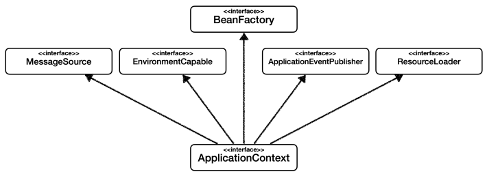
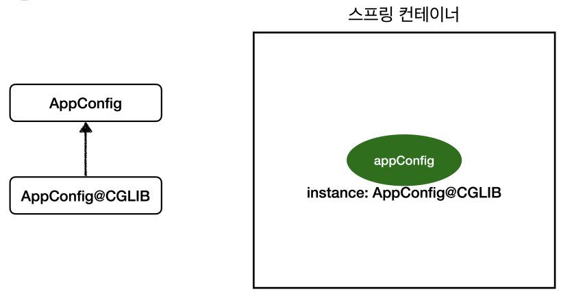
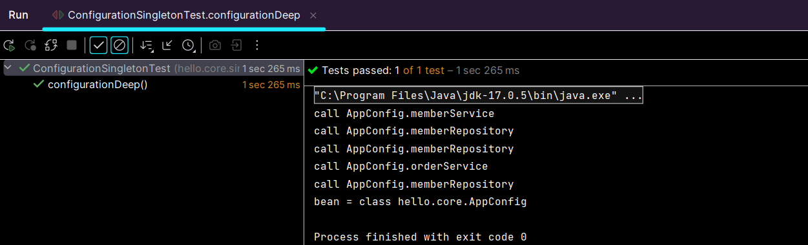

# 🐾🐾객체 지향 설계와 스프링🐾🐾

# 스프링이란?

## 스프링 생태계

**스프링** : 여러 가지 기술들의 모음

- 필수 : *스프링 프레임워크, 스프링 부트
- 선택 : 스프링 데이터, 스프링 세션, 스프링 시큐리티, 스프링 Rest Docs, 스프링 배치, 스프링 클라우드

관련 자료 검색 : [spring.io](http://spring.io) → Projects → Overview

## ⭐⭐⭐ 스프링 프레임워크

- **핵심 기술** : 스프링 DI 컨테이너, AOP, 이벤트, 기타
- 웹 기술 : 스프링 MVC, 스프링 WebFlux
- 데이터 접근 기술 : 트랜잭션, JDBC, ORM 지원, XML 지원
- 기술 통합 : 캐시, 이메일, 원격접근, 스케줄링
- 테스트 : 스프링 기반 테스트 지원
- 언어 : 코틀린, 그루비
- 최근에는 스프링 부트를 통해 스프링 프레임워크의 기술들을 편리하게 사용

## 스프링 부트

- 스프링을 편리하게 사용할 수 있도록 지원, 최근에는 기본으로 사용
- 단독으로 실행할 수 있는 스프링 애플리케이션을 쉽게 생성
- Tomcat 같은 웹 서버를 내장해서 별도의 웹 서버를 설치하지 않아도 됨
- 손쉬운 빌드 구성을 위한 starter 종속성 제공
- 스프링과 3rd parth(외부) 라이브러리 자동 구성
- 메트릭, 상태 확인, 외부 구성 같은 프로덕션 준비 기능 제공 (모니터링)
- 관례에 의한 간결한 설정

## 스프링 단어?

- 스프링이라는 단어는 문맥에 따라 다르게 사용된다
    - 스프링 DI 컨테이너 기술
    - 스프링 프레임워크
    - 스프링 부트, 스프링 프레임워크 등을 모두 포함한 스프링 생태계

## 스프링의 핵심

- 스프링은 자바 언어 기반의 프레임워크
- 자바 언어의 가장 큰 특징 - **객체 지향 언어**
- 스프링은 객체 지향 언어가 가진 강력한 특징을 살려내는 프레임워크
- 스프링은 **좋은 객체 지향** 애플리케이션을 개발할 수 있게 도와주는 프레임워크

<!------------------------------------------------------------>
<!------------------------------------------------------------>
<!------------------------------------------------------------>

# 객체 지향 프로그래밍

## 객체 지향 특징

- 추상화
- 캡슐화
- 상속
- **다형성**

## 객체 지향 프로그래밍

- 컴퓨터 프로그램을 여러 개의 독립된 단위, **객체**들의 **모임**으로 파악하는 것
- 각각의 객체는 메세지를 주고받고, 데이터를 처리할 수 있음 (**협력**)
- 프로그램을 **유연**하고 **변경**이 용이하게 만드는 것 → 대규모 소프트웨어 개발에 이용

    
    유연하고, 변경이 용이?

    - 레고 블럭 조립하듯이
    - 키보드, 마우스 갈아 끼우듯이
    - 컴퓨터 부품 갈아 끼우듯이
    - 컴포넌트를 쉽고 유연하게 변경하면서 개발할 수 있는 방법

    → 다형성 (Polymorphism)

# 다형성

## 다형성의 실세계 비유

- 실세계와 객체 지향을 1:1 로 매칭 X → 그래도 실세계의 비유로 이해하기에는 좋음
- **역할**과 **구현**으로 세상을 구분
- 예시
    - 운전자 - 자동차
    - 공연 무대
    - 키보드, 마우스, 세상의 표준 인터페이스들
    - 정렬 알고리즘
    - 할인 정책 로직


➡️ 자동차가 바뀌어도 운전자는 운전 가능

➡️ 자동차 무한 확장 가능

➡️ 클라이언트에 영향을 주지 않고 새로운 기능 제공 가능


➡️ 배우는 대체 가능

➡️ 유연하고 변경 용이

## 역할과 구현을 분리

- 장점
    - 세상이 **단순**해지고, **유연**해지며 **변경**이 편리
    - **클라이언트**는 대상의 역할(인터페이스)만 알면 됨
    - **클라이언트**는 구현 대상의 **내부 구조를 몰라**도 됨
    - **클라이언트**는 구현 대상의 **내부 구조가 변경**되어도 영향을 받지 않음
    - **클라이언트**는 구현 **대상 자체를 변경**해도 영향을 받지 않음


### 자바 언어

- 자바 언어의 다형성을 활용
    - 역할 = 인터페이스
    - 구현 = 인터페이스를 구현한 클래스, 구현 객체
- 객체를 설계할 때 **역할**과 **구현**을 명확히 분리
- 객체 설계시 역할(인터페이스)를 먼저 부여 후, 그 역할을 수행하는 구현 객체 만들기

## 자바 언어의 다형성

- **오버라이딩**
- 다형성으로 인터페이스를 구현한 객체를 실행 시점에 유연하게 변경 가능
- 클래스 상속 관계도 다형성, 오버라이딩 적용 가능


➡️ 클라이언트는 MemberRepository 의존

```java
// 1
public class MemberService {
	private MemberRepository memberRepository = new MemmoryMemberRepository();
}

// 2
public class MemberService {
	private MemberRepository memberRepository = new JdbcMemberRepository();
}
```


## 다형성의 본질

- 인터페이스를 구현한 객체 인스턴스를 **실행 시점**에 **유연**하게 **변경** 가능
- **협력** : 객체 사이의 관계
- **클라이언트를 변경하지 않고, 서버의 구현 기능을 유연하게 변경 가능**

## 역할과 구현을 분리

### 정리

- 유연하고, 변경이 용이
- 확장 가능한 설계 (무한 확장)
- 클라이언트에 영향을 주지 않는 변경 가능

### 한계

- 역할(인터페이스)이 변하면, 클라이언트 & 서버에 변경 발생

## 스프링과 객체 지향

- ⭐**다형성**
- 스프링은 다형성을 극대화해서 이용할 수 있게 도와줌
- 제어의 역전(IoC), 의존관계 주입(DI) : 다형성을 활용해 역할과 구현을 편리하게 다룰 수 있도록 지원
- 스프링을 사용하면 구현을 편리하게 변경 가능

<!------------------------------------------------------------>
<!------------------------------------------------------------>
<!------------------------------------------------------------>

# 좋은 객체 지향 설계의 5가지 원칙 (SOLID)

- 가끔 면접에서 나옴 👀

## SOLID
> 클린 코드로 유명한 로버트 마틴이 좋은 객체 지향 설계의 5가지 원칙을 정리

- SRP (Single Responsibility Principle) : 단일 책임 원칙
- OCP (Open/Closed Principle): 개방-폐쇄 원칙
- LSP (Liskov Substitution Principle) : 리스코프 치환 원칙
- ISP (Interface Segregation Principle) : 인터페이스 분리 원칙
- DIP (Dependency Inversion Principle) : 의존관계 역전 원칙

## SRP 단일 책임 원칙
> Single Responsibility Principle

- 한 클래스는 하나의 책임만 가져야 한다
- 기준 : **변경**
  - 변경이 있을 때 파급 효과가 적으면 단일 책임 원칙을 잘 따른 것
- 예) UI 변경, 객체의 생성과 사용을 분리

## ⭐⭐⭐ OCP 개방-폐쇄 원칙
> Open/Closed Principle

- 소프트웨어 요소는 **확장에는 열려** 있으나 **변경에는 닫혀** 있어야 한다
- **다형성** 활용
- 인터페이스를 구현한 새로운 클래스를 하나 만들어서 새로운 기능을 구현

```java
public class MemberService {
	// private MemberRepository memberRepository = new MemoryMemberRepository();
	private MemberRepository memberRepository = new JdbcMemberRepository();
}
```

### 문제점

- MemberService 클라이언트가 구현 클래스를 직접 선택
  - MemberRepository m = new MemoryMemberRepository(); ← 기존 코드
  - MemberRepository m = new JdbcMemberRepository(); ← 변경 코드
- **구현 객체를 변경하려면 클라이언트 코드 변경해야 함**
- **다형성을 사용했지만 OCP 원칙 불만족**
- 해결책 : 객체를 생성하고, 연관관계를 맺어주는 별도의 조립, 설정자가 필요하다

## LSP 리스코프 치환 원칙
> Liskov Substitution Principle

- 프로그램의 객체는 프로그램의 정확성을 깨뜨리지 않으면서 하위 타입의 인스턴스로 바꿀 수 있어야 한다
- 다형성에서 하위 클래스는 인터페이스 규약을 다 지켜야 한다는 것
- 예) 자동차 인터페이스의 엑셀은 앞으로 가는 기능, 뒤로 가게 구현하면 LSP 위반, 느리더라도 앞으로 가야함

## ISP 인터페이스 분리 원칙
> Interface Segregation Principle

- 특정 클라이언트를 위한 인터페이스 여러 개가 범용 인터페이스 하나보다 낫다
- 자동차 인터페이스 → 운전 인터페이스, 정비 인터페이스로 분리
- 사용자 클라이언트 → 운전자 클라이언트, 정비사 클라이언트로 분리
- 분리하면 정비 인터페이스 자체가 변해도 운전자 클라이언트에 영향을 주지 않음
- 인터페이스가 명확해지고, 대체 가능성이 향상

## ⭐⭐⭐ DIP 의존관계 역전 원칙
> Dependency Inversion Principle

- “추상화에 의존해야지, 구체화에 의존하면 안된다”
- 구현 클래스에 의존하지 말고, 인터페이스에 의존하라는 뜻
- MemberService 는 인터페이스에 의존하지만, 구현 클래스도 동시 의존
- MemberService 클라이언트가 구현 클래스를 직접 선택
  - MemberRepository m = new MemoryMemberRepository(); → **DIP 위반**

## 정리

- 객체 지향의 핵심은 다형성
- **다형성 만으로는 OCP, DIP 를 지킬 수 없음**

<!------------------------------------------------------------>
<!------------------------------------------------------------>
<!------------------------------------------------------------>

# 객체 지향 설계와 스프링

- **스프링은 다음 기술로 다형성 + OCP, DIP 를 가능하게 지원**
  - DI (Dependency Injection) : 의존관계, 의존성 주입
  - DI 컨테이너 제공
- **클라이언트 코드의 변경 없이 기능 확장**
- 쉽게 부품을 교체하듯이 개발

## 정리

- 모든 설계에 **역할**과 **구현**을 분리
- 이상적으로는 모든 설계에 인터페이스를 부여하자

### 실무 고민

- 인터페이스 도입 시 추상화 비용 발생
- 기능을 확장할 가능성이 없다면, 구체 클래스를 직접 사용하고, 향후 꼭 필요할 때 리팩터링하여 인터페이스 도입


<!------------------------------------------------------------>
<!------------------------------------------------------------>
<!------------------------------------------------------------>

# 🐾🐾스프링 핵심 원리 이해1 - 예제 만들기🐾🐾

# 프로젝트 생성

- 스프링 없이 순수 자바로 구현

- 사전 준비물
  - Oracle JDK 의 Java 11 설치
  - IDE : IntelliJ 또는 Eclipse 설치

## [스프링 부트 스타터 사이트](https://start.spring.io)로 이동해서 스프링 프로젝트 생성


    💡 **주의 ! 스프링 부트 3.0**
    → 스프링 부트 3.0 을 선택하게 되면 다음 부분 확인하기
    1. Java 17 이상 사용
    2. javax 패키지 이름을 jakarta 로 변경해야 함

    패키지 이름 변경 예시
    - JPA 애노테이션 :
    javax.persistence.Entity → jakarta.persistence.Entity
    - 스프링에서 자주 사용하는 @PostConstruct 애노테이션 :
    javax.annotation.PostConstruct → jakarta.annotation.PostConstruct
    - 스프링에서 자주 사용하는 검증 애노테이션
    javax. validation → jakarta.validation

    자세한 내용
    https://bit.ly/springboot3


- 프로젝트 선택
  - Project : Gradle - Groovy Project
  - Language : Java
  - Spring Boot : 3.1.4 (SNAPSHOT/M3 는 아직 정식 release 아님)
  - Project Metadata
    - Group : hello
    - Artifact : core
    - Packaging : Jar
    - Java : 17
  - Dependencies : 선택 안함 → core library 만 가지고 간단하게 생성됨


- 프로젝트 열기 : build.gradle → open
- build.gradle setting

```java
plugins {
	id 'java'
	id 'org.springframework.boot' version '3.1.4'
	id 'io.spring.dependency-management' version '1.1.3'
}

group = 'hello'
version = '0.0.1-SNAPSHOT'

java {
	sourceCompatibility = '17'
}

repositories {
	mavenCentral()
}

dependencies {
	implementation 'org.springframework.boot:spring-boot-starter'
	testImplementation 'org.springframework.boot:spring-boot-starter-test'
}

tasks.named('test') {
	useJUnitPlatform()
}
```

## 동작 확인하기(기본 메인 클래스 실행) : src/main/java/hello.core 의 CoreApplication Run 해보기


Gradle 대신 IntelliJ로 자바 직접 실행하기 → 실행 속도가 더 빠르다

- File - Settings - Build, Execution, Deployment - Build Tools - Gradle - Gradle projects
  - Build and run using : Gradle → IntelliJ IDEA 변경
  - Run tests using : Gradle → IntelliJ IDEA 변경


<!------------------------------------------------------------>
<!------------------------------------------------------------>
<!------------------------------------------------------------>

# 비즈니스 요구사항과 설계

- 회원
  - 회원 가입, 조회
  - 회원 등급 : 일반, VIP
  - 회원 데이터: 자체 DB 구축, 외부 시스템 연동 가능성 (미확정)
- 주문과 할인 정책
  - 회원이 상품 주문
  - 회원 등급에 따른 할인 정책
  - 고정 금액 할인 : 모든 VIP 1000원 할인 (변경 가능)
  - 할인 정책 변경 가능성, 할인을 하지 않을 수도 있음 (미확정)

→ 고정되지 않은 요구사항 : 객체 지향 설계 방법 사용하기

→ 구현체를 바꿀 수 있는 인터페이스 설계

<!------------------------------------------------------------>
<!------------------------------------------------------------>
<!------------------------------------------------------------>

# 회원 도메인 설계

- 회원 도메인 요구사항
  - 회원 가입, 조회
  - 회원 등급 : 일반, VIP
  - 회원 데이터: 자체 DB 구축, 외부 시스템 연동 가능성 (미확정)


- 회원 도메인 협력 관계


- 회원 클래스 다이어그램


➡️ 인터페이스 : MemberService

➡️ 구현체 : MemberServiceImpl

➡️ MemberRepository = 회원 저장소

- 회원 객체 다이어그램 (객체 간 메모리 참조)


MemberServiceImpl = 회원 서비스

<!------------------------------------------------------------>
<!------------------------------------------------------------>
<!------------------------------------------------------------>

# 회원 도메인 개발

- 만들 것

  


1. member 패키지 생성
2. member 패키지에 Grade 이름의 Enum 생성

```java
package hello.core.member;

public enum Grade {
    // 회원 등급
    BASIC,
    VIP
}
```

3. member 패키지에 Member 이름의 Class 생성

```java
package hello.core.member;

public class Member {
    private Long id;
    private String name;
    private Grade grade;

    // Alt + Insert -> Constructor, Getter&Setter

    public Member(Long id, String name, Grade grade) {
        this.id = id;
        this.name = name;
        this.grade = grade;
    }

    public Long getId() {
        return id;
    }

    public void setId(Long id) {
        this.id = id;
    }

    public String getName() {
        return name;
    }

    public void setName(String name) {
        this.name = name;
    }

    public Grade getGrade() {
        return grade;
    }

    public void setGrade(Grade grade) {
        this.grade = grade;
    }
}
```

4. member 패키지에 MemberRepository 이름의 Interface 생성

```java
package hello.core.member;

public interface MemberRepository {
    void save(Member member);

    Member findById(Long memberId);
}
```

5. member 패키지에 MemoryMemberRepository 이름의 Class 생성 (MemberRepository 구현체)

```java
package hello.core.member;

import java.util.HashMap;
import java.util.Map;

public class MemoryMemberRepository implements MemberRepository{

    // 실무에서는 동시성 이슈를 고려해 ConcurrentHashMap 사용
    private static Map<Long, Member> store = new HashMap<>();

    @Override
    public void save(Member member) {
        store.put(member.getId(), member);
    }

    @Override
    public Member findById(Long memberId) {
        return store.get(memberId);
    }
}
```

6. member 패키지에 MemberService 이름의 Interface 생성

```java
package hello.core.member;

public interface MemberService {
    // 회원 가입
    void join(Member member);

    // 회원 조회
    Member findMember(Long memberId);
}
```

7. member 패키지에 MemberServiceImpl 이름의 Class 생성 (MemberService 구현체)

```java
package hello.core.member;

public class MemberServiceImpl implements MemberService{

    private final MemberRepository memberRepository = new MemoryMemberRepository();

    @Override
    public void join(Member member) {
        memberRepository.save(member);
    }

    @Override
    public Member findMember(Long memberId) {
        return memberRepository.findById(memberId);
    }
}
```

<!------------------------------------------------------------>
<!------------------------------------------------------------>
<!------------------------------------------------------------>

# 회원 도메인 실행과 테스트

1. main/java/hello.core 패키지에 MemberApp 이름의 Class 생성

```java
package hello.core;

import hello.core.member.Grade;
import hello.core.member.Member;
import hello.core.member.MemberService;
import hello.core.member.MemberServiceImpl;

public class MemberApp {
    // psvm
    public static void main(String[] args) {
        MemberService memberService = new MemberServiceImpl();
        Member member = new Member(1L, "memberA", Grade.VIP); // ctrl + alt + v
        memberService.join(member);

        Member findMember = memberService.findMember(1L);
        System.out.println("new member = " + member.getName());
        System.out.println("findMember = " + findMember.getName());

    }
}
```

2. test/java/hello.core 패키지에 member 이름의 Package 생성
3. 만든 member 패키지에 MemberServiceTest 이름의 Class 생성

```java
package hello.core.member;

import org.assertj.core.api.Assertions;
import org.junit.jupiter.api.Test;

public class MemberServiceTest {

    MemberService memberService = new MemberServiceImpl();

    @Test
    void join() {
        // given
        Member member = new Member(1L, "memberA", Grade.VIP);

        // when
        memberService.join(member);
        Member findMember = memberService.findMember(1L);

        // then
        Assertions.assertThat(member).isEqualTo(findMember);

    }
}
```


→ 테스트 성공 !

💡 문제점 → 인터페이스 뿐만이 아니라 구현체도 직접 호출하고 있음

<!------------------------------------------------------------>
<!------------------------------------------------------------>
<!------------------------------------------------------------>

# 주문과 할인 도메인 설계

- 주문과 할인 정책
  - 회원이 상품 주문
  - 회원 등급에 따른 할인 정책
  - 고정 금액 할인 : 모든 VIP 1000원 할인 (변경 가능)
  - 할인 정책 변경 가능성, 할인을 하지 않을 수도 있음 (미확정)


- 주문 도메인 협력, 역할, 책임


1. **주문 생성** : 클라이언트는 주문 서비스에 주문 생성 요청
2. **회원 조회** : 주문 서비스는 회원 저장소에서 회원을 조회 (할인을 위해 회원 등급 필요)
3. **할인 적용** : 주문 서비스는 회원 등급에 따라 할인 적용
4. **주문 결과 반환** : 주문 서비스는 할인 결과를 포함한 주문 결과 반환


- 주문 도메인 전체


➡️ **역할과 구현을 분리**해서 자유롭게 구현 객체를 조립할 수 있도록 설계

➡️ 회원 저장소, 할인 정책 유연하게 변경 가능

- 주문 도메인 클래스 다이어그램


- 주문 도메인 객체 다이어그램1


➡️ 회원을 메모리에서 조회하고, 정액 할인 정책(고정 금액)을 지원해도 주문 서비스를 변경하지 않아도 됨

➡️ 역할들의 협력 관계 재사용 가능

- 주문 도메인 객체 다이어그램2


➡️ 회원을 메모리가 아닌 실제 DB 에서 조회하고, 정률 할인 정책(주문 금액에 따라 % 할인)을 지원해도 주문 서비스를 변경하지 않아도 됨

➡️ 역할들의 협력 관계 재사용 가능

<!------------------------------------------------------------>
<!------------------------------------------------------------>
<!------------------------------------------------------------>

# 주문과 할인 도메인 개발

1. hello.core 패키지에 discount 이름의 Package 생성
2. 만든 discount 패키지에 DiscountPolicy 이름의 Interface 생성

```java
package hello.core.discount;

import hello.core.member.Member;

public interface DiscountPolicy {

    // return 할인 대상 금액
    int discount(Member member, int price);
}
```

3. discount 패키지에 FixDiscountPolicy 이름의 Class 생성 (DiscountPolicy 구현체)

```java
package hello.core.discount;

import hello.core.member.Grade;
import hello.core.member.Member;

public class FixDiscountPolicy implements DiscountPolicy{

    private int discountFixAmount = 1000; // 1000원 할인

    @Override
    public int discount(Member member, int price) {
        if (member.getGrade() == Grade.VIP) { // Enum 비교 ==
            return discountFixAmount;
        } else {
            return 0;
        }
    }
}
```

4. hello.core 패키지에 order 이름의 Package 생성
5. 만든 order 패키지에 Order 이름의 Class 생성

```java
package hello.core.order;

public class Order {
    private Long memberId;
    private String itemName;
    private int itemPrice;
    private int discountPrice;

    public Order(Long memberId, String itemName, int itemPrice, int discountPrice) {
        this.memberId = memberId;
        this.itemName = itemName;
        this.itemPrice = itemPrice;
        this.discountPrice = discountPrice;
    }

    public int calculatePrice() {
        return itemPrice - discountPrice;
    }

    public Long getMemberId() {
        return memberId;
    }

    public void setMemberId(Long memberId) {
        this.memberId = memberId;
    }

    public String getItemName() {
        return itemName;
    }

    public void setItemName(String itemName) {
        this.itemName = itemName;
    }

    public int getItemPrice() {
        return itemPrice;
    }

    public void setItemPrice(int itemPrice) {
        this.itemPrice = itemPrice;
    }

    public int getDiscountPrice() {
        return discountPrice;
    }

    public void setDiscountPrice(int discountPrice) {
        this.discountPrice = discountPrice;
    }

    @Override
    public String toString() {
        return "Order{" +
                "memberId=" + memberId +
                ", itemName='" + itemName + '\'' +
                ", itemPrice=" + itemPrice +
                ", discountPrice=" + discountPrice +
                '}';
    }
}
```

6. order 패키지에 OrderService 이름의 Interface 생성

```java
package hello.core.order;

public interface OrderService {
    Order createOrder(Long memberId, String itemName, int itemPrice);

}
```

7. order 패키지에 OrderServiceImpl 이름의 Class 생성

```java
package hello.core.order;

import hello.core.member.Member;
import hello.core.discount.DiscountPolicy;
import hello.core.discount.FixDiscountPolicy;
import hello.core.member.MemberRepository;
import hello.core.member.MemoryMemberRepository;

public class OrderServiceImpl implements OrderService{

    private final MemberRepository memberRepository = new MemoryMemberRepository();
    private final DiscountPolicy discountPolicy = new FixDiscountPolicy();

    @Override
    public Order createOrder(Long memberId, String itemName, int itemPrice) {
        Member member = memberRepository.findById(memberId);
        int discountPrice = discountPolicy.discount(member, itemPrice);

        return new Order(memberId, itemName, itemPrice, discountPrice);
    }
}
```

<!------------------------------------------------------------>
<!------------------------------------------------------------>
<!------------------------------------------------------------>

# 주문과 할인 도메인 실행과 테스트

1. main/java/hello.core 에 OrderApp 이름의 Class 생성

```java
package hello.core;

import hello.core.member.Grade;
import hello.core.member.Member;
import hello.core.member.MemberService;
import hello.core.member.MemberServiceImpl;
import hello.core.order.Order;
import hello.core.order.OrderService;
import hello.core.order.OrderServiceImpl;

public class OrderApp {
    public static void main(String[] args) {
        MemberService memberService = new MemberServiceImpl();
        OrderService orderService = new OrderServiceImpl();

        Long memberId = 1L;
        Member member = new Member(memberId, "memberA", Grade.VIP);
        memberService.join(member);

        Order order = orderService.createOrder(memberId, "itemA", 10000);

        System.out.println("order = " + order);
        System.out.println("order.calculatePrice = " + order.calculatePrice());
    }
}
```

- Run


2. test/java/hello.core 에 order 이름의 Package 생성
3. 만든 order 패키지에 OrderServiceTest 이름의 Class 생성

```java
package hello.core.order;

import hello.core.member.Grade;
import hello.core.member.Member;
import hello.core.member.MemberService;
import hello.core.member.MemberServiceImpl;
import org.assertj.core.api.Assertions;
import org.junit.jupiter.api.Test;

public class OrderServiceTest {

    MemberService memberService = new MemberServiceImpl();
    OrderService orderService = new OrderServiceImpl();

    @Test
    void createOrder() {
        Long memberId = 1L;
        Member member = new Member(memberId, "memberA", Grade.VIP);
        memberService.join(member);

        Order order = orderService.createOrder(memberId, "itemA", 10000);
        Assertions.assertThat(order.getDiscountPrice()).isEqualTo(1000);
    }
}
```

- Run


→ 성공 !

<!------------------------------------------------------------>
<!------------------------------------------------------------>
<!------------------------------------------------------------>

# 🐾🐾스프링 핵심 원리 이해2 - 객체 지향 원리 적용🐾🐾

# 새로운 할인 정책 개발

### 새로운 할인 정책을 확장해보자

- 고정 할인 → 정률 할인 정책

1. discount 패키지에 RateDiscountPolicy 이름의 Class 생성 (DiscountPolicy 구현체)

```java
package hello.core.discount;

import hello.core.member.Grade;
import hello.core.member.Member;

public class RateDiscountPolicy implements DiscountPolicy{

    // ctrl + shift + t : 테스트 만들기
    private int discountPercent = 10;

    @Override
    public int discount(Member member, int price) {
        if (member.getGrade() == Grade.VIP) {
            return price * discountPercent / 100;
        } else {
            return 0;
        }
    }
}
```

2. test/java/hello.core/discount 에 RateDiscountPolicyTest 이름의 Class 생성

```java
package hello.core.discount;

import hello.core.member.Grade;
import hello.core.member.Member;
import org.assertj.core.api.Assertions;
import org.junit.jupiter.api.DisplayName;
import org.junit.jupiter.api.Test;

import static org.junit.jupiter.api.Assertions.*;

class RateDiscountPolicyTest {

    RateDiscountPolicy discountPolicy = new RateDiscountPolicy();

    @Test
    @DisplayName("VIP 는 10% 할인이 적용되어야 한다")
    void vip_o() {
        // given
        Member member = new Member(1L, "memberVIP", Grade.VIP);

        // when
        int discount = discountPolicy.discount(member, 10000);

        // then
        Assertions.assertThat(discount).isEqualTo(1000);
    }

    @Test
    @DisplayName("VIP 가 아니면 할인이 적용되지 않아야 한다")
    void vip_x() {
        // given
        Member member = new Member(2L, "memberBASIC", Grade.BASIC);

        // when
        int discount = discountPolicy.discount(member, 10000);

        // then
        Assertions.assertThat(discount).isEqualTo(0);
    }
}
```

- Run


→ 성공!

<!------------------------------------------------------------>
<!------------------------------------------------------------>
<!------------------------------------------------------------>

# 새로운 할인 정책 적용과 문제점

- 방금 추가한 할인 정책 적용하기

→ OrderServiceImpl 코드 수정

```java
...
public class OrderServiceImpl implements OrderService{

    private final MemberRepository memberRepository = new MemoryMemberRepository();
    // private final DiscountPolicy discountPolicy = new FixDiscountPolicy();
    private final DiscountPolicy discountPolicy = new RateDiscountPolicy();

    ...
}
```

### 문제점

- 역할과 구현 분리 → OK
- 다형성 활용 & 인터페이스와 구현 객체 분리 → OK
- OCP, DIP 객체지향 설계 원칙 준수 → X
  - DIP : 구체(구현) 클래스에 의존
    - 추상(인터페이스) 의존 : DiscountPolicy
    - 구체(구현) 클래스 : FixDiscountPolicy, RateDiscountPolicy
  - OCP : 기능 확장, 변경으로 클라이언트 코드에 영향

- 기대했던 의존 관계


→ DiscountPolicy 인터페이스에만 의존하기

- 실제 의존 관계


→ 클라이언트 OrderServiceImpl 은 DiscountPolicy 인터페이스 뿐만 아니라 FixDiscountPolicy 인 구체 클래스도 함께 의존 (**DIP 위반**)

- 정책 변경 시


→ FixDiscountPolicy 를 RateDiscountPolicy 로 변경하는 순간 OrderServiceImpl 의 소스 코드가 변경됨 (**OCP 위반**)

### 문제 해결 방법

- 인터페이스에만 의존하도록 설계 변경하기

→ 코드 변경

```java
...
public class OrderServiceImpl implements OrderService{

    private final MemberRepository memberRepository = new MemoryMemberRepository();
    // private final DiscountPolicy discountPolicy = new FixDiscountPolicy();
    // private final DiscountPolicy discountPolicy = new RateDiscountPolicy();
    private DiscountPolicy discountPolicy;

    ...
}
```

➡️ 실행 시 NPE (Null Pointer Exception) 발생

- 문제 해결을 위해서는 누군가가 클라이언트인 OrderServiceImpl 에 DiscountPolicy 의 구현 객체를 대신 생성하고 주입해주어야 함

<!------------------------------------------------------------>
<!------------------------------------------------------------>
<!------------------------------------------------------------>

# ⭐ 관심사의 분리

→ 기획자 만들기

### App Config 등장

- 애플리케이션의 전체 동작 방식을 구성하기 위해, 구현 객체를 생성하고, 연결하는 책임을 가지는 별도의 설정 클래스

1. hello.core 패키지에 AppConfig 이름을 가진 Class 생성
- 생성자 주입

```java
package hello.core;

import hello.core.discount.FixDiscountPolicy;
import hello.core.member.MemberService;
import hello.core.member.MemberServiceImpl;
import hello.core.member.MemoryMemberRepository;
import hello.core.order.OrderService;
import hello.core.order.OrderServiceImpl;

public class AppConfig {
    // 생성자 주입
    public MemberService memberService() {
        return new MemberServiceImpl(new MemoryMemberRepository());
    }

    public OrderService orderService() {
        return new OrderServiceImpl(new MemoryMemberRepository(), new FixDiscountPolicy());
    }
}
```

- AppConfig 는 애플리케이션의 실제 동작에 필요한 “**구현 객체를 생성**”
  - MemberServiceImpl
  - MemoryMemberRepository
  - OrderServiceImpl
  - FixDiscountPolicy
- AppConfig 는 생성한 객체 인스턴스의 참조(레퍼런스)를 “**생성자를 통해서 주입(연결)**”
  - MemberServiceImpl → MemoryMemberRepository
  - OrderServiceImpl → MemoryMemberRepository, FixDiscountPolicy

2. MemberServiceImpl 코드 수정

```java
...
public class MemberServiceImpl implements MemberService{

    private final MemberRepository memberRepository;

    public MemberServiceImpl(MemberRepository memberRepository) {
        this.memberRepository = memberRepository;
    }

    ...
}
```

- 설계 변경으로 MemberServiceImpl 은 MemoryMemberRepository 를 의존하지 않음 ➡️ MemberRepository 인터페이스만 의존 (DIP 만족)
- MemberServiceImpl 는 생성자를 통해 어떤 구현 객체가 들어올지 알 수 없음 (외부 - AppConfig 에서 결정)
- MemberServiceImpl 는 **의존관계에 대한 고민은 외부**에 맡기고 **실행에만 집중**


- 클래스 다이어그램


→ 객체의 생성과 연결은 AppConfig 담당

→ DIP 완성 : MemberServiceImpl 은 MemberRepository 인 추상에만 의존

→ 관심사의 분리 : 객체를 생성하고 연결하는 역할과 실행하는 역할이 명확히 분리됨

- 회원 객체 인스턴스 다이어그램


→ AppConfig 객체는 memoryMemberRepository 객체를 생성하고, 그 참조값을 memberServiceImpl 을 생성하면서 생성자로 전달

→ 의존 관계 주입(DI - Dependency Injection) : 클라이언트인 memberServiceImpl 입장에서 의존 관계를 외부에서 주입해주는 것 같이 보임

3. OrderServiceImpl 코드 수정

```java
...
public class OrderServiceImpl implements OrderService{

    private final MemberRepository memberRepository;
    private final DiscountPolicy discountPolicy;

    public OrderServiceImpl(MemberRepository memberRepository, DiscountPolicy discountPolicy) {
        this.memberRepository = memberRepository;
        this.discountPolicy = discountPolicy;
    }

    ...
}
```

- 설계 변경으로 OrderServiceImpl 은 FixDiscountPolicy 를 의존하지 않음 ➡️ DiscountPolicy 인터페이스만 의존 (DIP 만족)
- OrderServiceImpl 는 생성자를 통해 어떤 구현 객체가 들어올지 알 수 없음 (외부 - AppConfig 에서 결정)
- OrderServiceImpl 은 이제부터 실행에만 집중
- OrderServiceImpl 에는 MemoryMemberRepository, FixDiscountPolicy 객체의 의존관계가 주입됨

### AppConfig 실행

1. MemberApp 코드 수정하기

```java
...
public class MemberApp {
    public static void main(String[] args) {
        AppConfig appConfig = new AppConfig();
        MemberService memberService = appConfig.memberService();
        // MemberService memberService = new MemberServiceImpl();
        
        ...
    }
}
```

2. OrderApp 코드 수정하기

```java
...
public class OrderApp {
    public static void main(String[] args) {
        
        AppConfig appConfig = new AppConfig();
        MemberService memberService = appConfig.memberService();
        OrderService orderService = appConfig.orderService();
        // MemberService memberService = new MemberServiceImpl();
        // OrderService orderService = new OrderServiceImpl(memberRepository, discountPolicy);

        ...
    }
}
```

3. MemberServiceTest 코드 수정하기

```java
...
public class MemberServiceTest {

    MemberService memberService;

    // 각 테스트 실행 전 호출된다
    @BeforeEach
    public void beforeEach() {
        AppConfig appConfig = new AppConfig();
        memberService = appConfig.memberService();
    }

    ...
    }
}
```

4. OrderServiceTest 코드 수정하기

```java
...
public class OrderServiceTest {

    MemberService memberService;
    OrderService orderService;

    @BeforeEach
    public void beforeEach() {
        AppConfig appConfig = new AppConfig();
        memberService = appConfig.memberService();
        orderService = appConfig.orderService();
    }

    ...
}
```

- Run


→ 성공 !

- AppConfig 를 통해 관심사 분리
- AppConfig 는 구체 클래스를 선택 → 전체 구성 책임(애플리케이션 동작 방식)
- OrderServiceImpl 은 기능을 실행하는 책임만

<!------------------------------------------------------------>
<!------------------------------------------------------------>
<!------------------------------------------------------------>

# AppConfig 리팩터링

- 현재 AppConfig : **중복** 발생, **역할**에 따른 **구현** 불명확

➡️ 역할을 드러나게 하는 것이 중요

1. AppConfig 코드 수정하기

```java
...
public class AppConfig {
    // 생성자 주입
    public MemberService memberService() {
        // ctrl + alt + m 으로 변경
        return new MemberServiceImpl(memberRepository());
    }

    private MemoryMemberRepository memberRepository() {
        return new MemoryMemberRepository();
    }

    public OrderService orderService() {
        return new OrderServiceImpl(memberRepository(), discountPolicy());
    }

    private DiscountPolicy discountPolicy() {
        return new FixDiscountPolicy();
    }
}
```

- new MemoryMemberRepository() 중복이 제거 → MemoryMemberRepository 를 다른 구현체로 변경 시 한 부분만 변경하면 됨
- AppConfig 역할과 구현 클래스 명확 ➡️ 애플리케이션 전체 구성 빠르게 파악 가능

<!------------------------------------------------------------>
<!------------------------------------------------------------>
<!------------------------------------------------------------>

# 새로운 구조와 할인 정책 적용

- 정액 할인 정책 ➡️ 정률 할인 정책 변경하기
- FixDiscountPolicy → RateDiscountPolicy

➡️ AppConfig 등장 : 애플리케이션이 크게 사용 영역과, 객체를 생성하고 구성하는 영역으로 분리됨

- 사용, 구성의 분리


- 할인 정책의 변경


➡️ FixDiscountPolicy → RateDiscountPolicy 변경 : 구성 영역에만 영향, 사용 영역은 영향 X

1. AppConfig 코드 변경하기

```java
...
public class AppConfig {
    ...
    private DiscountPolicy discountPolicy() {
        // return new FixDiscountPolicy();
        return new RateDiscountPolicy();
    }
}
```

- AppConfig 할인 정책 역할 구현 담당 : FixDiscountPolicy → RateDiscountPolicy
- 할인 정책을 변경해도, 애플리케이션의 구성 역할을 담당하는 AppConfig 만 변경 (**사용 영역**의 어떤 코드도 변경 X)
- **구성 영역**은 변경됨

<!------------------------------------------------------------>
<!------------------------------------------------------------>
<!------------------------------------------------------------>

# 전체 흐름 정리

### 새로운 할인 정책 개발

- 다형성 덕분에 새로운 정률 할인 정책 코드를 추가로 개발하는 것은 문제 없음

### 새로운 할인 정책 적용과 문제점

- 새로 개발한 정률 할인 정책을 적용 시 “**클라이언트 코드**"인 주문 서비스 구현체도 함께 변경 해야 함
- 주문 서비스 클라이언트가 인터페이스인 DiscountPolicy 뿐만 아니라, 구체 클래스인 FixDiscountPolicy 도 함께 의존 → **DIP 위반**

### 관심사의 분리

- 기존에는 클라이언트가 의존하는 서버 구현 객체를 직접 생성, 실행
- 기획자인 AppConfig 등장
- AppConfig 는 애플리케이션의 전체 동작 방식을 구성하기 위해, **구현 객체를 생성**하고, **연결**하는 책임
- 이제부터 클라이언트 객체는 자신의 역할을 실행하는 것만 집중, 권한이 줄어듦 (책임이 명확해짐)

### AppConfig 리팩터링

- 구성 정보에서 역할과 구현을 명확하게 분리
- 역할이 잘 드러남
- 중복 제거

### 새로운 구조와 할인 정책 적용

- 정책 할인 정책 → 정률 할인 정책으로 변경
- AppConfig의 등장으로 애플리케이션이 크게 사용 영역과, 객체를 생성하고 구성하는 영역으로 분리됨
- 할인 정책을 변경해도 AppConfig 가 있는 구성 영역만 변경, 사용 영역은 변경 x

<!------------------------------------------------------------>
<!------------------------------------------------------------>
<!------------------------------------------------------------>

# 좋은 객체 지향 설계의 5가지 원칙의 적용

- 여기서는 3가지 SRP, DIP, OCP 가 적용되어 있음

### SRP 단일 책임 원칙

> 한 클래스는 하나의 책임만 가져야 한다

- 클라이언트 객체는 직접 구현 객체를 생성하고, 연결하고, 실행하는 다양한 책임을 가지고 있음
- SRP 단일 책임 원칙을 따르면서 관심사 분리
- 구현 객체를 생성하고 연결하는 책임은 AppConfig 가 담당
- 클라이언트 객체는 실행하는 책임만 담당

### DIP 의존관계 역전 원칙

> 프로그래머는 “추상화에 의존해야지, 구체화에 의존하면 안된다”
의존성 주입은 이 원칙을 따르는 방법 중 하나다

- 기존 클라이언트 코드 : DiscountPolicy 인터페이스 + FixDiscountPolicy 구체화 클래스 의존
- 클라이언트 코드가 DiscountPolicy 추상화 인터페이스에만 의존하도록 코드 변경
- 하지만 클라이언트 코드는 인터페이스만으로는 실행 불가
- AppConfig 가 FixDiscountPolicy 객체 인스턴스를 클라이언트 코드 대신 생성한 후 클라이언트 코드에 의존 관계 주입

### OCP

> 소프트웨어 요소는 확장에는 열려 있으나 변경에는 닫혀 있어야 한다

- 다형성 사용하고 클라이언트가 DIP 를 지킴
- 애플리케이션을 사용 영역과 구성 영역으로 나눔
- AppConfig 가 의존관계를 FixDiscountPolicy → RateDiscountPolicy 로 변경해서 클라이언트 코드에 주입하므로 클라이언트 코드는 변경하지 않아도 됨
- **소프트웨어 요소를 새롭게 확장해도 사용 영역의 변경은 닫혀 있음**

<!------------------------------------------------------------>
<!------------------------------------------------------------>
<!------------------------------------------------------------>

# IoC, DI, 그리고 컨테이너

### 제어의 역전 IoC (Inversion of Control)

> 프로그램의 제어 흐름을 직접 제어하는 것이 아닌 외부에서 관리하는 것

- 기존 프로그램 : 클라이언트 구현 객체가 스스로 필요한 서버 구현 객체를 생성하고, 연결하고 실행 ( 구현 객체가 프로그램의 제어 흐름을 스스로 조종 )
- AppConfig 등장 이후 : 구현 객체는 자신의 로직을 실행하는 역할만 담당 ( 프로그램의 제어 흐름은 AppConfig 담당 )
  - ex. OrderServiceImpl : 필요한 인터페이스들을 호출하지만 어떤 구현 객체들이 실행될지 모른다
- AppConfig
  - 프로그램 제어 흐름에 대한 권한
  - OrderServiceImpl 생성
  - OrderService 인터페이스의 다른 구현 객체 생성 및 실행

- 프레임워크 vs. 라이브러리
  - 프레임워크 : 내가 작성한 코드를 제어하고, 대신 실행 (ex. JUnit)
  - 라이브러리 : 내가 작성한 코드가 직접 제어의 흐름을 담당


### 의존 관계 주입 DI (Dependency Injection)

- OrderServiceImpl : DiscountPolicy 인터페이스에 의존, 어떤 구현 객체가 사용될지는 모름
- 의존 관계 : 정적인 클래스 의존 관계 or 실행 시점에 결정되는 동적인 객체(인스턴스) 의존 관계

- 정적인 클래스 의존 관계
  - 클래스가 사용하는 import 코드만 보고 의존관계 쉽게 파악 가능 (애플리케이션을 실행하지 않아도 분석 가능)
  - OrderServiceImpl -(의존)→ MemberRepository, DiscountPolicy


- 동적인 객체 인스턴스 의존 관계
  - 애플리케이션 실행 시점에서 실제 생성된 객체 인스턴스의 참조가 연결된 의존 관계
  - 의존 관계 주입 : 애플리케이션 실행 시점에 외부에서 실제 구현 객체를 생성하고 클라이언트에 전달하여, 클라이언트와 서버의 실제 의존 관계가 연결되는 것
  - 객체 인스턴스 생성 후, 그 참조값을 전달해서 연결
  - 의존관계 주입 사용 시
    - 클라이언트 코드 변경 X → 클라이언트가 호출하는 대상의 타입 인스턴스 변경
    - ⭐ 정적인 클래스 의존 관계 변경 X →동적인 객체 인스턴스 의존 관계 쉽게 변경


### IoC 컨테이너, DI 컨테이너

- AppConfig 처럼 객체를 생성하고 관리하면서 의존 관계를 연결해주는 것
- 의존 관계 주입에 초점을 맞추어 최근에는 주로 DI 컨테이너라 함
- 또는 어샘블러, 오브젝트 팩토리 등으로 불림

<!------------------------------------------------------------>
<!------------------------------------------------------------>
<!------------------------------------------------------------>

# 스프링으로 전환하기

1. AppConfig 코드 변경하기

```java
...
import org.springframework.context.annotation.Bean;
import org.springframework.context.annotation.Configuration;

@Configuration
public class AppConfig {

    @Bean
    public MemberService memberService() {...}

    @Bean
    public MemoryMemberRepository memberRepository() {...}

    @Bean
    public OrderService orderService() {...}

    @Bean
    public DiscountPolicy discountPolicy() {...}
}
```

2. MemberApp 코드 변경하기

```java
...
import org.springframework.context.ApplicationContext;
import org.springframework.context.annotation.AnnotationConfigApplicationContext;

public class MemberApp {
    public static void main(String[] args) {
        // AppConfig appConfig = new AppConfig();
        // MemberService memberService = appConfig.memberService();

        ApplicationContext applicationContext = new AnnotationConfigApplicationContext(AppConfig.class);
        MemberService memberService = applicationContext.getBean("memberService", MemberService.class);

        ...
    }
}
```

- Run


3. OrderApp 코드 변경하기

```java
...
import org.springframework.context.ApplicationContext;
import org.springframework.context.annotation.AnnotationConfigApplicationContext;

public class OrderApp {
    public static void main(String[] args) {

        // AppConfig appConfig = new AppConfig();
        // MemberService memberService = appConfig.memberService();
        // OrderService orderService = appConfig.orderService();

        ApplicationContext applicationContext = new AnnotationConfigApplicationContext(AppConfig.class);
        MemberService memberService = applicationContext.getBean("memberService", MemberService.class);
        OrderService orderService = applicationContext.getBean("orderService", OrderService.class);

        ...
    }
}
```

- Run


### 스프링 컨테이너

- ApplicationContext = 스프링 컨테이너
- @Configuration 이 붙은 AppConfig 를 설정(구성) 정보로 사용
- @Bean 이 적힌 메서드를 모두 호출해 반환된 객체를 스프링 컨테이너에 등록 → 스프링 빈
- 스프링 빈 이름 : @Bean 이 붙은 메서드 명 (ex. memberService, orderService)
- 스프링 빈 찾기 : applicationContext.getBean() 메서드 사용

<!------------------------------------------------------------>
<!------------------------------------------------------------>
<!------------------------------------------------------------>

# 🐾🐾스프링 컨테이너와 스프링 빈🐾🐾

# 스프링 컨테이너 생성

☑️ 컨테이너 : 사용하는 객체들을 담고 있음

- 스프링 컨테이너가 생성되는 과정

```java
ApplicationContext applicationContext = new AnnotationConfigApplicationContext(AppConfig.class);
```

→ ApplicationContext : 인터페이스, 스프링 컨테이너

→ 스프링 컨테이너 만드는 방법 : XML 기반, 애노테이션 기반 자바 설정 클래스

→ AppConfig 사용했던 방식 : 애노테이션 기반 자바 설정 클래스

- 자바 설정 클래스 기반 스프링 컨테이너(ApplicationContext) 만들기
  - 구현체 : new AnnotationConfigApplicationContext(AppConfig.class);

> 참고 : 정확히는 스프링 컨테이너를 부를 때 BeanFactory, ApplicationContext 로 구분해서 이야기한다. BeanFactory 를 직접 사용하는 경우는 거의 없으며, 일반적으로 ApplicationContext 를 스프링 컨테이너라 한다.
>

## 스프링 컨테이너 생성 과정

### 1. 스프링 컨테이너 생성


- 스프링 컨테이너 생성 시 구성 정보 지정 : AppConfig.class

### 2. 스프링 빈 등록


- 스프링 컨테이너는 파라미터로 넘어온 설정 클래스 정보를 이용해 스프링 빈 등록
- 빈 이름 = 메서드 이름
- 빈 이름 직접 부여 가능 (ex. @Bean(name=”memberService2”))

> 주의 : 빈 이름은 항상 다른 이름을 부여해야 한다. 같은 이름 부여 시, 다른 빈이 무시되거나, 기존 빈을 덮어버리거나, 설정에 따라 오류가 발생한다.
>

### 3. 스프링 빈 의존관계 설정 - 준비


### 4. 스프링 빈 의존관계 설정 - 완료


- 스프링 컨테이너는 설정 정보를 참고하여 의존관계 주입 (DI)

> 참고 : 스프링은 빈을 생성하고, 의존관계를 주입하는 단계가 나누어져 있다. 그런데 이렇게 자바 코드로 스프링 빈을 등록하면 생성자를 호출하면서 의존관계 주입도 한 번에 처리된다. (이해를 위한 설계)
>

> 정리 : 스프링 컨테이너를 생성하고, 설정(구성) 정보를 참고해 스프링 빈을 등록하고, 의존관계를 설정했다.
>

<!------------------------------------------------------------>
<!------------------------------------------------------------>
<!------------------------------------------------------------>

# 컨테이너에 등록된 모든 빈 조회

- 스프링 컨테이너에 실제로 스프링 빈이 등록되었는지 확인하기

1. test/java/hello.core 에 beanfind 이름의 Package 생성
2. 만든 beanfind 패키지에 ApplicationContextInfoTest 이름의 Class 생성

### 모든 빈 출력하기

➡️ 실행 시 스프링에 등록된 모든 빈 정보 출력 가능

➡️ ac.getBeanDefinitionNames() : 스프링에 등록된 모든 빈 이름 조회

➡️ ac.getBean() : 빈 이름으로 빈 객체(인스턴스) 조회

```java
package hello.core.beanfind;

import hello.core.AppConfig;
import org.junit.jupiter.api.DisplayName;
import org.junit.jupiter.api.Test;
import org.springframework.context.annotation.AnnotationConfigApplicationContext;

public class ApplicationContextInfoTest {

    AnnotationConfigApplicationContext ac = new AnnotationConfigApplicationContext(AppConfig.class);

    @Test
    @DisplayName("모든 빈 출력하기")
    void findAllBean() {
        String[] beanDefinitionNames = ac.getBeanDefinitionNames();
        // iter : 리스트/배열 for문 자동 생성
        for (String beanDefinitionName : beanDefinitionNames) {
            Object bean = ac.getBean(beanDefinitionName);
            System.out.println("name = " + beanDefinitionName + " object = " + bean);
        }
    }
}
```

- 출력 결과


### 직접 만든 애플리케이션 빈만 출력하기

➡️ 내가 등록한 빈만 출력 (스프링이 내부에서 사용하는 빈을 제외)

➡️ getRole() : 스프링이 내부에서 사용하는 빈 구분 (ROLE_APPLICATION/ROLE_INFRASTRUCTURE)

```java
...
public class ApplicationContextInfoTest {

    ...

    @Test
    @DisplayName("애플리케이션 빈 출력하기")
    void findApplicationBean() {
        String[] beanDefinitionNames = ac.getBeanDefinitionNames();
        for (String beanDefinitionName : beanDefinitionNames) {
            // BeanDefinition : 빈에 대한 메타데이터
            BeanDefinition beanDefinition = ac.getBeanDefinition(beanDefinitionName);

            // ROLE_APPLICATION : 내가 등록한 애플리케이션 or 외부 라이브러리
            // ROLE_INFRASTRUCTURE : 스프링이 내부에서 사용하는 빈
            if (beanDefinition.getRole() == beanDefinition.ROLE_APPLICATION) {
                Object bean = ac.getBean(beanDefinitionName);
                System.out.println("name = " + beanDefinitionName + " object = " + bean);
            }
        }
    }
}
```

- 출력 결과


<!------------------------------------------------------------>
<!------------------------------------------------------------>
<!------------------------------------------------------------>

# 스프링 빈 조회 - 기본

- 스프링 컨테이너에서 스프링 빈을 찾는 가장 기본적인 조회 방법

☑️ ac.getBean(빈이름, 타입)

☑️ ac.getBean(타입)

💡 조회 대상 스프링 빈이 없으면 예외 발생

- ‘NoSuchBeanDefinitionException : No bean named ‘xxxx’ available’

1. test/java/hello.core/beanfind 패키지에 ApplicationContextBasicFindTest 이름의 Class 생성

```java
package hello.core.beanfind;

import hello.core.AppConfig;
import hello.core.member.MemberService;
import hello.core.member.MemberServiceImpl;
import org.junit.jupiter.api.DisplayName;
import org.junit.jupiter.api.Test;
import org.springframework.beans.factory.NoSuchBeanDefinitionException;
import org.springframework.context.annotation.AnnotationConfigApplicationContext;

import static org.assertj.core.api.Assertions.assertThat;
import static org.junit.jupiter.api.Assertions.assertThrows;

public class ApplicationContextBasicFindTest {

    // Ctrl + E (Window) : 이전 코드로 바로가기
    // Command + E (Linux)
    AnnotationConfigApplicationContext ac = new AnnotationConfigApplicationContext(AppConfig.class);

    @Test
    @DisplayName("빈 이름으로 조회")
    void findBeanByName() {
        MemberService memberService = ac.getBean("memberService", MemberService.class);

        // 검증 - Assertions (org.junit)
        assertThat(memberService).isInstanceOf(MemberServiceImpl.class);
    }

    @Test
    @DisplayName("이름 없이 타입으로만 조회")
    void findBeanByType() {
        MemberService memberService = ac.getBean(MemberService.class);
        assertThat(memberService).isInstanceOf(MemberServiceImpl.class);
    }

    @Test
    @DisplayName("구체 타입으로 조회")
    void findBeanByName2() {
        // 인터페이스의 구현체로 직접 조회 - 좋지 않은 방법
        MemberService memberService = ac.getBean("memberService", MemberServiceImpl.class);
        assertThat(memberService).isInstanceOf(MemberServiceImpl.class);
    }

    // 실패 테스트 만들기
    @Test
    @DisplayName("빈 이름으로 조회X")
    void findBeanByNameX() {
        // ac.getBean("xxxx", MemberService.class);
        assertThrows(NoSuchBeanDefinitionException.class,
                () -> ac.getBean("xxxx", MemberService.class));
    }
}
```

- 테스트 결과


→ 성공 !

<!------------------------------------------------------------>
<!------------------------------------------------------------>
<!------------------------------------------------------------>

# 스프링 빈 조회 - 동일한 타입이 둘 이상

- 타입으로 조회 시 같은 타입의 스프링 빈이 둘 이상이면 오류 발생 → 빈 이름 지정
- ac.getBeansOfType() : 해당 타입의 모든 빈 조회 가능

1. test/java/hello.core/beanfind 패키지에 ApplicationContextSameBeanFindTest 이름의 Class 생성

```java
package hello.core.beanfind;

import hello.core.member.MemberRepository;
import hello.core.member.MemoryMemberRepository;
import org.junit.jupiter.api.DisplayName;
import org.junit.jupiter.api.Test;
import org.springframework.beans.factory.NoUniqueBeanDefinitionException;
import org.springframework.context.annotation.AnnotationConfigApplicationContext;
import org.springframework.context.annotation.Bean;
import org.springframework.context.annotation.Configuration;

import java.util.Map;

import static org.assertj.core.api.Assertions.assertThat;
import static org.junit.jupiter.api.Assertions.assertThrows;

public class ApplicationContextSameBeanFindTest {

    AnnotationConfigApplicationContext ac = new AnnotationConfigApplicationContext(SameBeanConfig.class);

    @Test
    @DisplayName("타입으로 조회 시 같은 타입이 둘 이상이면 중복 오류 발생")
    void findBeanByTypeDuplicate() {
        assertThrows(NoUniqueBeanDefinitionException.class,
                () -> ac.getBean(MemberRepository.class));
    }

    @Test
    @DisplayName("타입으로 조회 시 같은 타입이 둘 이상이면 빈 이름을 지정")
    void findBeanByName() {
        MemberRepository memberRepository = ac.getBean("memberRepository1", MemberRepository.class);
        assertThat(memberRepository).isInstanceOf(MemberRepository.class);
    }

    @Test
    @DisplayName("특정 타입 모두 조회")
    void findAllBeanByType() {
        Map<String, MemberRepository> beansOfType = ac.getBeansOfType(MemberRepository.class);
        for (String key : beansOfType.keySet()) {
            System.out.println("key = " + key + " value = " + beansOfType.get(key));
        }
        System.out.println("beansOfType = " + beansOfType);
        assertThat(beansOfType.size()).isEqualTo(2);
    }

    // static class 선언 : ApplicationContextSameBeanFindTest 안에서만 사용할 클래스라는 의미
    @Configuration
    static class SameBeanConfig {

        @Bean
        public MemberRepository memberRepository1() {
            return new MemoryMemberRepository();
        }

        @Bean
        public MemberRepository memberRepository2() {
            return new MemoryMemberRepository();
        }

    }
}
```

- 테스트 결과


→ 성공 !

<!------------------------------------------------------------>
<!------------------------------------------------------------>
<!------------------------------------------------------------>

# ⭐⭐⭐ 스프링 빈 조회 - 상속관계

- 부모 타입 조회 시, 자식 타입도 함께 조회됨
- 모든 자바 객체의 최고 부모인 Object 타입으로 조회 시, 모든 스프링 빈 조회 가능

1. test/java/hello.core/beanfind 패키지에 ApplicationContextExtendsFindTest 이름의 Class 생성

```java
package hello.core.beanfind;

import hello.core.discount.DiscountPolicy;
import hello.core.discount.FixDiscountPolicy;
import hello.core.discount.RateDiscountPolicy;
import org.junit.jupiter.api.DisplayName;
import org.junit.jupiter.api.Test;
import org.springframework.beans.factory.NoUniqueBeanDefinitionException;
import org.springframework.context.annotation.AnnotationConfigApplicationContext;
import org.springframework.context.annotation.Bean;
import org.springframework.context.annotation.Configuration;

import java.util.Map;

import static org.assertj.core.api.Assertions.assertThat;
import static org.junit.jupiter.api.Assertions.assertThrows;

public class ApplicationContextExtendsFindTest {

    AnnotationConfigApplicationContext ac = new AnnotationConfigApplicationContext(TestConfig.class);

    @Test
    @DisplayName("부모 타입으로 조회 시 자식이 둘 이상 있으면, 중복 오류 발생")
    void findBeanByParentTypeDuplicate() {
        assertThrows(NoUniqueBeanDefinitionException.class,
                () -> ac.getBean(DiscountPolicy.class));
    }

    @Test
    @DisplayName("부모 타입으로 조회 시 자식이 둘 이상 있으면, 빈 이름 지정")
    void findBeanByParentTypeBeanName() {
        DiscountPolicy rateDiscountPolicy = ac.getBean("rateDiscountPolicy", DiscountPolicy.class);
        assertThat(rateDiscountPolicy).isInstanceOf(RateDiscountPolicy.class);
    }

    @Test
    @DisplayName("특정 하위 타입으로 조회")
    void findBeanBySubType() {
        RateDiscountPolicy bean = ac.getBean(RateDiscountPolicy.class);
        assertThat(bean).isInstanceOf(RateDiscountPolicy.class);
    }

    @Test
    @DisplayName("부모 타입으로 모두 조회")
    void findAllBeanByParentType() {
        Map<String, DiscountPolicy> beansOfType = ac.getBeansOfType(DiscountPolicy.class);
        assertThat(beansOfType.size()).isEqualTo(2);
        for (String key : beansOfType.keySet()) {
            System.out.println("key = " + key + "value = " + beansOfType.get(key));
        }
    }

    @Test
    @DisplayName("부모 타입으로 모두 조회 - Object")
    void findAllBeanByObjectType() {
        Map<String, Object> beansOfType = ac.getBeansOfType(Object.class);
        for (String key : beansOfType.keySet()) {
            System.out.println("key = " + key + "value = " + beansOfType.get(key));
        }
    }

    @Configuration
    static class TestConfig {
        @Bean
        public DiscountPolicy rateDiscountPolicy() {
            return new RateDiscountPolicy();
        }

        @Bean
        public DiscountPolicy fixDiscountPolicy() {
            return new FixDiscountPolicy();
        }
    }
}
```

- 테스트 결과


→ 성공 !

<!------------------------------------------------------------>
<!------------------------------------------------------------>
<!------------------------------------------------------------>

# BeanFactory 와 ApplicationContext


## BeanFactory

- 스프링 컨테이너의 최상위 인터페이스
- 스프링 빈을 관리하고 조회하는 역할
- getBean() 제공
- 지금까지 사용했던 대부분의 기능은 BeanFactory 가 제공하는 기능

## ApplicationContext

- BeanFactory 의 기능을 모두 상속받아 제공 (BeanFactory 기능 + ɑ)

### ApplicationContext 가 제공하는 부가기능



- **MessageSource** : 메시지소스를 활용한 국제화 기능 (ex. 한국에서 들어오면 한국어, 영어권에서 들어오면 영어로 출력)
- **EnvironmentCapable** : 환경변수 (로컬, 개발, 운영 등을 구분해서 처리)
- **ApplicationEventPublisher** : 애플리케이션 이벤트 (이벤트 발행&구독 모델 편리하게 지원)
- **ResourceLoader** : 편리한 리소스 조회 (파일, 클래스패스, 외부 등에서 리소스를 편리하게 조회)

> **정리**
> - ApplicationContext 는 BeanFactory 의 기능을 상속받는다
> - ApplicationContext 는 빈 관리 기능 + 편리한 부가 기능을 제공한다
> - BeanFactory 를 직접 사용할 일은 거의 없다 (부가 기능이 포함된 ApplicationContext 사용)
> - BeanFactory 나 ApplicationContext 를 스프링 컨테이너라 한다
>

<!------------------------------------------------------------>
<!------------------------------------------------------------>
<!------------------------------------------------------------>

# 다양한 설정 형식 지원 - 자바 코드, XML

- 스프링 컨테이너는 다양한 형식의 설정 정보를 받아들일 수 있게 유연하게 설계되어 있음
  - 자바 코드, XML, Groovy …


## 애노테이션 기반 자바 코드 설정 사용

- 지금까지 했던 것
- new AnnotationConfigApplicationContext(AppConfig.class)
- AnnotationConfigApplicationContext 클래스를 사용하여 자바 코드로 된 설정 정보를 넘김

## XML 설정 사용

- 최근에는 잘 사용하지 않음 (스프링 부트 영향)
- 컴파일 없이 빈 설정 정보를 변경할 수 있는 장점
- GenericXmlApplicationContext 클래스를 사용하여 xml 설정 정보를 넘김

1. main/resources 에 appConfig.xml 파일 생성

```xml
<?xml version="1.0" encoding="UTF-8"?>
<beans xmlns="http://www.springframework.org/schema/beans"
       xmlns:xsi="http://www.w3.org/2001/XMLSchema-instance"
       xsi:schemaLocation="http://www.springframework.org/schema/beans http://www.springframework.org/schema/beans/spring-beans.xsd">

    <bean id="memberService" class="hello.core.member.MemberServiceImpl">
        <constructor-arg name="memberRepository" ref="memberRepository" />
    </bean>

    <bean id="memberRepository" class="hello.core.member.MemoryMemberRepository" />

    <bean id="orderService" class="hello.core.order.OrderServiceImpl">
        <constructor-arg name="memberRepository" ref="memberRepository" />
        <constructor-arg name="discountPolicy" ref="discountPolicy" />
    </bean>

    <bean id="discountPolicy" class="hello.core.discount.RateDiscountPolicy" />

</beans>
```

➡️ xml 기반의 appConfig.xml 스프링 설정 정보 ≒ 자바 코드로 된 [AppConfig.java](http://AppConfig.java) 설정 정보

2. test/java/hello.core 에 xml 이름의 Package 생성
3. 만든 xml 패키지에 XmlAppContext 이름의 Class 생성

```java
package hello.core.xml;

import hello.core.member.MemberService;
import org.junit.jupiter.api.Test;
import org.springframework.context.ApplicationContext;
import org.springframework.context.support.GenericXmlApplicationContext;

import static org.assertj.core.api.Assertions.assertThat;

public class XmlAppContext {

    @Test
    void xmlAppContext() {
        ApplicationContext ac = new GenericXmlApplicationContext("appConfig.xml");
        MemberService memberService = ac.getBean("memberService", MemberService.class);
        assertThat(memberService).isInstanceOf(MemberService.class);
    }
}
```

- 테스트 결과


→ 성공 !

<!------------------------------------------------------------>
<!------------------------------------------------------------>
<!------------------------------------------------------------>

# 스프링 빈 설정 메타 정보 - BeanDefinition

- Bean 정보에 대한 추상화 (Bean 설정 메타 정보) : BeanDefinition
  - @Bean, <bean> 당 각각 하나씩 메타 정보가 생성됨
- 스프링 컨테이너는 메타 정보를 기반으로 스프링 빈 생성


- 코드 레벨로 확장


➡️ AnnotationConfigApplicationContext 는 AnnotatedBeanDefinitionReder 를 사용해 AppConfig.class 를 읽고 BeanDefinition 생성

➡️ GenericXmlApplicationContext 는 XmlBeanDefinitionReader 를 사용해 appConfig.xml 를 읽고 BeanDefinition 생성

➡️ 새로운 형식의 설정 정보가 추가될 시, ~BeanDefinitionReader 를 만들어서 BeanDefinition 생성

## BeanDefinition 살펴보기

1. test/java/hellocore 에 beandefinition 이름의 Package 생성
2. 만든 beandefinition 패키지에 BeanDefinitionTest 이름의 Class 생성

```java
package hello.core.beandefinition;

import hello.core.AppConfig;
import org.junit.jupiter.api.DisplayName;
import org.junit.jupiter.api.Test;
import org.springframework.beans.factory.config.BeanDefinition;
import org.springframework.context.annotation.AnnotationConfigApplicationContext;

public class BeanDefinitionTest {

   AnnotationConfigApplicationContext ac = new AnnotationConfigApplicationContext(AppConfig.class);

   @Test
   @DisplayName("빈 설정 메타 정보 확인")
   void findApplicationBean() {
       String[] beanDefinitionNames = ac.getBeanDefinitionNames();
       for (String beanDefinitionName : beanDefinitionNames) {
           BeanDefinition beanDefinition = ac.getBeanDefinition(beanDefinitionName);

           if (beanDefinition.getRole() == BeanDefinition.ROLE_APPLICATION) {
               System.out.println("beanDefinitionName = " + beanDefinitionName +
                       " beanDefinition = " + beanDefinition);
           }
       }
   }
}
```

- 테스트 결과


→ 성공 !

> **정리**
> - BeanDefinition 을 직접 생성해 스프링 컨테이너에 등록할 수 있다. 하지만 실무에서 직접 정의하거나 사용할 일은 거의 없다.
> - BeanDefinition 에 대해 너무 깊이 있게 이해하기 보다, 스프링이 다양한 형태의 설정 정보를 BeanDefinition 으로 추상화하여 사용한다는 것 정도만 이해하면 된다.
>

<!------------------------------------------------------------>
<!------------------------------------------------------------>
<!------------------------------------------------------------>

# 🐾🐾싱글톤 컨테이너🐾🐾

# 웹 애플리케이션과 싱글톤

- 스프링 : 기업용 온라인 서비스 기술을 지원하기 위해 탄생
- 대부분의 스프링 애플리케이션 → 웹 애플리케이션 (웹이 아닌 애플리케이션도 개발 가능)
- 웹 애플리케이션 : 보통 여러 고객이 동시에 요청


동시 요청

1. test/java/hello.core 에 singleton 이름의 Package 생성
2. 만든 singleton 패키지에 SingletonTest 이름의 Class 생성

```java
package hello.core.singleton;

import hello.core.AppConfig;
import hello.core.member.MemberService;
import org.assertj.core.api.Assertions;
import org.junit.jupiter.api.DisplayName;
import org.junit.jupiter.api.Test;

public class SingletonTest {

    @Test
    @DisplayName("스프링 없는 순수한 DI 컨테이너")
    void pureContainer() {
        AppConfig appConfig = new AppConfig();

        // 1. 조회 : 호출할 때마다 객체 생성
        MemberService memberService1 = appConfig.memberService();

        // 2. 조회 : 호출할 때마다 객체 생성
        MemberService memberService2 = appConfig.memberService();

        // 참조값이 다른 것을 확인
        System.out.println("memberService1 = " + memberService1);
        System.out.println("memberService2 = " + memberService2);

        // memberService1 ≠ memberService2
        Assertions.assertThat(memberService1).isNotSameAs(memberService2);
    }
}
```

- 테스트 결과


→ 참조값이 다른 것을 확인할 수 있다

✅ AppConfig (스프링 없는 순수한 DI 컨테이너) : 요청을 할 때 마다 객체 새로 생성 → 메모리 낭비가 심함

✅ 싱글톤 패턴 : 해당 객체를 1개만 생성한 후 공유

<!------------------------------------------------------------>
<!------------------------------------------------------------>
<!------------------------------------------------------------>

# 싱글톤 패턴

- 클래스의 인스턴스가 딱 1개만 생성되는 것을 보장하는 디자인 패턴
- private 생성자 사용 (외부에서 임의로 new 키워드 사용 방지) → 객체 인스턴스 2개 이상 생성 방지

1. test/java/hello.core/singleton 패키지에 SingletonService 이름의 Class 생성

```java
package hello.core.singleton;

public class SingletonService {

    private static final SingletonService instance = new SingletonService();

    public static SingletonService getInstance() {
        return instance;
    }
    
    private SingletonService() {}

    public void logic() {
        System.out.println("싱글톤 객체 로직 호출");
    }
}
```

- private 으로 new 키워드를 막아둠
- 호출할 때마다 같은 객체 인스턴스 반환

2. test/java/hello.core/singleton/SingletonTest 에 코드 추가

```java
...

import static org.assertj.core.api.Assertions.assertThat;

public class SingletonTest {

    ...

    @Test
    @DisplayName("싱글톤 패턴을 적용한 객체 사용")
    void singletonServiceTest() {
        SingletonService singletonService1 = SingletonService.getInstance();
        SingletonService singletonService2 = SingletonService.getInstance();

        System.out.println("singletonService1 = " + singletonService1);
        System.out.println("singletonService2 = " + singletonService2);

        assertThat(singletonService1).isSameAs(singletonService2);
    }
}
```

- 테스트 결과


→ 같은 객체가 생성된 것을 확인할 수 있다

### 싱글톤 패턴 문제점

- 싱글톤 패턴을 구현하는 코드가 많음
- 클라이언트가 구체 클래스에 의존 → DIP, OCP 위반
- 테스트가 어려움
- 내부 속성을 변경하거나 초기화 하기 어려움
- private 생성자 → 자식 클래스 만들기 어려움
- 유연성이 떨어짐
- 안티패턴이라 불림

<!------------------------------------------------------------>
<!------------------------------------------------------------>
<!------------------------------------------------------------>

# 싱글톤 컨테이너

- 스프링 컨테이너는 싱글톤 패턴을 적용하지 않아도, 객체 인스턴스를 싱글톤(1개만 생성)으로 관리
- 스프링 컨테이너 : 싱글톤 컨테이너 역할
  - 싱글톤 레지스트리 : 싱글톤 객체를 생성하고 관리하는 기능
- 스프링 컨테이너 → 싱글톤 패턴 단점 해결
  - 싱글톤 패턴을 위한 지저분한 코드 X
  - DIP, OCP, 테스트, private 생성자로부터 자유롭게 싱글톤 사용

1. test/java/hello.core/SingletonTest 에 코드 추가

```java
...
public class SingletonTest {

    ...

    @Test
    @DisplayName("스프링 컨테이너와 싱글톤")
    void springContainer() {
        // AppConfig appConfig = new AppConfig();
        ApplicationContext ac = new AnnotationConfigApplicationContext(AppConfig.class);

        // 1. 조회 : 호출할 때마다 객체 생성
        MemberService memberService1 = ac.getBean("memberService", MemberService.class);

        // 2. 조회 : 호출할 때마다 객체 생성
        MemberService memberService2 = ac.getBean("memberService", MemberService.class);

        // 참조값이 같은 것을 확인
        System.out.println("memberService1 = " + memberService1);
        System.out.println("memberService2 = " + memberService2);

        // memberService1 = memberService2
        assertThat(memberService1).isSameAs(memberService2);
    }
}
```

- 테스트 결과


### 싱글톤 컨테이너 적용 후


➡️ 이미 만들어진 객체 공유 : 효율적인 재사용

<!------------------------------------------------------------>
<!------------------------------------------------------------>
<!------------------------------------------------------------>

# ⭐ 싱글톤 방식의 주의점

- 싱글톤 객체는 상태를 유지(stateful)하도록 설계해서는 안됨 (여러 클라이언트가 같은 객체 인스턴스를 공유하기 때문)
- 무상태(stateless)로 설계
  - 특정 클라이언트에 의존적인 필드가 있어선 안됨
  - 특정 클라이언트가 값을 변경할 수 있는 필드가 있어선 안됨 (가급적 읽기만 가능)
  - 필드 대신 자바에서 공유되지 않는 지역변수, 파라미터, ThreadLocal 등 사용
- 스프링 빈 필드에 공유 값 설정 시 장애 발생 가능

## 문제 상황

1. test/java/hello.core/singleton 패키지에 StatefulService 이름의 Class 생성

```java
package hello.core.singleton;

public class StatefulService {

    // 상태를 유지하는 필드
    private int price;

    public void order(String name, int price) {
        System.out.println("name = " + name + "price = " + price);

        // 문제가 되는 부분 !!
        this.price = price;
    }

    public int getPrice() {
        return price;
    }
}
```

2. test/java/hello.core/singleton 패키지에 StatefulServiceTest 이름의 Class 생성 (Windows : Ctrl + Shift + t, Linux : Command + Shift + t)

```java
package hello.core.singleton;

import org.junit.jupiter.api.Assertions;
import org.junit.jupiter.api.Test;
import org.springframework.context.ApplicationContext;
import org.springframework.context.annotation.AnnotationConfigApplicationContext;
import org.springframework.context.annotation.Bean;

import static org.assertj.core.api.Assertions.assertThat;
import static org.junit.jupiter.api.Assertions.*;

class StatefulServiceTest {

    @Test
    void statefulServiceSingleton() {
        ApplicationContext ac = new AnnotationConfigApplicationContext(TestConfig.class);
        StatefulService statefulService1 = ac.getBean(StatefulService.class);
        StatefulService statefulService2 = ac.getBean(StatefulService.class);

        // Thread A : A 사용자 10000원 주문
        statefulService1.order("userA", 10000);

        // Thread B : B 사용자 20000원 주문
        statefulService2.order("userB", 20000);

        // Thread A : A 사용자 주문 금액 조회
        int price = statefulService1.getPrice();
        System.out.println("A price = " + price);

        assertThat(statefulService1.getPrice()).isEqualTo(20000);
    }

    static class TestConfig {
        @Bean
        public StatefulService statefulService() {
            return new StatefulService();
        }
    }

}
```

- 테스트 결과


→ Thread A 사용자는 10000원을 기대했지만, 20000원 출력 !

☑️ StatefulService 의 price 필드는 공유 필드인데, 특정 클라이언트가 값을 변경

## 해결

1. StatefulService 코드 변경

```java
package hello.core.singleton;

public class StatefulService {

    // 상태를 유지하는 필드
    // private int price;

    public int order(String name, int price) {
        System.out.println("name = " + name + "price = " + price);

        // 문제가 되는 부분 !!
        // this.price = price;

        return price;
    }

//    public int getPrice() {
//        return price;
//    }
}
```

2. StatefulServiceTest 코드 변경

```java
...

class StatefulServiceTest {

    @Test
    void statefulServiceSingleton() {
        ApplicationContext ac = new AnnotationConfigApplicationContext(TestConfig.class);
        StatefulService statefulService1 = ac.getBean(StatefulService.class);
        StatefulService statefulService2 = ac.getBean(StatefulService.class);

        // Thread A : A 사용자 10000원 주문
        int userAPrice = statefulService1.order("userA", 10000);

        // Thread B : B 사용자 20000원 주문
        int userBPrice = statefulService2.order("userB", 20000);

        // Thread A : A 사용자 주문 금액 조회
        // int price = statefulService1.getPrice();
        System.out.println("A price = " + userAPrice);

        // assertThat(statefulService1.getPrice()).isEqualTo(20000);
    }

    ...
}
```

- 테스트 결과


→ 해결

✅ 스프링 빈은 항상 무상태(stateless)로 설계 !!

<!------------------------------------------------------------>
<!------------------------------------------------------------>
<!------------------------------------------------------------>

# @Configuration 과 싱글톤

## 의문점

- AppConfig

```java
...

@Configuration
public class AppConfig {

    // @Bean memberService -> new MemoryMemberRepository()
    // @Bean orderService -> new MemoryMemberRepository()

    @Bean
    public MemberService memberService() {
        return new MemberServiceImpl(memberRepository());
    }

    @Bean
    public MemoryMemberRepository memberRepository() {
        return new MemoryMemberRepository();
    }

    @Bean
    public OrderService orderService() {
        return new OrderServiceImpl(memberRepository(), discountPolicy());
    }

    ...
}
```

➡️ MemoryMemberRepository 가 2번 호출되면서 싱글톤이 깨지는 건 아닌가 ?

### 테스트 해보기

1. MemberServiceImpl 에 테스트 코드 추가

```java
...

public class MemberServiceImpl implements MemberService{

    ...

    // 테스트 용도
    public MemberRepository getMemberRepository() {
        return memberRepository;
    }
}
```

2. OrderServiceImpl 에 테스트 코드 추가

```java
...

public class OrderServiceImpl implements OrderService{

    ...

    // 테스트 용도
    public MemberRepository getMemberRepository() {
        return memberRepository;
    }
}
```

3. test/java/hello.core/singleton 패키지에 ConfigurationSingletonTest 이름의 Class 생성

```java
package hello.core.singleton;

import hello.core.AppConfig;
import hello.core.member.MemberRepository;
import hello.core.member.MemberServiceImpl;
import hello.core.order.OrderServiceImpl;
import org.assertj.core.api.Assertions;
import org.junit.jupiter.api.Test;
import org.springframework.context.ApplicationContext;
import org.springframework.context.annotation.AnnotationConfigApplicationContext;

public class ConfigurationSingletonTest {

    @Test
    void configurationTest() {
        ApplicationContext ac = new AnnotationConfigApplicationContext(AppConfig.class);

        MemberServiceImpl memberService = ac.getBean("memberService", MemberServiceImpl.class);
        OrderServiceImpl orderService = ac.getBean("orderService", OrderServiceImpl.class);
        MemberRepository memberRepository = ac.getBean("memberRepository", MemberRepository.class);

        MemberRepository memberRepository1 = memberService.getMemberRepository();
        MemberRepository memberRepository2 = orderService.getMemberRepository();

        System.out.println("memberService -> memberRepository = " + memberRepository1);
        System.out.println("orderService -> memberRepository = " + memberRepository2);
        System.out.println("memberRepository = " + memberRepository);

        Assertions.assertThat(memberService.getMemberRepository()).isSameAs(memberRepository);
        Assertions.assertThat(orderService.getMemberRepository()).isSameAs(memberRepository);
    }
}
```

- 테스트 결과


→ 같은 인스턴스가 조회된다

### AppConfig 에서 호출 로그 확인하기

```java
...
@Configuration
public class AppConfig {

    @Bean
    public MemberService memberService() {
        // soutm
        System.out.println("call AppConfig.memberService");
        return new MemberServiceImpl(memberRepository());
    }

    @Bean
    public MemoryMemberRepository memberRepository() {
        System.out.println("call AppConfig.memberRepository");
        return new MemoryMemberRepository();
    }

    @Bean
    public OrderService orderService() {
        System.out.println("call AppConfig.orderService");
        return new OrderServiceImpl(memberRepository(), discountPolicy());
    }

    ...
}
```

- 테스트 결과


→ 3번의 call 발생 : memberService, memberRepository, orderService

☑️ 예상 call 호출 (순서는 보장 X)

→ call AppConfig.memberService

→ call AppConfig.memberRepository

→ call AppConfig.memberRepository

→ call AppConfig.orderService

→ call AppConfig.memberRepository

✅ 실제 call 호출

→ call AppConfig.memberService

→ call AppConfig.memberRepository

→ call AppConfig.orderService

<!------------------------------------------------------------>
<!------------------------------------------------------------>
<!------------------------------------------------------------>

# @Configuration 과 바이트코드 조작의 마법

- 스프링은 클래스의 바이트코드를 조작하는 라이브러리 사용
- 비밀은 @Configuration 을 적용한 AppConfig 에 !!!

1. ConfigurationSingletonTest 에 코드 추가

```java
...
public class ConfigurationSingletonTest {

    ...

    @Test
    void configurationDeep() {
        ApplicationContext ac = new AnnotationConfigApplicationContext(AppConfig.class);
        AppConfig bean = ac.getBean(AppConfig.class);

        System.out.println("bean = " + bean.getClass());
    }
}
```

- 테스트 결과


→ 내가 만든 클래스가 아니라 스프링이 CGLIB 라는 바이트코드 조작 라이브러리를 사용해 AppConfig 클래스를 상속받은 임의의 다른 클래스를 만들고, 그 다른 클래스를 스프링 빈으로 등록한 것

### AppConfig@CGLIB



→ 임의의 다른 클래스가 싱글톤이 보장되도록 해줌

- 예상 코드

```java
@Bean
public MemberRepository memberRepository() {
	if (memoryMemberRepository 가 이미 스프링 컨테이너에 등록되어 있으면) {
		return 스프링 컨테이너에서 찾아서 반환;
	} else { // 스프링 컨테이너에 없으면
		기존 로직을 호출해서 MemoryMemberRepository 를 생성하고 스프링 컨테이너에 등록
		return 반환
	}
}
```

### @Configuration 삭제했을 경우

- @Configuration 을 적용하지 않고, @Bean 만 적용

1. AppConfig 에서 @Configuration 삭제

```java
...
// @Configuration
public class AppConfig {

    ...
}
```

- 테스트 결과



→ AppConfig 가 CGLIB 기술 없이 순수한 AppConfig 로 스프링 빈에 등록된 것을 확인

☑️ 각자 다른 MemoryMemberRepository 인스턴스를 가지고 있다

> **정리**
> - @Bean 만 사용해도 스프링 빈으로 등록되지만, 싱글톤은 보장하지 않는다
> - 항상 @Configuration 사용하기
>

<!------------------------------------------------------------>
<!------------------------------------------------------------>
<!------------------------------------------------------------>

# 🐾🐾컴포넌트 스캔🐾🐾

# 컴포넌트 스캔과 의존관계 자동 주입 시작하기

- 컴포넌트 스캔 : 설정 정보 없이 자동으로 스프링 빈을 등록
- @Autowired : 의존관계 자동 주입

1. main/java/hello.core 에 AutoAppConfig 이름의 Class 생성

```java
package hello.core;

import org.springframework.context.annotation.ComponentScan;
import org.springframework.context.annotation.Configuration;
import org.springframework.context.annotation.FilterType;

@Configuration
@ComponentScan(
        // AppConfig 설정 정보 제외하기
        excludeFilters = @ComponentScan.Filter(type = FilterType.ANNOTATION, classes = Configuration.class)
)
public class AutoAppConfig { }
```

- @ComponentScan : @Component 애노테이션이 붙은 클래스를 스캔해서 스프링 빈으로 등록

2. 구현체(MemoryMemberRepository, RateDiscountPolicy, MemberServiceImp, OrderServiceImpl)에 @Component, @Autowired 애노테이션 붙이기
- MemoryMemberRepository

```java
...
import org.springframework.stereotype.Component;

@Component
public class MemoryMemberRepository implements MemberRepository{

    ...
}
```

- RateDiscountPolicy

```java
...
import org.springframework.stereotype.Component;

@Component
public class RateDiscountPolicy implements DiscountPolicy{

    ...
}
```

- MemberServiceImpl

```java
...
import org.springframework.beans.factory.annotation.Autowired;
import org.springframework.stereotype.Component;

@Component
public class MemberServiceImpl implements MemberService{

    ...
    @Autowired // 자동 의존관계 주입
    public MemberServiceImpl(MemberRepository memberRepository) { ... }

    ...
}
```

- OrderServiceImpl

```java
...
import org.springframework.beans.factory.annotation.Autowired;
import org.springframework.stereotype.Component;

@Component
public class OrderServiceImpl implements OrderService{

    ...
    @Autowired
    public OrderServiceImpl(MemberRepository memberRepository, DiscountPolicy discountPolicy) { ... }

    ...
}
```

3. test/java/hello.core 에 scan 이름의 Package 생성
4. 만든 scan 패키지에 AutoAppConfigTest 이름의 Class 생성

```java
package hello.core.scan;

import hello.core.AutoAppConfig;
import hello.core.member.MemberService;
import org.junit.jupiter.api.Test;
import org.springframework.context.annotation.AnnotationConfigApplicationContext;

import static org.assertj.core.api.Assertions.assertThat;

public class AutoAppConfigTest {

    @Test
    void basicScan() {
        AnnotationConfigApplicationContext ac = new AnnotationConfigApplicationContext(AutoAppConfig.class);

        MemberService memberService = ac.getBean(MemberService.class);
        assertThat(memberService).isInstanceOf(MemberService.class);
    }
}
```

- 테스트 결과


→ 잘 동작한다

### @ComponentScan


- @ComponentScan 은 @Component 가 붙은 모든 클래스를 스프링 빈으로 등록
- 스프링 빈의 기본 이름 : 클래스명 - 맨 앞글자만 소문자 사용
  - ex) MemberServiceImpl → memberServiceImpl
  - 빈 이름 직접 지정 : @Component(”memberService2”)

### @Autowired


- 생성자에 @Autowired 지정 시, 스프링 컨테이너가 자동으로 해당 스프링 빈 찾은 후 주입
- 기본 조회 전략 : 타입이 같은 빈을 찾아 주입


- 생성자에 파라미터가 많아도 자동 주입

<!------------------------------------------------------------>
<!------------------------------------------------------------>
<!------------------------------------------------------------>

# 탐색 위치와 기본 스캔 대상

## 탐색할 패키지의 시작 위치 지정

- AutoAppConfig

```java
...
@Configuration
@ComponentScan(
        // 탐색할 패키지 시작 위치 지정하기
        basePackages = "hello.core.member",
        // 지정한 클래스의 패키지를 탐색 시작 위치로 지정하기
        basePackageClasses = AutoAppConfig.class,
        ...
)
public class AutoAppConfig { }
```

→ basePackages : 탐색할 패키지의 시작 위치 지정, 하위 패키지 모두 탐색

→ basePackageClasses : 지정하지 않을 시 @ComponentScan 이 붙은 설정 정보 클래스의 패키지가 시작 위치

> ✅ **권장하는 방법**
>
> 패키지 위치를 지정하지 않고, 설정 정보 클래스의 위치를 프로젝트 최상단에 두는 것 (스프링 부트가 기본으로 제공하는 방법)
>

### 컴포넌트 스캔 기본 대상

- @Component : 컴포넌트 스캔에서 사용
- @Controller : 스프링 MVC 컨트롤러에서 사용
- @Service : 스프링 비즈니스 로직에서 사용 → 비즈니스 계층 인식
- @Repository : 스프링 데이터 접근 계층에서 사용 →데이터 계층의 예외를 스프링 예외로 변환
- @Configuration : 스프링 설정 정보에서 사용 → 스프링 빈이 싱글톤을 유지하도록 추가 처리

> ⭐ **참고 ⭐**
>
> 애노테이션에는 상속관계라는 것이 없다. 애노테이션이 특정 애노테이션을 들고 있는 것을 인식할 수 있는 것은 자바 언어가 지원하는 기능은 아니고, 스프링이 지원하는 기능이다.
>

> **참고**
>
> useDefaultFilters 옵션은 기본으로 켜져있는데, 이 옵션을 끄면 기본 스캔 대상들이 제외된다.
>

<!------------------------------------------------------------>
<!------------------------------------------------------------>
<!------------------------------------------------------------>

# 필터

- includeFilters : 컴포넌트 스캔 대상을 추가로 지정
- excludeFilters : 컴포넌트 스캔에서 제외할 대상 지정

1. test/java/hello.core/scan 에 filter 이름의 Package 생성
2. 만든 filter 패키지에 MyIncludeComponent 이름의 Annotation 생성

```java
package hello.core.scan.filter;

import java.lang.annotation.*;

@Target(ElementType.TYPE)
@Retention(RetentionPolicy.RUNTIME)
@Documented
public @interface MyIncludeComponent { }
```

→ 컴포넌트 스캔 대상에 추가할 애노테이션

3. filter 패키지에 MyExcludeComponent 이름의 Annotation 생성

```java
package hello.core.scan.filter;

import java.lang.annotation.*;

@Target(ElementType.TYPE)
@Retention(RetentionPolicy.RUNTIME)
@Documented
public @interface MyExcludeComponent { }
```

→ 컴포넌트 스캔 대상에서 제외할 애노테이션

4. filter 패키지에 BeanA, BeanB 이름의 Class 생성
- BeanA

```java
package hello.core.scan.filter;

@MyIncludeComponent
public class BeanA { }
```

→ 컴포넌트 스캔 대상에 추가할 클래스 (@MyIncludeComponent 적용)

- BeanB

```java
package hello.core.scan.filter;

@MyExcludeComponent // 컴포넌트 스캔 대상에서 제외
public class BeanB { }
```

→ 컴포넌트 스캔 대상에서 제외할 클래스 (@MyExcludeComponent 적용)

5. filter 패키지에 ComponentFilterAppConfigTest 이름의 Class 생성

```java
package hello.core.scan.filter;

import org.junit.jupiter.api.Test;
import org.springframework.beans.factory.NoSuchBeanDefinitionException;
import org.springframework.context.ApplicationContext;
import org.springframework.context.annotation.AnnotationConfigApplicationContext;
import org.springframework.context.annotation.ComponentScan;
import org.springframework.context.annotation.Configuration;
import org.springframework.context.annotation.FilterType;

import static org.assertj.core.api.Assertions.assertThat;
import static org.junit.jupiter.api.Assertions.assertThrows;

public class ComponentFilterAppConfigTest {

    @Test
    void filterScan() {
        ApplicationContext ac = new AnnotationConfigApplicationContext(ComponentFilterAppConfig.class);
        BeanA beanA = ac.getBean("beanA", BeanA.class);
        assertThat(beanA).isNotNull();

        assertThrows(
                NoSuchBeanDefinitionException.class,
                () -> ac.getBean("beanB", BeanB.class)
        );
    }

    @Configuration
    @ComponentScan(
            includeFilters = @ComponentScan.Filter(type = FilterType.ANNOTATION, classes = MyIncludeComponent.class),
            excludeFilters = @ComponentScan.Filter(type = FilterType.ANNOTATION, classes = MyExcludeComponent.class)
    )
    static class ComponentFilterAppConfig {}
}
```

➡️ includeFilters 에 MyIncludeComponent 애노테이션을 추가해서 BeanA 가 스프링 빈에 등록됨

➡️ excludeFilters 에 MyExcludeComponent 애노테이션을 추가해서 BeanB 는 스프링 빈에 등록되지 않음

- 테스트 결과


→ 성공 !

### FilterType 옵션

- ANNOTATION : 기본값, 애노테이션을 인식해서 동작 (생략 가능)
- ASSIGNABLE_TYPE : 지정한 타입과 자식 타입을 인식해서 동작
- ASPECT J : AspectJ 패턴 사용
- REGEX : 정규 표현식
- CUSTOM : TypeFilter 이라는 인터페이스 구현해서 처리

> **참고**
>
> @Component 면 충분하기 때문에, includeFilters 를 사용할 일은 거의 없다. excludeFilters 는 간혹 사용하지만 많지는 않다. 최근 스프링 부트는 컴포넌트 스캔을 기본으로 제공하는데, 옵션을 변경하면서 사용하기보단 스프링의 기본 설정에 맞추어 사용하는 것을 권장한다.
>

<!------------------------------------------------------------>
<!------------------------------------------------------------>
<!------------------------------------------------------------>

# 중복 등록과 충돌

- 컴포넌트 스캔에서 같은 빈 이름을 등록하면 어떻게 될까?
  - 자동 빈 등록 vs. 자동 빈 등록
  - 수동 빈 등록 vs. 자동 빈 등록

## 자동 빈 등록 vs. 자동 빈 등록

- ConflictingBeanDefinitionException 예외 발생

## 수동 빈 등록 vs. 자동 빈 등록

- 수동 빈 등록이 우선권을 가짐 → 수동 빈이 자동 빈을 오버라이딩
- 최근 스프링 부트에서는 수동 빈 등록과 자동 빈 등록이 충돌나면 오류가 발생하도록 기본 값을 바꿈


<!------------------------------------------------------------>
<!------------------------------------------------------------>
<!------------------------------------------------------------>


<!------------------------------------------------------------>
<!------------------------------------------------------------>
<!------------------------------------------------------------>


<!------------------------------------------------------------>
<!------------------------------------------------------------>
<!------------------------------------------------------------>


<!------------------------------------------------------------>
<!------------------------------------------------------------>
<!------------------------------------------------------------>
