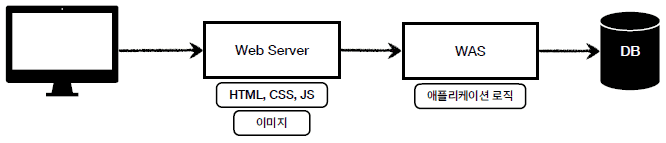
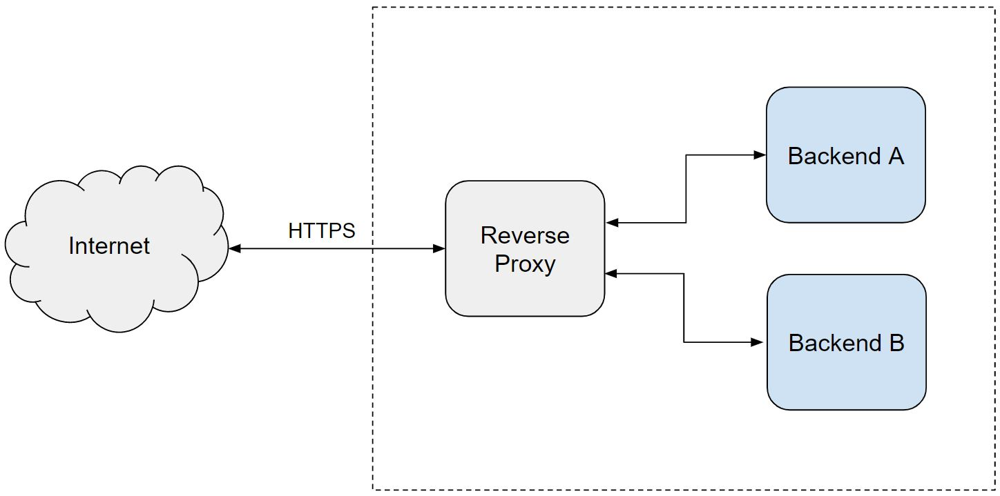

- WAS (Web Application Server) : 클라이언트 요청에 대해 적절한 데이터를 만들어주는 서버
  - ex. Node.js, SpringBoot

# Web Server 정적 콘텐츠 호스팅
- NGINX : 웹 서버

1. 웹 브라우저가 80번 포트로 요청
2. NGINX 가 요청에 대해 정적 콘텐츠(html) 응답

# NGINX 에서의 정적 콘텐츠 호스팅
- 웹 서버는 NGINX 의 설정 파일을 읽음
  - ubuntu : /etc/nginx/sites-available 디렉토리의 default 파일

```shell
##
# You should look at the following URL's in order to grasp a solid understanding
# of Nginx configuration files in order to fully unleash the power of Nginx.
# https://www.nginx.com/resources/wiki/start/
# https://www.nginx.com/resources/wiki/start/topics/tutorials/config_pitfalls/
# https://wiki.debian.org/Nginx/DirectoryStructure
#
# In most cases, administrators will remove this file from sites-enabled/ and
# leave it as reference inside of sites-available where it will continue to be
# updated by the nginx packaging team.
#
# This file will automatically load configuration files provided by other
# applications, such as Drupal or Wordpress. These applications will be made
# available underneath a path with that package name, such as /drupal8.
#
# Please see /usr/share/doc/nginx-doc/examples/ for more detailed examples.
##

# Default server configuration
#
server {
        listen 80 default_server;
        listen [::]:80 default_server;

        # SSL configuration
        #
        # listen 443 ssl default_server;
        # listen [::]:443 ssl default_server;
        #
        # Note: You should disable gzip for SSL traffic.
        # See: https://bugs.debian.org/773332
        #
        # Read up on ssl_ciphers to ensure a secure configuration.
        # See: https://bugs.debian.org/765782
        #
        # Self signed certs generated by the ssl-cert package
        # Don't use them in a production server!
        #
        # include snippets/snakeoil.conf;

        root /var/www/html;

        # Add index.php to the list if you are using PHP
        index index.html index.htm index.nginx-debian.html;

        server_name _;

        location / {
                # First attempt to serve request as file, then
                # as directory, then fall back to displaying a 404.
                try_files $uri $uri/ =404;
        }

        # pass PHP scripts to FastCGI server
        #
        #location ~ \.php$ {
        #       include snippets/fastcgi-php.conf;
        #
        #       # With php-fpm (or other unix sockets):
        #       fastcgi_pass unix:/var/run/php/php7.4-fpm.sock;
        #       # With php-cgi (or other tcp sockets):
        #       fastcgi_pass 127.0.0.1:9000;
        #}

        # deny access to .htaccess files, if Apache's document root
        # concurs with nginx's one
        #
        #location ~ /\.ht {
        #       deny all;
        #}
}


# Virtual Host configuration for example.com
#
# You can move that to a different file under sites-available/ and symlink that
# to sites-enabled/ to enable it.
#
#server {
#       listen 80;
#       listen [::]:80;
#
#       server_name example.com;
#
#       root /var/www/example.com;
#       index index.html;
#
#       location / {
#               try_files $uri $uri/ =404;
#       }
#}
```

- root : 정적 콘텐츠를 찾는 시작 디렉토리
- index : 기본 요청에 응답할 파일 설정

### nginx 설정 파일에서의 location 블록
1. /etc/nginx/sites-available/default 에 설정 추가
```shell
location /temp{
                root /var/www;
                index temp.html
                try_files $uri $uri/ =404;
        }
```
➡️ /temp 앞에 /var/www 를 붙여서 /var/www/temp 디렉토리에서 temp.html 정적 파일 찾기

2. /var/www 이동 후 temp.html 문서 생성
```shell
sudo systemctl restart nginx
sudo mkdir temp
sudo vi temp.html
```
```html
<h1> hi UMC! <h1>
```

3. 웹 브라이저에서 /temp 로 접속
➡️ html 이 화면에 뜨면 성공

# Web Server Vs. Web Application Server (WAS)


# Reverse Proxy
- 클라이언트와 서버 간 통신을 중계하고 보안, 성능 개선 등의 목적을 위해 중간에 위치하는 서버
- 내부(같은 컴퓨터)의 다른 서버로 요청 전송
- cf) forward proxy : 다른 외부(다른 컴퓨터) 서버로 요청 전송



# NGINX 에서 Reverse Proxy 설정하기
1. nginx 설정 파일 변경
```shell
location / {
                proxy_pass http://localhost:3000;
                # First attempt to serve request as file, then
                # as directory, then fall back to displaying a 404.
                try_files $uri $uri/ =404;
        }
```

2. nginx 재시작 후 웹 브라우저 접속
➡️ 502 Bad Gateway 에러 반환 시 성공 (현재 3000번 포트 프로세스 없기 때문)