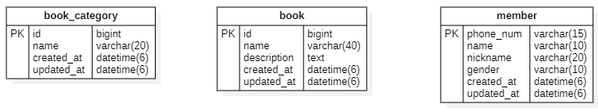
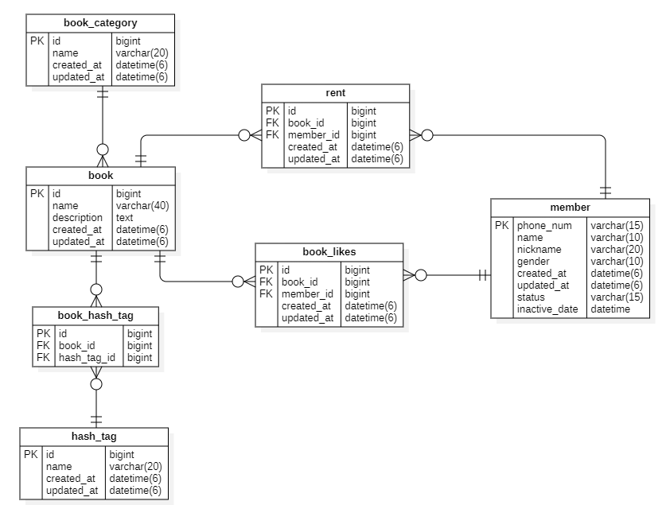
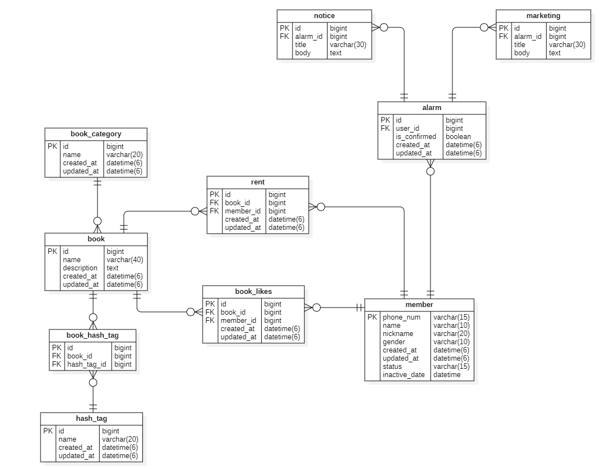
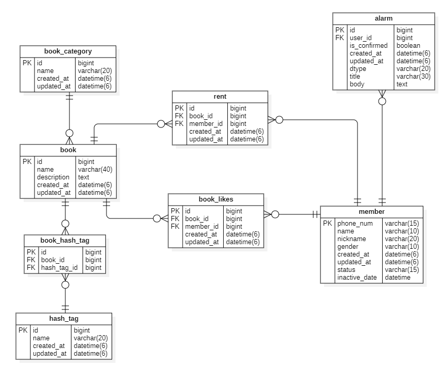
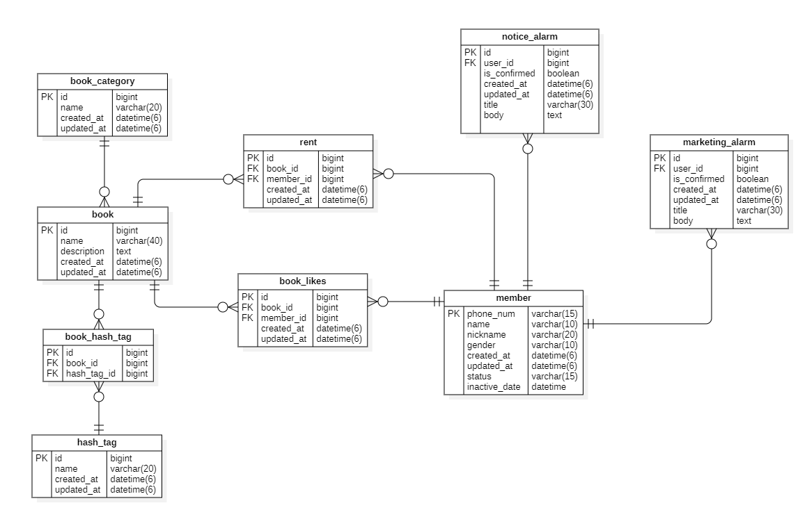

💡 데이터베이스 설계하는 방법
- 설계 결과물 : **ERD**
- 프로젝트 시작과 동시에 설계 → 모두가 공통된 데이터베이스 인지 후 작업 시작

# DATABASE 설계 - 도서 대여 관리 app
## 요구 사항
### 사용자 관련 요구 사항
- 카카오 소셜 로그인
- 회원 탈퇴
- 이름, 닉네임, 전화번호, 성별

### 책 관련 요구 사항
- 사용자가 여러 권의 책 대여 가능
- 책 한 권에 해시태그 여러 개, 해시태그 하나가 여러 책에 붙을 수 있음
- 좋아요 기능
- 카테고리 별 책 수 집계
- 하나의 카테고리
- 제목, 설명 정보

### 알림 관련 요구 사항
- 공지 관련 알림
- 책 반납 시간 임박 알림
- 마케팅 알림

## 설계 규칙
1. 테이블 이름 & 칼럼 이름 → 소문자
2. 단어 구분 → 밑줄로 구분
3. 기본 키 : index 따로 두기 → id
4. 기본 키 타입 : bigint

- MySQL varchar 최대 20글자
- text 타입 : 길이 제한 없음
- gender 관리 유형 
  - 0이면 남자, 1이면 여자
  - varchar → enum 으로 문자 관리

- 최신순 정렬 → 밀리초까지 구분 설계
  - datetime(6)

- member 테이블 : status-varchar(15), inactive_date-datetime 추가
  - 비활성 상태 : 일정 기간 동안 비활성인 경우 자동 삭제
  - status : active, inactive → enum 관리
  - inactive_date : 얼마 동안 비활성된 상태인지
  - 자동으로 지우는 방법 : batch (정해진 시간에 자동으로 실행되는 프로세스)
    - soft delete

- 좋아요 개수 : 순수 DML 연산으로 book_likes 에서 해당 책 아이디를 가진 것이 몇 개인지 직접 세는 것이 좋음

## 연관 관계
- 카테고리와 책 → 1:N
- 사용자와 책 → N:M
- 책과 해시태그 → N:M
- 책과 사용자가 누르는 좋아요 → N:M
- N:M 관계는 가운데에 매핑 테이블을 따로 두기
  - 가운데 매핑 테이블이 양쪽의 기본 키를 외래 키로 가지며 각각 1:N 관계

## 알림
- 공지 사항 알림 터치 시 해당 공지 사항으로 이동
- 마케팅 알림 터치 시 해당 마케팅으로 이동

### 1. 슈퍼 타입 & 서브 타입

### 2. 하나의 테이블에서 dtype 으로 구분

### 3. 모든 테이블 설계

