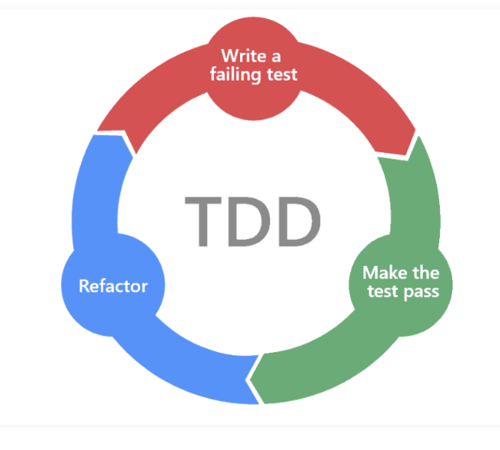
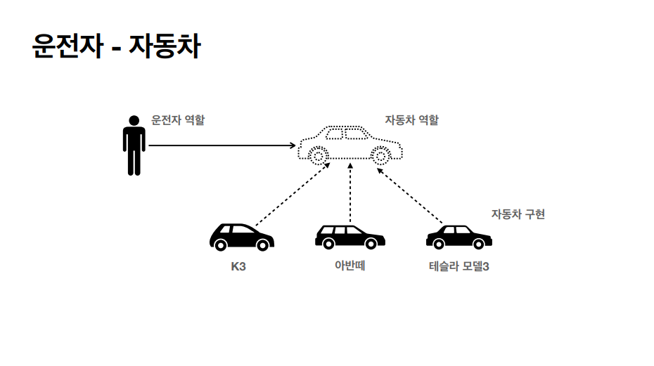
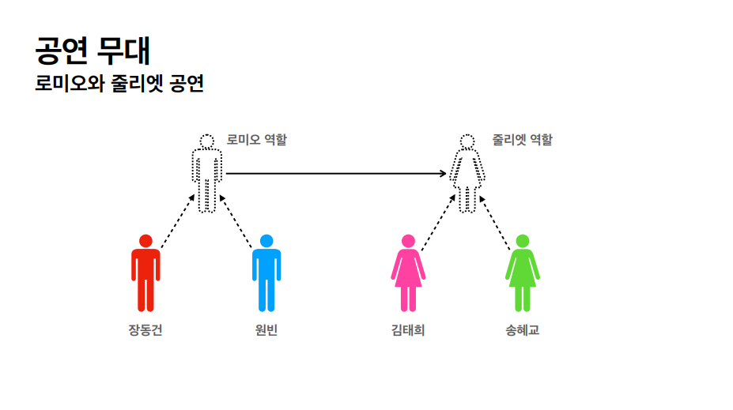
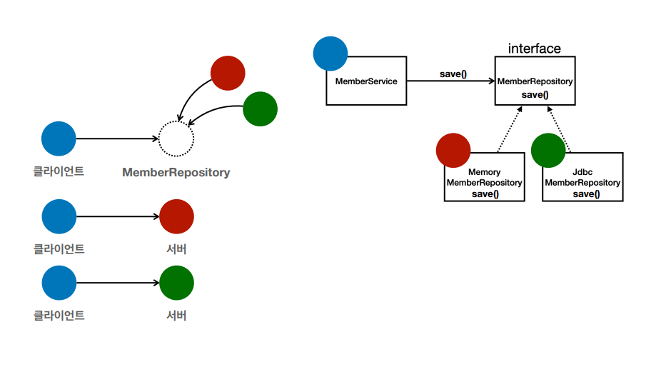
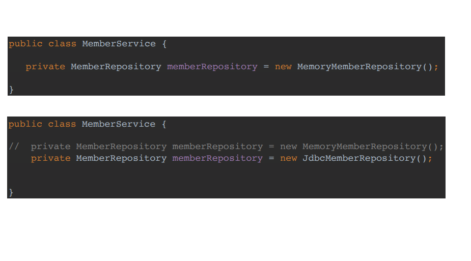
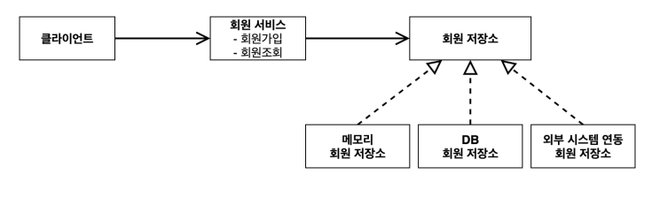
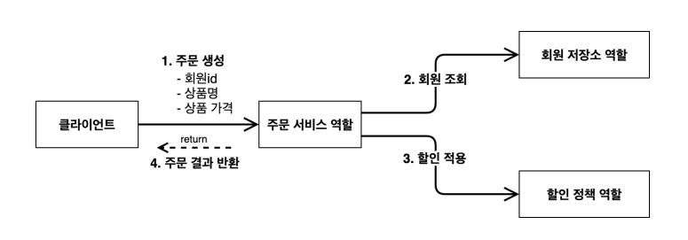
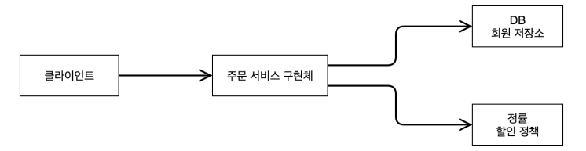
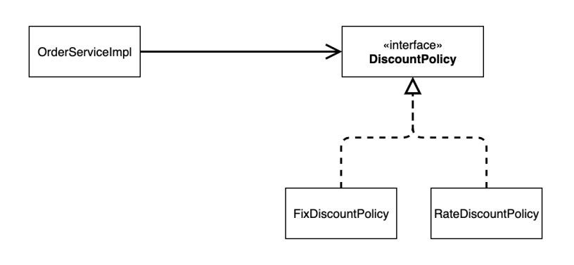

<**필수 정리 내용**>

💡 **아래 키워드에 대해 서술하시오.**

1. **컨트롤러, 서비스, 리포지토리의 역할**

   **Controller**는 View에서 전송받은 정보를 Service에게 넘긴다.

   **Service**에서 핵심 비즈니스 로직을 수행 후 DB 접근이 필요하면 Repository에게 요청한다.

   **Repository**는 DB와 접근하기 위해 필요하다.


2. **TDD란? 왜 하는가?**

   **TDD**란 **테스트 주도 개발(Test Driven Development)** 이라고 한다.

   반복 테스트를 이용한 소프트웨어 방법론으로 **작은 단위의 테스트 케이스**를 작성하고 이를 통과하는 코드를 추가하는 단계를 반복하여 구현한다.

   **단위 테스트(unit Test)**는 말 그대로 한 단위(일반적으로 class)만을 테스트 하는 것이다.

   

   **TDD 개발 주기**

    - **Red** 단계에서는 실패하는 테스트 코드를 먼저 작성
    - **Green** 단계에서는 테스트 코드를 성공시키기 위한 실제 코드 작성
    - **Blue** 단계에서는 중복 코드 제거, 일반화 등의 리팩토링 수행

   → 중요한 것은 **실패하는 테스트 코드를 작성할 때까지 실제 코드를 작성하지 않는 것**과, 실패하는 테스트를 통과할 정도의 **최소 실제 코드**를 작성해야 하는 것이다. 이를 통해 실제 코드에 대해 기대되는 바를 보다 명확하게 정의 함으로써 **불필요한 설계**를 피할 수 있고, **정확한 요구 사항에 집중**할 수 있다.


### **IntelliJ 윈도우 단축키**

---

디렉토리, 패키지, 클래스 등 생성 목록 보기

- command+N → **Alt + Insert**

변수 추출하기

- command+option+V → **Ctrl+Alt+V**

JUnit 단위테스트 생성

- command+shift+T → Ctrl+Shift+T

메서드 추출

- Command+Option+M → Ctrl+Alt+m


## 좋은 객체 지향 프로그래밍이란

----

**객체 지향 특징**

- 추상화
- 캡슐화
- 상속
- 다형성

**다형성의 실세계 비유**

→ **역할**(인터페이스)과 **구현**(객체)로 세상을 구분



❗ 자동차가 K3에서 테슬라로 바뀌어도 운전자에게 영향을 주지 않는다


why?

자동차 인터페이스에 따라 구현한 객체들이기 때문

운전자(클라이언트)는 자동차 역할(인터페이스)에만 의존

클라이언트는 자동차의 내부 구조에 대해 알 필요가 없다

새로운 자동차가 나와도 운전자는 새로운 것을 배우지 않아도 된다 → 운전자는 그대로



로미오(클라이언트), 줄리엣(서버)

줄리엣 역할을 맡은 배우가 바뀐다고 해서 (구현이 변경) 로미오에게 영향을 주지 않는다

배우 변경 가능 = 다른 대상으로 대체 가능 → 유연, 변경 용이

---

**역할과 구현을 분리**

- **역할**과 **구현**으로 구분하면 세상에 **단순**해지고, **유연**해지며 **변경**도 편리해진다
- 장점
    - **클라이언트**는 대상의 역할(인터페이스)만 알면 된다
    - **클라이언트**는 구현 대상의 **내부 구조를 몰라도** 된다
    - **클라이언트**는 구현 대상의 **내부 구조가 변경**되어도 영향을 받지 않는다
    - **클라이언트는** 구현 **대상 자체를 변경**해도 영향을 받지 않는다

**자바 언어**

- 자바 언어의 다형성을 활용
    - 역할 = 인터페이스
    - 구현 = 인터페이스를 구현한 클래스, 구현 객체
- 객체를 설계할 때 **역할**과 **구현**을 명확히 분리
- 객체 설계시 역할(인터페이스)를 먼저 부여하고, 그 역할을 수행하는 구현 객체 만들기

**다형성의 본질**

- 인터페이스를 구현한 객체 인스턴스를 **실행 시점**에 **유연**하게 **변경**할 수 있다
- 다형성의 본질을 이해하려면 **협력**이라는 객체 사이의 관계에서 시작해야함
- **클라이언트를 변경하지 않고, 서버 구현 기능을 유연하게 변경할 수 있다**

**정리**

- 실세계의 역할과 구현이라는 편리한 컨셉을 다형성을 통해 객체 세상으로 가져올 수 있음
- 유연하고, 변경이 용이
- 확장 가능한 설계
- 클라이언트에 영향을 주지 않는 변경 가능
- 인터페이스를 안정적으로 잘 설계하는 것이 중요

**한계**

- 역할(인터페이스) 자체가 변하면, 클라이언트, 서버 모두에 큰 변경이 발생한다
- 자동차를 비행기로 변경해야 한다면?
- 대본 자체가 변경된다면?
- 인터페이스를 안정적으로 잘 설계하는 것이 중요

---

**스프링과 객체 지향**

- 다형성이 가장 중요하다!
- 스프링은 다형성을 극대화해서 이용할 수 있게 도와준다
- 스프링에서 이야기하는 제어의 역전(IoC), 의존관계 주입(DI)은 다형성을 활용해서 역할과 구현을 편리하게 다룰 수 있도록 지원한다
- 스프링을 사용하면 마치 레고 블럭을 조립하듯이! 공연 무대의 배우를 선택하듯이! 구현을 편리하게 변경할 수 있다


## 좋은 객체 지향 설계의 5가지 원칙(SOLID)

---

<span style='background-color: #f5f0ff'> SRP: 단일 책임 원칙 (single responsibility principle) </span>

- 한 클래스는 하나의 책임만 가져야 한다
- 하나의 책임이라는 것은 모호하다
- **중요한 기준은 변경**이다. 변경이 있을 때 파급 효과가 적으면 단일 책임 원칙을 잘 따른 것
- ex) UI 변경, 객체의 생성과 사용을 분리

<span style='background-color: #f1f8ff'> 📍 OCP: 개방-폐쇄 원칙 (Open/closed principle)</span>

- 소프트웨어 요소는 **확장에는 열려**있으나 **변경에는 닫혀**있어야 한다
- 확장을 하려면, 당연히 기존 코드를 변경해야 하지 않은가?
- **다형성**을 활용해보자
- 인터페이스를 구현한 새로운 클래스를 하나 만들어서 새로운 기능을 구현
- 지금까지 배운 역할과 구현의 분리를 생각해보자


→ 자동차가 기름차인 K3에서 전기차인 테슬라로 변경되어도 운전자는 그대로 운전 가능



MemberService(클라이언트)가 MemberRepository(인터페이스)를 알고 있고, MemberRepository의 구현으로 MemoryMemberRepository와 JdbcMemberRepository가 있음

만약 MemoryMemberRepository만 존재하다가 JdbcMemberRepository를 새로 생성했고, 내 프로그램을 Memory~ 에서 Jdbc~로 변경하고 싶을 상황

OCP원칙을 잘 지키고 있다고 하면 MemberService의 코드를 변경하지 않아도 되는데,



→ 이 경우에는 변경이 필요한 상황 → OCP가 잘 지켜지지 않은 것

**문제점**

- MemberService 클라이언트가 구현 클래스를 직접 선택

```java
MemberRepository m = new MemoryMemberRepository (); //기존 코드
MemberRepository m = new JdbcMemberRepository (); // 변경 코드
```

- **구현 객체를 변경하려면 클라이언트 코드를 변경해야 한다**
- **분명 다형성을 사용했지만 OCP원칙을 지킬 수 없다**
- 이 문제를 어떻게 해결?
- 객체를 생성하고, 연관 관계를 맺어주는 별도의 조립, 설정자가 필요하다 → **스프링 컨테이너**

<span style='background-color: #f1f8ff'> LSP: 리스코프 치환 원칙 (Liskov substitution principle) </span>

- 프로그램의 객체는 프로그램의 정확성을 깨뜨리지 않으면서 하위 타입의 인스턴스로 바꿀 수 있어야 한다
- 다형성에서 하위 클래스는 인터페이스 규약을 다 지켜야 한다는 것, 다형성을 지원하기 위한 원칙, 인터페이스를 구현한 구현체는 믿고 시용하려면, 이 원칙이 필요하다
- 단순히 컴파일에 성공하는 것을 넘어서는 이야기
- ex) 자동차 인터페이스의 엑셀은 앞으로 가라는 기능, 뒤로 가게 구현하면 **컴파일 오류는 안나지만** **LSP 위반**, 느리더라도 앞으로 가야함

<span style='background-color: #f1f8ff'> ISP: 인터페이스 분리 원칙 (Interface segregation principle) </span>

- 특정 클라이언트를 위한 인터페이스 여러 개가 범용 인터페이스 하나보다 낫다
- 자동차 인터페이스 → 운전 인터페이스와 정비 인터페이스로 분리
- 사용자 클라이언트 → 운전자 클라이언트와 정비사 클라이언트로 분리
- 분리하면 정비 인터페이스 자체가 변해도 운전자 클라이언트에 영향을 주지 않음
- 인터페이스가 명확해지고 대체 가능성이 높아진다

<span style='background-color: #f1f8ff'> 📍DIP: 의존 관계 역전 원칙 (Dependency inversion principle)</span>

- 프로그래머는 “추상화에 의존해야지, 구체화에 의존하면 안된다.” 의존성 주입은 이 원칙을 따르는 방법 중에 하나다
- 쉽게 이야기 해서 구현 클래스에 의존하지 말고, 인터페이스에 의존하라는 뜻
- 앞에서 이야기한 **역할(Role)에 의존하게 해야 한다는 것과 같다**. 객체 세상도 클라이언트가 인터페이스에 의존해야 유연하게 구현체를 변경할 수 있다! 구현체에 의존하게 도면 변경이 아주 어려워진다

```java
public class MemberService {
// private MemberRepository m = new MemoryMemberRepository ();
	 private MemberRepository m = new JdbcMemberRepository ();
}
```

- 위의 경우 MemberService는 인터페이스에 의존하지만, 구현 클래스도 동시에 의존한다.
- MemberService 클라이언트가 구현 클래스를 직접 선택
    - MemberRepository m = new **MemoryMemberRepository**();
- **DIP 위반**

**정리**

- 객체 지향의 핵심은 다형성
- 다형성 만으로는 쉽게 부품을 갈아 끼우듯이 개발할 수 없다
- 다형성 만으로는 구현 객체를 변경할 때 클라이언트 코드도 함께 변경된다
- **다형성 만으로는 OCP, DIP를 지킬 수 없다**
- 뭔가 더 필요하다

## 객체 지향 설계와 스프링

---
**스프링 이야기에 왜 객체 지향 이야기가 나오는가?**

- 스프링은 다음 기술로 다형성 + OCP, DIP를 가능하게 지원
    - DI(Dependency Injection): 의존관계, 의존성 주입
    - DI 컨테이너 제공
- **클라이언트 코드의 변경 없이 기능 확장**
- 쉽게 부품을 교체하듯이 개발

******정리******

- 모든 설계에 ****************역할****************과 ******구현******을 분리하자
- 자동차, 공연의 예를 떠올려보자
- 애플리케이션 설계도 공연을 설계하듯이 배역만 만들어두고, 배우는 언제든지 **유연**하게 **변경**할 수 있도록 만드는 것이 좋은 객체 지향 설계다
- 이상적으로는 모든 설계에 인터페이스를 부여하자

******************실무 고민******************

- 하지만 인터페이스를 도입하면 추상화라는 비용이 발생한다
- 기능을 확장할 가능성이 없다면, 구체 클래스를 직접 사용하고, 향후 꼭 필요할 때 리팩터링해서 인터페이스를 도입하는 것도 방법이다

---

## **비즈니스 요구 사항과 설계**

---

- 회원
    - 회원을 가입하고 조회할 수 있다.
    - 회원은 일반과 VIP 두 가지 등급이 있다.
    - 회원 데이터는 자체 DB를 구축할 수 있고, 외부 시스템과 연동할 수 있다. (미확정)
- 주문과 할인 정책
    - 회원은 상품을 주문할 수 있다.
    - 회원 등급에 따라 할인 정책을 적용할 수 있다.
    - 할인 정책은 모든 VIP는 1000원을 할인해주는 고정 금액 할인을 적용해달라. (나중에 변경 될 수 있다.)
    - 할인 정책은 변경 가능성이 높다. 회사의 기본 할인 정책을 아직 정하지 못했고, 오픈 직전까지 고민을 미루
      고 싶다. 최악의 경우 할인을 적용하지 않을 수 도 있다. (미확정)

회원 데이터, 할인 정책 같은 부분은 지금 결정하기 어려운 부분

그렇다고 이런 정책이 결정될 때까지 개발을 무기한 기다릴 수 도 없다

우리는 앞에서 배운 객체 지향 설계 방법이 있지 않은가! → **역할과 구현 분리**

인터페이스를 만들고 구현체를 언제든지 갈아끼울 수 있도록 설계하면 된다

> **참고**: 프로젝트 환경설정을 편리하게 하려고 스프링 부트를 사용한 것이다. 지금은 스프링 없는 순수한 자바로만
개발을 진행한다는 점을 꼭 기억하자! 스프링 관련은 한참 뒤에 등장한다.
>

---

## 회원 도메인 설계

**회원 도메인 요구사항**

- 회원을 가입하고 조회할 수 있다.
- 회원은 일반과 VIP 두 가지 등급이 있다.
- 회원 데이터는 자체 DB를 구축할 수 있고, 외부 시스템과 연동할 수 있다. (미확정)

**회원 도메인 협력 관계**


→ 메모리 회원 저장소로 개발 진행 (재부팅 시 데이터 초기화) → DB나 외부시스템 중 확정이 되면 갈아끼우기

**회원 클래스 다이어그램**


**회원 객체 다이어그램**


## 회원 도메인 개발

---
### **회원 엔티티**

---

**회원 등급**

```java
package hello.core.member;
public enum Grade {
 BASIC,
 VIP
}
```

**회원 엔티티**

```java
package hello.core.member;
public class Member {
 private Long id;
 private String name;
 private Grade grade;
 public Member(Long id, String name, Grade grade) {
 this.id = id;
 this.name = name;
 this.grade = grade;
 }
 public Long getId() {
 return id;
 }
 public void setId(Long id) {
 this.id = id;
 }
 public String getName() {
 return name;
 }
 public void setName(String name) {
 this.name = name;
 }
 public Grade getGrade() {
 return grade;
 }
 public void setGrade(Grade grade) {
 this.grade = grade;
 }
}
```

### 회원 저장소

---

**회원 저장소 인터페이스**

```java
package hello.core.member;
public interface MemberRepository {
	 void save(Member member);
	 Member findById(Long memberId);
}
```

**메모리 회원 저장소 구현체**

```java
package hello.core.member;

import java.util.HashMap;
import java.util.Map;

public class MemoryMemberRepository implements MemberRepository {
	 private static Map<Long, Member> store = new HashMap<>();

	 @Override
	 public void save(Member member) {
		 store.put(member.getId(), member);
	 }

	 @Override
	 public Member findById(Long memberId) {
		 return store.get(memberId);
	 }
}
```

→ 데이터베이스가 아직 확정이 안되었다. 그래도 개발은 진행해야 하니 가장 단순한, 메모리 회원 저장소를 구현해서 우선 개발을 진행하자.

> **참고:** HashMap 은 동시성 이슈가 발생할 수 있다. 이런 경우 ConcurrentHashMap 을 사용하자.
>

### 회원 서비스

---

**회원 서비스 인터페이스**

```java
package hello.core.member;

public interface MemberService {
	 void join(Member member);
	 Member findMember(Long memberId);
}
```

**회원 서비스 구현체**

```java
package hello.core.member;

public class MemberServiceImpl implements MemberService {
		private final MemberRepository memberRepository = new
	MemoryMemberRepository();
	 
		public void join(Member member) {
			 memberRepository.save(member);
	 }
		
		public Member findMember(Long memberId) {
			 return memberRepository.findById(memberId);
	 }
}
```

## 회원 도메인 실행과 테스트

---

### 회원 도메인 - 회원 가입 main


```java
package hello.core;

import hello.core.member.Grade;
import hello.core.member.Member;
import hello.core.member.MemberService;
import hello.core.member.MemberServiceImpl;

public class MemberApp {
	 public static void main(String[] args) {
		 MemberService memberService = new MemberServiceImpl();

		 Member member = new Member(1L, "memberA", Grade.VIP);
		 memberService.join(member);

		 Member findMember = memberService.findMember(1L);

		 System.out.println("new member = " + member.getName());
		 System.out.println("find Member = " + findMember.getName());
	 }
	}
```

→ 애플리케이션 로직으로 이렇게 테스트 하는 것은 좋은 방법이 아니다. JUnit 테스트를 사용하자.

### 회원 도메인 - 회원 가입 테스트


```java
package hello.core.member;

import org.assertj.core.api.Assertions;
import org.junit.jupiter.api.Test;
import static org.junit.jupiter.api.Assertions.*;

class MemberServiceTest {
	 MemberService memberService = new MemberServiceImpl();

	 @Test
	 void join() {

		 //given
		 Member member = new Member(1L, "memberA", Grade.VIP);

		 //when
		 memberService.join(member);
		 Member findMember = memberService.findMember(1L);

		 //then
		 Assertions.assertThat(member).isEqualTo(findMember);
	 }
}
```

### 회원 도메인 설계의 문제점

- 설계상의 문제점은 무엇일까?
- 다른 저장소로 변경할 때 OCP 원칙을 잘 준수할까?
- DIP를 잘 지키고 있을까?
- **의존관계가 인터페이스 뿐만 아니라 모두 의존하는 문제점이 있음**
    - **→ 주문까지 만들고 나서 문제점과 해결 방안을 설명**

## 주문과 할인 도메인 설계

---

**주문과 할인 정책**

- 회원은 상품을 주문할 수 있다.
- 회원 등급에 따라 할인 정책을 적용할 수 있다.
- 할인 정책은 모든 VIP는 1000원을 할인해주는 고정 금액 할인을 적용해달라. (나중에 변경 될 수 있다.)
- 할인 정책은 변경 가능성이 높다. 회사의 기본 할인 정책을 아직 정하지 못했고, 오픈 직전까지 고민을 미루
  고 싶다. 최악의 경우 할인을 적용하지 않을 수 도 있다. (미확정)

**주문 도메인 협력, 역할, 책임**



1. **주문 생성:** 클라이언트는 주문 서비스에 주문 생성을 요청한다.
2. **회원 조회**: 할인을 위해서는 회원 등급이 필요하다. 그래서 주문 서비스는 회원 저장소에서 회원을 조회한다.
3. **할인 적용:** 주문 서비스는 회원 등급에 따른 할인 여부를 할인 정책에 위임한다.
4. **주문 결과 반환:** 주문 서비스는 할인 결과를 포함한 주문 결과를 반환한다.

> **참고:** 실제로는 주문 데이터를 DB에 저장하겠지만, 예제가 너무 복잡해 질 수 있어서 생략하고, 단순히 주문 결과
를 반환한다.
>

**주문 도메인 전체**


→ **역할과 구현을 분리**해서 자유롭게 구현 객체를 조립할 수 있게 설계했다. 덕분에 회원 저장소는 물론, 할인 정책도 유연하게 변경할 수 있다.

**주문 도메인 클래스 다이어그램**


**주문 도메인 객체 다이어그램 1**


→ 회원을 메모리에서 조회하고, 정액 할인 정책을 지원해도 주문 서비스를 변경하지 않아도 된다.

→ 역할들의 협력 관계를 그대로 재사용 할 수 있다.

**주문 도메인 객체 다이어그램 2**



→ 회원을 메모리가 아닌 실제 DB에서 조회하고, 정률 할인 정책을 지원해도 주문 서비스를 변경하지 않아도 된다.

→ 협력 관계를 그대로 재사용 할 수 있다.

## 주문과 할인 도메인 개발

---
**할인 정책 인터페이스**
```java
package hello.core.discount;

import hello.core.member.Member;

public interface DiscountPolicy {
	 /**
	 * @return 할인 대상 금액
	 */
	 int discount(Member member, int price);
}
```

**정액 할인 정책 구현체**

```java
package hello.core.discount;

import hello.core.member.Grade;
import hello.core.member.Member;

public class FixDiscountPolicy implements DiscountPolicy {
	 private int discountFixAmount = 1000; //1000원 할인
	
	 @Override
	 public int discount(Member member, int price) {
		 if (member.getGrade() == Grade.VIP) {
			 return discountFixAmount;
		 } else {
			 return 0;
		 }
	 }
}
```

→ VIP면 1000원 할인, 아니면 할인 없음

→ **eNum은** isEqual()이 아닌 **== 사용**

**주문 엔티티**

```java
package hello.core.order;

public class Order {
	 private Long memberId;
	 private String itemName;
	 private int itemPrice;
	 private int discountPrice;
	 
	 public Order(Long memberId, String itemName, int itemPrice, int discountPrice) {
		 this.memberId = memberId;
		 this.itemName = itemName;
		 this.itemPrice = itemPrice;
		 this.discountPrice = discountPrice;
	 }

	 public int calculatePrice() {
		 return itemPrice - discountPrice;
	 }

	 public Long getMemberId() {
		 return memberId;
	 }

	 public String getItemName() {
		 return itemName;
	 }

	 public int getItemPrice() {
		 return itemPrice;
	 }

	 public int getDiscountPrice() {
		 return discountPrice;
	 }

	 @Override
	 public String toString() {
		 return "Order{" +
		 "memberId=" + memberId +
		 ", itemName='" + itemName + '\'' +
		 ", itemPrice=" + itemPrice +
		 ", discountPrice=" + discountPrice +
		 '}';
	 }
}
```

**주문 서비스 인터페이스**

```java
package hello.core.order;

public interface OrderService {
	 Order createOrder(Long memberId, String itemName, int itemPrice);
}
```

**주문 서비스 구현체**


```java
package hello.core.order;

import hello.core.discount.DiscountPolicy;
import hello.core.discount.FixDiscountPolicy;
import hello.core.member.Member;
import hello.core.member.MemberRepository;
import hello.core.member.MemoryMemberRepository;

public class OrderServiceImpl implements OrderService {
	 private final MemberRepository memberRepository = new MemoryMemberRepository();
	 private final DiscountPolicy discountPolicy = new FixDiscountPolicy();
	
	 @Override
	 public Order createOrder(Long memberId, String itemName, int itemPrice) {
		 Member member = memberRepository.findById(memberId);
		 int discountPrice = discountPolicy.discount(member, itemPrice);

		 return new Order(memberId, itemName, itemPrice, discountPrice);
	 }
}
```

→ 주문 생성 요청이 오면, 회원 정보를 조회하고, 할인 정책을 적용한 다음 주문 객체를 생성해서 반환한다.

**→ 메모리 회원 리포지토리와, 고정 금액 할인 정책을 구현체로 생성한다.**

## 주문과 할인 도메인 실행과 테스트

---

```java
package hello.core.order;

import hello.core.member.Grade;
import hello.core.member.Member;
import hello.core.member.MemberService;
import hello.core.member.MemberServiceImpl;
import org.assertj.core.api.Assertions;
import org.junit.jupiter.api.Test;
import static org.junit.jupiter.api.Assertions.*;

class OrderServiceTest {
	 MemberService memberService = new MemberServiceImpl();
	 OrderService orderService = new OrderServiceImpl();

	 @Test
	 void createOrder() {
		 long memberId = 1L;
		 Member member = new Member(memberId, "memberA", Grade.VIP);

		 memberService.join(member);

		 Order order = orderService.createOrder(memberId, "itemA", 10000);

		 Assertions.assertThat(order.getDiscountPrice()).isEqualTo(1000);
		 }
}
```


## 새로운 할인 정책 개발

---

**새로운 할인 정책을 확장해보자.**

- **악덕 기획자:** 서비스 오픈 직전에 할인 정책을 지금처럼 고정 금액 할인이 아니라 좀 더 합리적인 주문 금액당 할
  인하는 정률% 할인으로 변경하고 싶어요. 예를 들어서 기존 정책은 VIP가 10000원을 주문하든 20000원을 주
  문하든 항상 1000원을 할인했는데, 이번에 새로 나온 정책은 10%로 지정해두면 고객이 10000원 주문시 1000
  원을 할인해주고, 20000원 주문시에 2000원을 할인해주는 거에요!
- **순진 개발자:** 제가 처음부터 고정 금액 할인은 아니라고 했잖아요.
- **악덕 기획자:** 애자일 소프트웨어 개발 선언 몰라요? “계획을 따르기보다 변화에 대응하기를”
- **순진 개발자**: … (하지만 난 유연한 설계가 가능하도록 객체지향 설계 원칙을 준수했지 후후)

> **참고:** 애자일 소프트웨어 개발 선언 https://agilemanifesto.org/iso/ko/manifesto.html
>


**RateDiscountPolicy 추가**



RateDiscountPolicy 코드 추가

```java
package hello.core.discount;

import hello.core.member.Grade;
import hello.core.member.Member;

public class RateDiscountPolicy implements DiscountPolicy {
	 private int discountPercent = 10; //10% 할인

	 @Override
	 public int discount(Member member, int price) {
		 if (member.getGrade() == Grade.VIP) {
			 return price * discountPercent / 100;
		 } else {
			 return 0;
		 }
	 }
}
```

**테스트 작성**


```java
package hello.core.discount;

import hello.core.member.Grade;
import hello.core.member.Member;
import org.junit.jupiter.api.DisplayName;
import org.junit.jupiter.api.Test;
import static org.assertj.core.api.Assertions.*;
import static org.junit.jupiter.api.Assertions.*;

class RateDiscountPolicyTest {
	 RateDiscountPolicy discountPolicy = new RateDiscountPolicy();

	 @Test
	 @DisplayName("VIP는 10% 할인이 적용되어야 한다.")
	 void vip_o() {
		 //given
		 Member member = new Member(1L, "memberVIP", Grade.VIP);

		 //when
		 int discount = discountPolicy.discount(member, 10000);

		 //then
		 assertThat(discount).isEqualTo(1000);
		}

	 @Test
	 @DisplayName("VIP가 아니면 할인이 적용되지 않아야 한다.")
	 void vip_x() {
		 //given
		 Member member = new Member(2L, "memberBASIC", Grade.BASIC);

		 //when
		 int discount = discountPolicy.discount(member, 10000);

		 //then
		 assertThat(discount).isEqualTo(0);
	 }
}
```

## 새로운 할인 정책 적용과 문제점

---

**방금 추가한 할인 정책을 적용해보자.**

할인 정책을 변경하려면 클라이언트인 OrderServiceImpl 코드를 고쳐야 한다.

```java
public class OrderServiceImpl implements OrderService {
	// private final DiscountPolicy discountPolicy = new FixDiscountPolicy();
	private final DiscountPolicy discountPolicy = new RateDiscountPolicy();
}
```

**문제점 발견**

- 우리는 역할과 구현을 충실하게 분리했다. → OK
- OCP, DIP 같은 객체지향 설계 원칙을 충실히 준수했다
    - → 그렇게 보이지만 사실은 아니다.
- DIP: 주문서비스 클라이언트( OrderServiceImpl )는 DiscountPolicy 인터페이스에 의존하면서 DIP를
  지킨 것 같은데?
    - → 클래스 의존관계를 분석해 보자. 추상(인터페이스) 뿐만 아니라 구체(구현) 클래스에도 의존하고 있다.
        - 추상(인터페이스) 의존: DiscountPolicy
        - 구체(구현) 클래스: FixDiscountPolicy , RateDiscountPolicy
- OCP: 변경하지 않고 확장할 수 있다고 했는데!
    - → **지금 코드는 기능을 확장해서 변경하면, 클라이언트 코드에 영향을 준다!** 따라서 **OCP를 위반**한다.

**기대했던 의존 관계**


→ 지금까지 단순히 DicountPolicy 인터페이스만 의존한다고 생각했다

**실제 의존관계**


→ 잘 보면 클라이언트인 OrderServiceImpl이 DiscountPolicy 인터페이스 뿐만 아니라 FixDiscountPolicy인 구체 클래스도 함께 의존하고 있다. 실제 코드를 보면 의존하고 있다! **DIP 위반**

**정책 변경**


**중요! :** 그래서 FixDiscountPolicy를 RateDiscountPolicy로 변경하는 순간 OrderServiceImpl의 소스 코드도 함꼐 변경해야 한다! **OCP 위반**

**어떻게 문제를 해결할 수 있을까?**

- 클라이언트 코드인 OrderServiceImpl 은 DiscountPolicy 의 인터페이스 뿐만 아니라 구체 클래스도 함께 의존한다
- 그래서 구체 클래스를 변경할 때 클라이언트 코드도 함께 변경해야 한다.
- **DIP 위반 →** 추상에만 의존하도록 변경(인터페이스에만 의존)
- DIP를 위반하지 않도록 인터페이스에만 의존하도록 의존관계를 변경하면 된다

→ **인터페이스에만 의존하도록 설계를 변경하자**


**인터페이스에만 의존하도록 코드 변경**

```java
public class OrderServiceImpl implements OrderService {
	 //private final DiscountPolicy discountPolicy = new RateDiscountPolicy();
	 private DiscountPolicy discountPolicy;
}
```

- 인터페이스에만 의존하도록 설계와 코드를 변경했다.
- **그런데 구현체가 없는데 어떻게 코드를 실행할 수 있을까?**
- 실제 실행을 해보면 NPE(null pointer exception)가 발생한다.

**해결 방안**

→ 이 문제를 해결하려면 누군가가 클라이언트인 OrderServiceImpl 에 DiscountPolicy 의 구현 객체를 대
신 생성하고 주입해주어야 한다.

## 관심사의 분리

---

- 애플리케이션을 하나의 공연이라 생각해보자. 각각의 인터페이스를 배역(배우 역할)이라 생각하자. 그런데! 실제
  배역 맞는 배우를 선택하는 것은 누가 하는가?
- 로미오와 줄리엣 공연을 하면 로미오 역할을 누가 할지 줄리엣 역할을 누가 할지는 배우들이 정하는게 아니다. 이전 코드는 마치 로미오 역할(인터페이스)을 하는 레오나르도 디카프리오(구현체, 배우)가 줄리엣 역할(인터페이
  스)을 하는 여자 주인공(구현체, 배우)을 직접 초빙하는 것과 같다. 디카프리오는 공연도 해야하고 동시에 여자 주
  인공도 공연에 직접 초빙해야 하는 **다양한 책임**을 가지고 있다.

**관심사를 분리하자**

- 배우는 본인의 역할인 배역을 수행하는 것에만 집중해야 한다.
- 디카프리오는 어떤 여자 주인공이 선택되더라도 똑같이 공연을 할 수 있어야 한다.
- 공연을 구성하고, 담당 배우를 섭외하고, 역할에 맞는 배우를 지정하는 책임을 담당하는 별도의 **공연 기획자**가 나올시점이다.
- 공연 기획자를 만들고, 배우와 공연 기획자의 책임을 확실히 분리하자

### AppConfig 등장

---

애플리케이션의 전체 동작 방식을 구성(config)하기 위해, **구현 객체를 생성**하고, **연결**하는 책임을 가지는 별도의 설정 클래스를 만들자.

**AppConfig**

```java
package hello.core;

import hello.core.discount.FixDiscountPolicy;
import hello.core.member.MemberService;
import hello.core.member.MemberServiceImpl;
import hello.core.member.MemoryMemberRepository;
import hello.core.order.OrderService;
import hello.core.order.OrderServiceImpl;

public class AppConfig {
	 public MemberService memberService() {
			 return new MemberServiceImpl(new MemoryMemberRepository());
		 }
	 public OrderService orderService() {
			 return new OrderServiceImpl( new MemoryMemberRepository(), new FixDiscountPolicy());
	 }
}
```

- AppConfig는 애플리케이션의 실제 동작에 필요한 **구현 객체를 생성**한다.
    - MemberServiceImpl
    - MemoryMemberRepository
    - OrderServiceImpl
    - FixDiscountPolicy
- AppConfig는 생성한 객체 인스턴스의 참조(레퍼런스)를 **생성자를 통해서 주입(연결)**해준다.
    - MemberServiceImpl → MemoryMemberRepository
    - OrderServiceImpl → FixDiscountPolicy

**MemberServiceImpl - 생성자 주입**

```java
package hello.core.member;

public class MemberServiceImpl implements MemberService {
	 private final MemberRepository memberRepository;

	 public MemberServiceImpl(MemberRepository memberRepository) {
		 this.memberRepository = memberRepository;
	 }
	 public void join(Member member) {
		 memberRepository.save(member);
	 }
	 public Member findMember(Long memberId) {
		 return memberRepository.findById(memberId);
	 }
}
```

- 설계 변경으로 MemberServiceImpl 은 MemoryMemberRepository 를 의존하지 않는다!
- 단지 MemberRepository 인터페이스만 의존한다.
- MemberServiceImpl 입장에서 생성자를 통해 어떤 구현 객체가 들어올지(주입될지)는 알 수 없다.
- MemberServiceImpl 의 생성자를 통해서 어떤 구현 객체를 주입할지는 오직 외부( AppConfig )에서 결정된다.
- MemberServiceImpl 은 이제부터 **의존관계에 대한 고민은 외부**에 맡기고 **실행에만 집중**하면 된다

**클래스 다이어그램**


- 객체의 생성과 연결은 AppConfig 가 담당한다.
- **DIP 완성:** MemberServiceImpl 은 MemberRepository 인 추상에만 의존하면 된다. 이제 구체 클래스를 몰라도 된다.
- **관심사의 분리:** 객체를 생성하고 연결하는 역할과 실행하는 역할이 명확히 분리되었다.

**회원 객체 인스턴스 다이어그램**


- appConfig 객체는 memoryMemberRepository 객체를 생성하고 그 참조값을 memberServiceImpl 을
  생성하면서 생성자로 전달한다.
- 클라이언트인 memberServiceImpl 입장에서 보면 의존관계를 마치 외부에서 주입해주는 것 같다고 해서 DI(Dependency Injection) 우리말로 의존관계 주입 또는 의존성 주입이라 한다.

**OrderServiceImpl - 생성자 주입**

```java
package hello.core.order;

import hello.core.discount.DiscountPolicy;
import hello.core.member.Member;
import hello.core.member.MemberRepository;

public class OrderServiceImpl implements OrderService {
	 private final MemberRepository memberRepository;
	 private final DiscountPolicy discountPolicy;

	 public OrderServiceImpl(MemberRepository memberRepository, DiscountPolicy discountPolicy) {
		 this.memberRepository = memberRepository;
		 this.discountPolicy = discountPolicy;
	 }

	 @Override
	 public Order createOrder(Long memberId, String itemName, int itemPrice) {
		 Member member = memberRepository.findById(memberId);
		 int discountPrice = discountPolicy.discount(member, itemPrice);

		 return new Order(memberId, itemName, itemPrice, discountPrice);
	 }
}
```

- 설계 변경으로 OrderServiceImpl 은 FixDiscountPolicy 를 의존하지 않는다!
  단지 DiscountPolicy 인터페이스만 의존한다.
- OrderServiceImpl 입장에서 생성자를 통해 어떤 구현 객체가 들어올지(주입될지)는 알 수 없다.
- OrderServiceImpl 의 생성자를 통해서 어떤 구현 객체을 주입할지는 오직 외부( AppConfig )에서 결정한다.
- OrderServiceImpl 은 이제부터 실행에만 집중하면 된다.
- OrderServiceImpl 에는 MemoryMemberRepository , FixDiscountPolicy 객체의 의존관계가 주
  입된다.

### **AppConfig 실행**

---

**사용 클래스 - MemberApp**

```java
package hello.core;

import hello.core.member.Grade;
import hello.core.member.Member;
import hello.core.member.MemberService;

public class MemberApp {
	 public static void main(String[] args) {
		 AppConfig appConfig = new AppConfig();

		 MemberService memberService = appConfig.memberService();

		 Member member = new Member(1L, "memberA", Grade.VIP);
		 memberService.join(member);

		 Member findMember = memberService.findMember(1L);

		 System.out.println("new member = " + member.getName());
		 System.out.println("find Member = " + findMember.getName());
	 }
}
```

**사용 클래스 - OrderApp**

```java
package hello.core;

import hello.core.member.Grade;
import hello.core.member.Member;
import hello.core.member.MemberService;
import hello.core.order.Order;
import hello.core.order.OrderService;

public class OrderApp {
	 public static void main(String[] args) {
		 AppConfig appConfig = new AppConfig();

		 MemberService memberService = appConfig.memberService();
		 OrderService orderService = appConfig.orderService();

		 long memberId = 1L;
		 Member member = new Member(memberId, "memberA", Grade.VIP);
		 memberService.join(member);

		 Order order = orderService.createOrder(memberId, "itemA", 10000);
		 System.out.println("order = " + order);
	 }
}
```

**테스트 코드 오류 수정**

```java
class MemberServiceTest {
	 MemberService memberService;

	 @BeforeEach
	 public void beforeEach() {
		 AppConfig appConfig = new AppConfig();
		 memberService = appConfig.memberService();
	 }
}

class OrderServiceTest {
	 MemberService memberService;
	 OrderService orderService;

	 @BeforeEach
	 public void beforeEach() {
		 AppConfig appConfig = new AppConfig();
		 memberService = appConfig.memberService();
		 orderService = appConfig.orderService();
	 }
}
```

테스트 코드에서 @BeforeEach 는 각 테스트를 실행하기 전에 호출된다.

**정리**

- AppConfig를 통해서 관심사를 확실하게 분리했다.
- 배역, 배우를 생각해보자.
- AppConfig는 공연 기획자다.
- AppConfig는 구체 클래스를 선택한다. 배역에 맞는 담당 배우를 선택한다. 애플리케이션이 어떻게 동작해야 할 지 전체 구성을 책임진다.
- 이제 각 배우들은 담당 기능을 실행하는 책임만 지면 된다.
- OrderServiceImpl 은 기능을 실행하는 책임만 지면 된다

## AppConfig 리팩터링

---

현재 AppConfig를 보면 **중복**이 있고, **역할**에 따른 **구현**이 잘 안보인다.

**기대하는 그림**


**리팩터링 전**

```java
package hello.core;

import hello.core.discount.FixDiscountPolicy;
import hello.core.member.MemberService;
import hello.core.member.MemberServiceImpl;
import hello.core.member.MemoryMemberRepository;
import hello.core.order.OrderService;
import hello.core.order.OrderServiceImpl;

public class AppConfig {
	 public MemberService memberService() {
		 return new MemberServiceImpl(new MemoryMemberRepository());
	 }

	 public OrderService orderService() {
		 return new OrderServiceImpl( new MemoryMemberRepository(), new FixDiscountPolicy());
	 }
}
```

→ 중복을 제거하고, 역할에 따른 구현이 보이도록 리팩터링 하자.

********리팩터링 후********

```java
package hello.core;

import hello.core.discount.DiscountPolicy;
import hello.core.discount.FixDiscountPolicy;
import hello.core.member.MemberRepository;
import hello.core.member.MemberService;
import hello.core.member.MemberServiceImpl;
import hello.core.member.MemoryMemberRepository;
import hello.core.order.OrderService;
import hello.core.order.OrderServiceImpl;

public class AppConfig {
	 public MemberService memberService() {
		 return new MemberServiceImpl(memberRepository());
	 }

	 public OrderService orderService() {
		 return new OrderServiceImpl( memberRepository(), discountPolicy());
	 }

	 public MemberRepository memberRepository() {
		 return new MemoryMemberRepository();
	 }

	 public DiscountPolicy discountPolicy() {
		 return new FixDiscountPolicy();
	 }
}
```

- new MemoryMemberRepository() 이 부분이 중복 제거되었다. 이제 MemoryMemberRepository 를
  다른 구현체로 변경할 때 한 부분만 변경하면 된다.
- AppConfig 를 보면 역할과 구현 클래스가 한눈에 들어온다. 애플리케이션 전체 구성이 어떻게 되어있는지 빠르게 파악할 수 있다

## 새로운 구조와 할인 정책 적용

---

- 처음으로 돌아가서 정액 할인 정책을 정률% 할인 정책으로 변경해보자.
- FixDiscountPolicy → RateDiscountPolicy
- 어떤 부분만 변경하면 되겠는가? → **AppConfig**

**AppConfig의 등장으로 애플리케이션이 크게 사용 영역과, 객체를 생성하고 구성(Configuration)하는 영역으로 분리되었다.**

**사용, 구성의 분리**


**할인 정책의 변경**


- FixDiscountPolicy → RateDiscountPolicy로 변경해도 구성 영역만 영향을 받고, 사용 영역은 전혀 영향을 받지 않는다.

**할인 정책 변경 구성 코드**


```java
package hello.core;

import hello.core.discount.DiscountPolicy;
import hello.core.discount.FixDiscountPolicy;
import hello.core.discount.RateDiscountPolicy;
import hello.core.member.MemberRepository;
import hello.core.member.MemberService;
import hello.core.member.MemberServiceImpl;
import hello.core.member.MemoryMemberRepository;
import hello.core.order.OrderService;
import hello.core.order.OrderServiceImpl;

public class AppConfig {
	 public MemberService memberService() {
		 return new MemberServiceImpl(memberRepository());
	 }

	 public OrderService orderService() {
		 return new OrderServiceImpl(memberRepository(), discountPolicy());
	 }

	 public MemberRepository memberRepository() {
		 return new MemoryMemberRepository();
	 }

	 public DiscountPolicy discountPolicy() {
		// return new FixDiscountPolicy();
		 return new RateDiscountPolicy();
	 }
	}
```

- AppConfig 에서 할인 정책 역할을 담당하는 구현을 FixDiscountPolicy RateDiscountPolicy 객체로 변경했다.
- 이제 할인 정책을 변경해도, 애플리케이션의 구성 역할을 담당하는 AppConfig만 변경하면 된다. 클라이언트 코드인 OrderServiceImpl 를 포함해서 **사용 영역**의 어떤 코드도 변경할 필요가 없다.
- **구성 영역**은 당연히 변경된다. 구성 역할을 담당하는 AppConfig를 애플리케이션이라는 공연의 기획자로 생각하자. 공연 기획자는 공연 참여자인 구현 객체들을 모두 알아야 한다.

## 전체 흐름 정리

---

지금까지의 흐름을 정리해보자.

- 새로운 할인 정책 개발
- 새로운 할인 정책 적용과 문제점
- 관심사의 분리
- AppConfig 리팩터링
- 새로운 구조와 할인 정책 적용

**새로운 할인 정책 개발**

다형성 덕분에 새로운 정률 할인 정책 코드를 추가로 개발하는 것 자체는 아무 문제가 없음

**새로운 할인 정책 적용과 문제점**

새로 개발한 정률 할인 정책을 적용하려고 하니 **클라이언트 코드**인 주문 서비스 구현체도 함께 변경해야함

주문 서비스 클라이언트가 인터페이스인 DiscountPolicy 뿐만 아니라, 구체 클래스인 FixDiscountPolicy 도 함께 의존 **→ DIP 위반**

**관심사의 분리**

- 애플리케이션을 하나의 공연으로 생각
- 기존에는 클라이언트가 의존하는 서버 구현 객체를 직접 생성하고, 실행함
- 비유를 하면 기존에는 남자 주인공 배우가 공연도 하고, 동시에 여자 주인공도 직접 초빙하는 다양한 책임을 가지고 있음
- 공연을 구성하고, 담당 배우를 섭외하고, 지정하는 책임을 담당하는 별도의 **공연 기획자**가 나올 시점
- 공연 기획자인 AppConfig가 등장
- AppConfig는 애플리케이션의 전체 동작 방식을 구성(config)하기 위해, **구현 객체를 생성**하고, **연결**하는 책임
- 이제부터 클라이언트 객체는 자신의 역할을 실행하는 것만 집중, 권한이 줄어듬(책임이 명확해짐)

**AppConfig 리팩터링**

- 구성 정보에서 역할과 구현을 명확하게 분리
- 역할이 잘 드러남
- 중복 제거

**새로운 구조와 할인 정책 적용**

- 정액 할인 정책 → 정률% 할인 정책으로 변경
- AppConfig의 등장으로 애플리케이션이 크게 **사용 영역**과, 객체를 생성하고 **구성(Configuration)**하는 영역으로 분리
- 할인 정책을 변경해도 AppConfig가 있는 구성 영역만 변경하면 됨, 사용 영역은 변경할 필요가 없음. 물론 클라이언트 코드인 주문 서비스 코드도 변경하지 않음

## 좋은 객체 지향 설계의 5가지 원칙의 적용

---

여기서 3가지 SRP, DIP, OCP 적용

### **SRP 단일 책임 원칙**

**한 클래스는 하나의 책임만 가져야 한다.**

- 클라이언트 객체는 직접 구현 객체를 생성하고, 연결하고, 실행하는 다양한 책임을 가지고 있음
- SRP 단일 책임 원칙을 따르면서 관심사를 분리함
- 구현 객체를 생성하고 연결하는 책임은 AppConfig가 담당
- 클라이언트 객체는 실행하는 책임만 담당

### DIP 의존관계 역전 원칙

**프로그래머는 “추상화에 의존해야지, 구체화에 의존하면 안된다.” 의존성 주입은 이 원칙을 따르는 방법 중 하나다.**

- 새로운 할인 정책을 개발하고, 적용하려고 하니 클라이언트 코드도 함께 변경해야 했다. 왜냐하면 기존 클라이언트 코드( OrderServiceImpl )는 DIP를 지키며 DiscountPolicy 추상화 인터페이스에 의존하는 것 같았지만, FixDiscountPolicy 구체화 구현 클래스에도 함께 의존했다.
- 클라이언트 코드가 DiscountPolicy 추상화 인터페이스에만 의존하도록 코드를 변경했다.
- 하지만 클라이언트 코드는 인터페이스만으로는 아무것도 실행할 수 없다.
- AppConfig가 FixDiscountPolicy 객체 인스턴스를 클라이언트 코드 대신 생성해서 클라이언트 코드에 의존관계를 주입했다. 이렇게해서 DIP 원칙을 따르면서 문제도 해결했다

### OCP

**소프트웨어 요소는 확장에는 열려 있으나 변경에는 닫혀 있어야 한다**

- 다형성 사용하고 클라이언트가 DIP를 지킴
- 애플리케이션을 사용 영역과 구성 영역으로 나눔
- AppConfig가 의존관계를 FixDiscountPolicy → RateDiscountPolicy 로 변경해서 클라이언트 코드에 주입하므로 클라이언트 코드는 변경하지 않아도 됨
- **소프트웨어 요소를 새롭게 확장해도 사용 영역의 변경은 닫혀 있다!**


## IoC, DI, 그리고 컨테이너 

---

### 제어의 역전 IoC(Inversion of Control)


- 기존 프로그램은 클라이언트 구현 객체가 스스로 필요한 서버 구현 객체를 생성하고, 연결하고, 실행했다. 한마디
  로 구현 객체가 프로그램의 제어 흐름을 스스로 조종했다. 개발자 입장에서는 자연스러운 흐름이다.
- 반면에 AppConfig가 등장한 이후에 구현 객체는 자신의 로직을 실행하는 역할만 담당한다. 프로그램의 제어 흐름은 이제 AppConfig가 가져간다. 예를 들어서 OrderServiceImpl 은 필요한 인터페이스들을 호출하지만 어떤 구현 객체들이 실행될지 모른다.
- 프로그램에 대한 제어 흐름에 대한 권한은 모두 AppConfig가 가지고 있다. 심지어 OrderServiceImpl 도 AppConfig가 생성한다. 그리고 AppConfig는 OrderServiceImpl 이 아닌 OrderService 인터페이스의 다른 구현 객체를 생성하고 실행할 수 도 있다. 그런 사실도 모른체 OrderServiceImpl 은 묵묵히 자신의 로직을 실행할 뿐이다.
- 이렇듯 프로그램의 제어 흐름을 직접 제어하는 것이 아니라 외부에서 관리하는 것을 제어의 역전(IoC)이라 한다.

**프레임워크 vs 라이브러리**

- 프레임워크가 내가 작성한 코드를 제어하고, 대신 실행하면 그것은 프레임워크가 맞다. (JUnit)
- 반면에 내가 작성한 코드가 직접 제어의 흐름을 담당한다면 그것은 프레임워크가 아니라 라이브러리다


### 의존관계 주입 DI(Dependency Injection)


- OrderServiceImpl 은 DiscountPolicy 인터페이스에 의존한다. 실제 어떤 구현 객체가 사용될지는 모른다.
- 의존관계는 **정적인 클래스 의존 관계와, 실행 시점에 결정되는 동적인 객체(인스턴스) 의존 관계** 둘을 분리해서 생각해야 한다.

**정적인 클래스 의존관계**

클래스가 사용하는 import 코드만 보고 의존관계를 쉽게 판단할 수 있다. 정적인 의존관계는 애플리케이션을 실행하지 않아도 분석할 수 있다. 클래스 다이어그램을 보자
OrderServiceImpl 은 MemberRepository , DiscountPolicy 에 의존한다는 것을 알 수 있다.
그런데 이러한 클래스 의존관계 만으로는 실제 어떤 객체가 OrderServiceImpl 에 주입 될지 알 수 없다.

**클래스 다이어그램**


**동적인 객체 인스턴스 의존 관계**

애플리케이션 실행 시점에 실제 생성된 객체 인스턴스의 참조가 연결된 의존 관계다.

**객체 다이어그램**


- 애플리케이션 **실행 시점(런타임)**에 외부에서 실제 구현 객체를 생성하고 클라이언트에 전달해서 클라이언트와 서버의 실제 의존관계가 연결 되는 것을 **의존관계 주입**이라 한다.
- 객체 인스턴스를 생성하고, 그 참조값을 전달해서 연결된다.
- 의존관계 주입을 사용하면 클라이언트 코드를 변경하지 않고, 클라이언트가 호출하는 대상의 타입 인스턴스를 변경할 수 있다.
- 의존관계 주입을 사용하면 정적인 클래스 의존관계를 변경하지 않고, 동적인 객체 인스턴스 의존관계를 쉽게 변경할 수 있다.

**IoC 컨테이너, DI 컨테이너**

- AppConfig 처럼 객체를 생성하고 관리하면서 의존관계를 연결해 주는 것을
- IoC 컨테이너 또는 **DI 컨테이너**라 한다.
- 의존관계 주입에 초점을 맞추어 최근에는 주로 DI 컨테이너라 한다.
- 또는 어샘블러, 오브젝트 팩토리 등으로 불리기도 한다.

## 스프링으로 전환하기

---

지금까지 순수한 자바 코드만으로 DI를 적용했다. 이제 스프링을 사용해보자.

**AppConfig 스프링 기반으로 변경**

```java
package hello.core;

import hello.core.discount.DiscountPolicy;
import hello.core.discount.RateDiscountPolicy;
import hello.core.member.MemberRepository;
import hello.core.member.MemberService;
import hello.core.member.MemberServiceImpl;
import hello.core.member.MemoryMemberRepository;
import hello.core.order.OrderService;
import hello.core.order.OrderServiceImpl;
import org.springframework.context.annotation.Bean;
import org.springframework.context.annotation.Configuration;

@Configuration
public class AppConfig {

 @Bean
 public MemberService memberService() {
	 return new MemberServiceImpl(memberRepository());
 }

 @Bean
 public OrderService orderService() {
	 return new OrderServiceImpl(memberRepository(), discountPolicy());
 }

 @Bean
 public MemberRepository memberRepository() {
	 return new MemoryMemberRepository();
 }

 @Bean
 public DiscountPolicy discountPolicy() {
	 return new RateDiscountPolicy();
 }
}
```

- AppConfig에 설정을 구성한다는 뜻의 @Configuration 을 붙여준다.
- 각 메서드에 @Bean 을 붙여준다. 이렇게 하면 스프링 컨테이너에 스프링 빈으로 등록한다.

**MemberApp에 스프링 컨테이너 적용**

```java
package hello.core;

import hello.core.member.Grade;
import hello.core.member.Member;
import hello.core.member.MemberService;
import org.springframework.context.ApplicationContext;
import org.springframework.context.annotation.AnnotationConfigApplicationContext;

public class MemberApp {
 public static void main(String[] args) {

	// AppConfig appConfig = new AppConfig();
	// MemberService memberService = appConfig.memberService();

	 ApplicationContext applicationContext = new AnnotationConfigApplicationContext(AppConfig.class);
	 MemberService memberService = applicationContext.getBean("memberService", MemberService.class);

	 Member member = new Member(1L, "memberA", Grade.VIP);
	 memberService.join(member);

	 Member findMember = memberService.findMember(1L);

	 System.out.println("new member = " + member.getName());
	 System.out.println("find Member = " + findMember.getName());
	 }
}
```

**OrderApp에 스프링 컨테이너 적용**

```java
package hello.core;

import hello.core.member.Grade;
import hello.core.member.Member;
import hello.core.member.MemberService;
import hello.core.order.Order;
import hello.core.order.OrderService;
import org.springframework.context.ApplicationContext;
import org.springframework.context.annotation.AnnotationConfigApplicationContext;

public class OrderApp {
	 public static void main(String[] args) {
			// AppConfig appConfig = new AppConfig();
			// MemberService memberService = appConfig.memberService();
			// OrderService orderService = appConfig.orderService();
		 ApplicationContext applicationContext = new AnnotationConfigApplicationContext(AppConfig.class);
		 MemberService memberService = applicationContext.getBean("memberService", MemberService.class);
		 OrderService orderService = applicationContext.getBean("orderService",	OrderService.class);

		 long memberId = 1L;

		 Member member = new Member(memberId, "memberA", Grade.VIP);
		 memberService.join(member);

		 Order order = orderService.createOrder(memberId, "itemA", 10000);

		 System.out.println("order = " + order);
		 }
}
```

- 코드를 실행하면 스프링 관련 로그가 몇줄 실행되면서 기존과 동일한 결과가 출력된다.

**스프링 컨테이너**

- ApplicationContext 를 스프링 컨테이너라 한다.
- 기존에는 개발자가 AppConfig를 사용해서 직접 객체를 생성하고 DI를 했지만, 이제부터는 스프링 컨테이너를 통해서 사용한다.
- 스프링 컨테이너는 @Configuration 이 붙은 AppConfig 를 설정(구성) 정보로 사용한다. 여기서 @Bean 이라 적힌 메서드를 모두 호출해서 반환된 객체를 스프링 컨테이너에 등록한다. 이렇게 스프링 컨테이너에 등록된 객체를 스프링 빈이라 한다.
- 스프링 빈은 @Bean 이 붙은 메서드의 명을 스프링 빈의 이름으로 사용한다. ( memberService , orderService )
- 이전에는 개발자가 필요한 객체를 AppConfig 를 사용해서 직접 조회했지만, 이제부터는 스프링 컨테이너를 통해서 필요한 스프링 빈(객체)를 찾아야 한다. 스프링 빈은 applicationContext.getBean() 메서드를 사용해서 찾을 수 있다.
- 기존에는 개발자가 직접 자바코드로 모든 것을 했다면 이제부터는 스프링 컨테이너에 객체를 스프링 빈으로 등록하고, 스프링 컨테이너에서 스프링 빈을 찾아서 사용하도록 변경되었다.  


---
# 3주차(10/2~)

<**필수 정리 내용>**

<aside>

1. **순차 지향 프로그래밍과 절차 지향 프로그래밍의 특징과 차이**

    절차 지향 언어는 개체를 순차적으로 처리하여 프로그램 전체가 유기적으로 연결되어야 한다.
    
    자동차 제조를 예로 들면 엔진, 차체, 핸들, 의자, 바퀴 순으로 차례대로 만들어 저야 하고,
    서로 분리되어서도 안 되고, 순서가 틀려도 안 된다.
    
    절차 지향 프로그래밍 역시 이와 같다.
    절차 지향 언어의 구조는 컴퓨터의 처리 구조와 유사하다.

   하지만, 핸들이 고장났다고 엔진부터 바퀴까지 전부 수리해야 한다면 너무 비효율적이다.
   


2. **JVM의 역할과 가비지컬렉션(GC)이란?**
3. **메소드, 힙, 스택 영역에 각각 어떤 게 존재하는지?**
4. **“클래스는 붕어빵 틀이고 객체는 붕어빵이다.” 에 대해서 논하시오.**
</aside>


**<멘토’s Tip>**

<aside>
💡 **헷갈릴 만한 단어들**

`필드` vs `속성` vs `property` vs `변수` vs `메서드` vs `함수`

⏩ 저도 그랬지만, 처음엔 진짜 헷갈릴 거라고 생각됩니다. 5~10분만 투자하셔서 이 단어들은 확실히 구분하시고 진행하시면 될 것 같습니다.

</aside>

고생하셨습니다 😊

### 스프링 컨테이너 생성

스프링 컨테이너가 생성되는 과정을 알아보자.

```java
//스프링 컨테이너 생성
ApplicationContext applicationContext = new AnnotationConfigApplication(AppConfig.class);
```

- ApplicationContext를 스프링 컨테이너라 한다.
- ApplicationContext는 인터페이스이다.
- 스프링 컨테이너는 XML을 기반으로 만들 수 있고, 애노테이션 기반의 자바 설정 클래스로 만들 수 있다.
- 직전에 AppConfig를 사용했던 방식이 애노테이션 기반의 자바 설정 클래스로 스프링 컨테이너를 만든 것이다.
- 자바 설정 클래스를 기반으로 스프링 컨테이너(ApplicationContext)를 만들어보자
    - new AnnotationConfigApplicationContext(AppConfig.class);
    - 이 클래스는 ApplicationContext 인터페이스의 구현체이다

**스프링 컨테이너의 생성 과정**

1. **스프링 컨테이너 생성**

%20d4709ec217f34bfca8e7cf0e80dd4973/Untitled.png)

- new AnnotationConfigApplicationContext(AppConfig.class)
- 스프링 컨테이너를 생성할 때는 구성 정보를 지정해 주어야 한다.
- 여기서는 AppConfig.class를 구성 정보로 지정했다.

1. **스프링 빈 등록**

%20d4709ec217f34bfca8e7cf0e80dd4973/Untitled%201.png)

- 스프링 컨테이너는 파라미터로 넘어온 설정 클래스 정보를 사용해서 스프링 빈을 등록한다.

**빈 이름**

- 빈 이름은 메서드 이름을 사용
- 빈 이름 직접 부여 가능
    - @Bean(name=”memverService2”)

> **주의: 빈 이름은 항상 다른 이름을 부여해야 함.**
>

1. **스프링 빈 의존관계 설정 - 준비**

%20d4709ec217f34bfca8e7cf0e80dd4973/Untitled%202.png)

1. **스프링 빈 의존관계 설정 - 완료**

%20d4709ec217f34bfca8e7cf0e80dd4973/Untitled%203.png)

- 스프링 컨테이너는 설정 정보를 참고해서 의존관계를 주입(DI)한다.
- 단순히 자바 코드를 호출하는 것 같지만, 차이가 있다. 차이는 싱글톤 컨테이너에서 설명

**정리**

스프링 컨테이너를 생성하고, 설정(구성) 정보를 참고해서 스프링 빈도 등록하고, 의존관계도 설정헀다.

이제 스프링 컨테이너에서 데이터를 조회해보자.

### 컨테이너에 등록된 모든 빈 조회

```java
package hello.core.beanfind;
import org.junit.jupiter.api.DisplayName;
import org.junit.jupiter.api.Test;
import org.springframework.beans.factory.config.BeanDefinition;
import
org.springframework.context.annotation.AnnotationConfigApplicationContext;
import static org.assertj.core.api.Assertions.assertThat;

class ApplicationContextInfoTest{
	AnnotationConfigApplicationContext ac = new AnnotationConfigApplicationContext(AppConfig.class);
	
	@Test
	@DisplayName("모든 빈 출력하기")
	void findAllBean(){
		String[] beanDefinitionNames = ac.getBeanDefinitionNames();
		for (String beanDefinitionNames : beanDefinitionNames) {
			Object bean = ac.getBean(beanDefinitionName) {
			System.out.println("name=" + beanDefinitionName + " object=" + bean);
		}
	}
	
	@Test
	@DisplayName("애플리케이션 빈 출력하기")
	void findAllApplicationBean(){
		String[] beanDefinitionNames = ac.getBeanDefinitionNames();
		for(String beanDefinitionName : beanDefinitionNames) {
			BeanDefinition beanDefinition = ac.getBeanDefinition(beanDefinitionName);
		
			//Role ROLE_APPLICATION: 직접 등록한 애플리케이션 빈
			//Role ROLE_INFRASTRUCTURE: 스프링이 내부에서 사용하는 빈
			if (beanDefinition.getRole() == BeanDefinition.ROLE_APPLICATION){
				Object bean = ac.getBean(beanDefinition);
				System.out.println("name=" + beanDefinitionName + " object=" + bean);
			}
		}
	}
}
```

- 모든 빈 출력하기
    - 실행하면 스프링에 등록된 모든 빈 정보를 출력할 수 있다.
    - ac.getBeanDefinitionNames() : 스프링에 등록된 모든 빈 이름을 조회한다
    - ac.getBean() : 빈 이름으로 빈 객체(인스턴스)를 조회한다.
- 애플리케이션 빈 출력하기
    - 스프링이 내부에서 사용하는 빈은 제외하고, 내가 등록한 빈만 출력해보자.
    - 스프링이 내부에서 사용하는 빈은 getRole()로 구분할 수 있다.
        - ROLE_APPLICATION: 일반적으로 사용자가 정의한 빈
        - ROLE_INFRASTRUCTURE: 스프링 내부에서 사용하는 빈

### 스프링 빈 조회 - 기본

스프링 빈 컨테이너에서 스프링 빈을 찾는 가장 기본적인 조회 방법

- ac.getBean(빈이름, 타입)
- ac.getBean(타입)
- 조회 대상 스프링 빈이 없으면 예외 발생
    - NoSuchBeanDefinitionException: No bean named ‘xxxxx’ available

**예제 코드**

```java
package hello.core.beanfind;
import hello.core.AppConfig;
import hello.core.member.MemberService;
import hello.core.member.MemberServiceImpl;
import org.junit.jupiter.api.Assertions;
import org.junit.jupiter.api.DisplayName;
import org.junit.jupiter.api.Test;
import org.springframework.beans.factory.NoSuchBeanDefinitionException;
import
org.springframework.context.annotation.AnnotationConfigApplicationContext;
import static org.assertj.core.api.Assertions.*;

class ApplicationContextBasicFindTest{
	AnnotationConfigApplicationContext ac = new AnnotationConfigApplicationContext(AppConfig.class);

	@Test
	@DisplayName("빈 이름으로 조회")
	void findBeanByName(){
		MemberService memverService = ac.getBean("memberService", MemberService.class);
		assertThat(memberService).isInstanceOf(MemberServiceImpl.class);
	}

	@Test
	@DisplayName("이름 없이 타입만으로 조회")
	void findBeanByType(){
		MemberService memverService = ac.getBean(MemberService.class);
		assertThat(memberService).isInstanceOf(MemberServiceImpl.class);
	}

	@Test
	@DisplayName("구체 타입으로 조회")
	void findBeanByName2(){
		MemberServiceImpl memverService = ac.getBean("memberService", MemberServiceImpl.class);
		assertThat(memberService).isInstanceOf(MemberServiceImpl.class);
	}

	@Test
	@DisplayName("빈 이름으로 조회X")
	void findBeanByNameX(){
		//ac.getBean("xxxxx", MemberService.class);
		Assertions.assertThrows(NoSuchBeanDefinitionException.class,
											() -> ac.getBean("xxxxx", MemberService.class));
	}
}
```

> 참고: 구체 타입으로 조회하면 변경시 유연성이 떨어진다.
>

### 스프링 빈 조회 - 동일한 타입이 둘 이상

- 타입으로 조회시 같은 타입의 스프링 빈이 둘 이상이면 오류가 발생한다. 이때는 빈 이름을 지정하자
- ac.getBeansOfType() 을 사용하면 해당 타입의  모든 빈을 조회할 수 있다.

**예제 코드**

```java
package hello.core.beanfind;
import hello.core.member.MemberRepository;
import hello.core.member.MemoryMemberRepository;
import org.junit.jupiter.api.DisplayName;
import org.junit.jupiter.api.Test;
import org.springframework.beans.factory.NoUniqueBeanDefinitionException;
import
org.springframework.context.annotation.AnnotationConfigApplicationContext;
import org.springframework.context.annotation.Bean;
import org.springframework.context.annotation.Configuration;
import java.util.Map;
import static org.assertj.core.api.Assertions.assertThat;
import static org.junit.jupiter.api.Assertions.assertThrows;

class ApplicationContextSameBeanFindTest{

	AnnotationConfigApplicationContext ac = new AnnotationConfigApplicationContext(SameBeanConfig.class);

	@Test
	@DisplayName("타입으로 조회시 같은 타입이 둘 이상 있으면, 중복 오류가 발생한다")
	void findBeanByTypeDuplicate(){
		//MemberRepository bean = ac.getBean(MemberRepository.class);
		assertThrows(NoUniqueBeanDefinitionException.class,
									() -> ac.getBean(MemberRepository.class));
	}

	@Test
	@DisplayName("타입으로 조회 시 같은 타입이 둘 이상 있으면, 빈 이름을 지정하면 된다")
	void findBeanByName(){
		MemberRepository memberRepository = ac.getBean("memberRepository1", MemberRepository.class);
		assertThat(memberRepository).isInstanceOf(MemberRepository.class);
	}

	@Test
	@DisplayName("특정 타입을 모두 조회하기")
	void findAllBeanByType(){
		Map<String, MemberRepository> beansOfType = ac.getBeansOfType(MemberRepository.class);
		for (String key : beansOfType.keySey()) {
				System.out.println("key = " + key + " value = " + beansOfType.get(key));
		}

		System.out.println("beansOfType = " + beansOfType);
		assertTHat(beansOfType.size()).isEqualTo(2);
	}

	@Configuration
	static class SameBeanConfig{
		@Bean
		 public MemberRepository memberRepository1() {
			 return new MemoryMemberRepository();
		 }

		 @Bean
		 public MemberRepository memberRepository2() {
			 return new MemoryMemberRepository();
		 }
	}

}
```

### 스프링 빈 조회 - 상속 관계

- 부모 타입으로 조회하면, 자식 타입도 함께 조회한다.
- 그래서 모든 자바 객체 최고 부모인 Object 타입으로 조회하면, 모든 스프링 빈을 조회한다.

%20d4709ec217f34bfca8e7cf0e80dd4973/Untitled%204.png)

**예제 코드**

```java
package hello.core.beanfind;
import hello.core.discount.DiscountPolicy;
import hello.core.discount.FixDiscountPolicy;
import hello.core.discount.RateDiscountPolicy;
import hello.core.member.MemberService;
import hello.core.member.MemberServiceImpl;
import org.junit.jupiter.api.DisplayName;
import org.junit.jupiter.api.Test;
import org.springframework.beans.factory.NoUniqueBeanDefinitionException;
import
org.springframework.context.annotation.AnnotationConfigApplicationContext;
import org.springframework.context.annotation.Bean;
import org.springframework.context.annotation.Configuration;
import java.util.Map;
import static org.assertj.core.api.Assertions.assertThat;
import static org.junit.jupiter.api.Assertions.assertThrows;

class ApplicationContextExtendsFindTest{
	AnnotationConfigApplicationContext ac = new AnnotationConfigApplicationContext(TestConfig.class);

		@Test
		@DisplayName("부모 타입으로 조회시, 자식이 둘 이상 있으면, 중복 오류가 발생한다")
		void findBeanByParentTypeDuplicate() {
				//DiscountPolicy bean = ac.getBean(DiscountPolicy.class);
				assertThrows(NoUniqueBeanDefinitionException.class, 
							() -> ac.getBean(DiscountPolicy.class));
		}

		 @Test
		 @DisplayName("부모 타입으로 조회시, 자식이 둘 이상 있으면, 빈 이름을 지정하면 된다")
		 void findBeanByParentTypeBeanName() {
				 DiscountPolicy rateDiscountPolicy = ac.getBean("rateDiscountPolicy",	DiscountPolicy.class);
				 assertThat(rateDiscountPolicy).isInstanceOf(RateDiscountPolicy.class);
		 }

		 @Test
		 @DisplayName("특정 하위 타입으로 조회")
		 void findBeanBySubType() {
			 RateDiscountPolicy bean = ac.getBean(RateDiscountPolicy.class);
			 assertThat(bean).isInstanceOf(RateDiscountPolicy.class);
		 }

		 @Test
		 @DisplayName("부모 타입으로 모두 조회하기")
		 void findAllBeanByParentType() {
				Map<String, DiscountPolicy> beansOfType = ac.getBeansOfType(DiscountPolicy.class);
				assertThat(beansOfType.size()).isEqualTo(2);
				for (String key : beansOfType.keySet()) {
					 System.out.println("key = " + key + " value=" + beansOfType.get(key));
				}
		}

		 @Test
		 @DisplayName("부모 타입으로 모두 조회하기 - Object")
		 void findAllBeanByObjectType() {
			 Map<String, Object> beansOfType = ac.getBeansOfType(Object.class);
			 for (String key : beansOfType.keySet()) {
				 System.out.println("key = " + key + " value=" + beansOfType.get(key));
			 }
		 }

	   @Configuration
		 static class TestConfig {
			 @Bean
			 public DiscountPolicy rateDiscountPolicy() {
				 return new RateDiscountPolicy();
			 }

			 @Bean
			 public DiscountPolicy fixDiscountPolicy() {
				 return new FixDiscountPolicy();
			 }
		 }
}
```

### BeanFactory와 ApplicationContext

%20d4709ec217f34bfca8e7cf0e80dd4973/Untitled%205.png)

**BeanFactory**

- 스프링 컨테이너의 최상위 인터페이스다
- 스프링 빈을 관리하고 조회하는 역할을 담당한다
- getBean() 을 제공한다
- 지금까지 우리가 사용했던 대부분의 기능은 BeanFactory가 제공하는 기능이다

**ApplicationContext**

- BeanFactory 기능을 모두 상속받아서 제공한다
- 빈을 관리하고 검색하는 기능을 BeanFactory가 제공해주는데, 그러면 둘의 차이는 뭘까?
- 애플리케이션을 개발할 때는 빈을 관리하고 조회하는 기능은 물론이고, 수 많은 부가기능이 필요하다

**ApplicationContext가 제공하는 부가 기능**

%20d4709ec217f34bfca8e7cf0e80dd4973/Untitled%206.png)

- **메세지소스를 활용한 국제화 기능**
    - 예를 들어서 한국에서 들어오면 한국어로, 영어권에서 들어오면 영어로 출력
- **환경변수**
    - 로컬, 개발, 운영등을 구분해서 처리
- **애플리케이션 이벤트**
    - 이벤트를 발행하고 구독하는 모델을 편리하게 지원
- **편리한 리소스 조회**
    - 파일, 클래스패스, 외부 등에서 리소스를 편리하게 조회

**정리**

- ApplicationContext는 BeanFactory의 기능을 상속받는다.
- ApplicationContext는 빈 관리기능 + 편리한 부가 기능을 제공한다.
- BeanFactory를 직접 사용할 일은 거의 없다. 부가기능이 포함된 ApplicationContext를 사용한다.
- BeanFactory나 ApplicationContext를 스프링 컨테이너라 한다

### 다양한 설정 형식 지원 - 자바 코드, XML

- 스프링 컨테이너는 다양한 형식의 설정 정보를 받아드릴 수 있게 유연하게 설계되어 있다.
    - 자바 코드, XML, Groovy 등등

%20d4709ec217f34bfca8e7cf0e80dd4973/Untitled%207.png)

**애노테이션 기반 자바 코드 설정 사용**

- 지금까지 했던 것이다.
- new AnnotationConfigApplicationContext(AppConfig.class)
- AnnotationConfigApplicationContext 클래스를 사용하면서 자바 코드로된 설정 정보를 넘기면 된다

**XML 설정 사용**

- 최근에는 스프링 부트를 많이 사용하면서 XML기반의 설정은 잘 사용하지 않는다. 아직 많은 레거시 프로젝트 들이 XML로 되어 있고, 또 XML을 사용하면 컴파일 없이 빈 설정 정보를 변경할 수 있는 장점도 있으므로 한번쯤 배워두는 것도 괜찮다.
- GenericXmlApplicationContext 를 사용하면서 xml 설정 파일을 넘기면 된다.

**XmlAppConfig 사용 자바 코드**

```java
package hello.core.xml;
import hello.core.member.MemberService;
import org.junit.jupiter.api.Test;
import org.springframework.context.ApplicationContext;
import org.springframework.context.support.GenericXmlApplicationContext;
import static org.assertj.core.api.Assertions.*;

public class XmlAppContext {
 @Test
 void xmlAppContext() {
	 ApplicationContext ac = new GenericXmlApplicationContext("appConfig.xml");

	 MemberService memberService = ac.getBean("memberService", MemberService.class);
	 assertThat(memberService).isInstanceOf(MemberService.class);
 }
}
```

**xml 기반의 스프링 빈 설정 정보**

src/main/resource/appConfig.xml

```java
<?xml version="1.0" encoding="UTF-8"?>
<beans xmlns="http://www.springframework.org/schema/beans"
	 xmlns:xsi="http://www.w3.org/2001/XMLSchema-instance"
	 xsi:schemaLocation="http://www.springframework.org/schema/beans http://
	www.springframework.org/schema/beans/spring-beans.xsd">

 <bean id="memberService" class="hello.core.member.MemberServiceImpl">
	 <constructor-arg name="memberRepository" ref="memberRepository" />
 </bean>

 <bean id="memberRepository" class="hello.core.member.MemoryMemberRepository" />
 
 <bean id="orderService" class="hello.core.order.OrderServiceImpl">
	 <constructor-arg name="memberRepository" ref="memberRepository" />
	 <constructor-arg name="discountPolicy" ref="discountPolicy" />
 </bean>

 <bean id="discountPolicy" class="hello.core.discount.RateDiscountPolicy" />
</beans>
```

- xml 기반의 appConfig.xml 스프링 설정 정보와 자바 코드로 된 AppConfig.java 설정 정보를 비교해보면
  거의 비슷하다는 것을 알 수 있다.
- xml 기반으로 설정하는 것은 최근에 잘 사용하지 않으므로 이정도로 마무리 하고, 필요하면 스프링 공식 레퍼런스 문서를 확인하자.
    - [https://spring.io/projects/spring-framework](https://spring.io/projects/spring-framework)

### 스프링 빈 설정 메타 정보 - BeanDefinition

---

### 웹 애플리케이션과 싱글톤

- 스프링은 태생이 기업용 온라인 서비스 기술을 지원하기 위해 탄생했다.
- 대부분의 스프링 애플리케이션은 웹 애플리케이션이다. 물론 웹이 아닌 애플리케이션 개발도 얼마든지 개발할 수 있다.
- 웹 애플리케이션은 보통 여러 고객이 동시에 요청을 한다

%20d4709ec217f34bfca8e7cf0e80dd4973/Untitled%208.png)

**스프링 없는 순수한 DI 컨테이너 테스트**

```java
package hello.core.singleton;
import hello.core.AppConfig;
import hello.core.member.MemberService;
import org.junit.jupiter.api.DisplayName;
import org.junit.jupiter.api.Test;
import static org.assertj.core.api.Assertions.*;

public class SingletonTest{

	@Test
	@DisplayName("스프링 없는 순수한 DI 컨테이너")
	void pureContainer(){
		
		AppConfig appConfig = new AppConfig();
		
		//1. 조회: 호출할 때 마다 객체를 생성
		MemberService memberService1 = appConfig.memberService();

		//2. 조회: 호출할 때 마다 객체를 생성
		MemberService memberService2 = appConfig.memberService()

		//참조값이 다른 것을 확인
		System.out.println("memberService1 = " + memberService1);
		System.out.println("memberService2 = " + memberService2);

		//memberService1 != memberService2
		assertThat(memberService1).isNotSameAs(memberService2);
		}

}
```

- 우리가 만들었던 스프링 없는 순수한 DI 컨테이너인 AppConfig는 요청을 할 때 마다 객체를 새로 생성한다.
- 고객 트래픽이 초당 100이 나오면 초당 100개 객체가 생성되고 소멸된다! 메모리 낭비가 심하다.
- 해결방안은 해당 객체가 딱 1개만 생성되고, 공유하도록 설계하면 된다. → **싱글톤 패턴**

### 싱글톤 패턴

- 클래스의 인스턴스가 딱 1개만 생성되는 것을 보장하는 디자인 패턴이다.
- 그래서 객체 인스턴스를 2개 이상 생성하지 못하도록 막아야 한다.
    - private 생성자를 사용해서 외부에서 임의로 new 키워드를 사용하지 못하도록 막아야 한다.

싱글톤 패턴을 적용한 예제 코드를 보자. **main이 아닌 test 위치에 생성**

```java
package hello.core.singleton;

public class SingletonService{
	
	//1. static 영역에 객체를 딱 1개만 생성해둔다.
	private static final SingletonService instance = new SingletonService();

	//2. public으로 열어서 객체 인스턴스가 필요하면 이 static 메서드를 통해서만 조회하도록 허용한다.
	public static SingletonService getInstance(){
		return instance;
	}

	//3.  생성자를 private로 선언해서 외부에서 new 키워드를 사용한 객체 생성을 못하게 막는다.
	private SingletonService(){
	}

	public void logic(){
		System.out.println("싱글톤 객체 로직 호출");
	}

}
```

1. static 영역에 객체 instance를 미리 하나 생성해서 올려둔다.
2. 이 객체 인스턴스가 필요하면 오직 getInstance() 메서드를 통해서만 조회할 수 있다. 이 메서드를 호
   출하면 항상 같은 인스턴스를 반환한다.
3. 딱 1개의 객체 인스턴스만 존재해야 하므로, 생성자를 private으로 막아서 혹시라도 외부에서 new 키워드로 객체 인스턴스가 생성되는 것을 막는다.

싱글톤 패턴을 사용하는 테스트 코드를 보자

```java
@Test
@DisplayName("싱글톤 패턴을 적용한 객체 사용")
public void singletonServiceTest() {

	//private으로 생성자를 막아두었다. 컴파일 오류가 발생한다.
	//new SingletonService();

	//1. 조회: 호출할 때 마다 같은 객체를 반환
	SingletonService singletonService1 = SingletonService.getInstance();
  //2. 조회: 호출할 때 마다 같은 객체를 반환
  SingletonService singletonService2 = SingletonService.getInstance();

	// singletonService1 == singletonService2
  assertThat(singletonService1).isSameAs(singletonService2);

	singletonService1.logic();
}
```

- private으로 new 키워드를 막아두었다.
- 호출할 때 마다 같은 객체 인스턴스를 반환하는 것을 확인할 수 있다.

> 참고: 싱글톤 패턴을 구현하는 방법은 여러가지가 있다. 여기서는 객체를 미리 생성해두는 가장 단순하고 안전한 방법을 선택했다.
>

싱글톤 패턴을 적용하면 고객의 요청이 올 때 마다 객체를 생성하는 것이 아니라, 이미 만들어진 객체를 공유해서 효율적으로 사용할 수 있다. 하지만 싱글톤 패턴은 다음과 같은 수 많은 문제점들을 가지고 있다.

**싱글톤 패턴 문제점**

- 싱글톤 패턴을 구현하는 코드 자체가 많이 들어간다.
- 의존관계상 클라이언트가 구체 클래스에 의존한다.다. → DIP를 위반한다.
- 클라이언트가 구체 클래스에 의존해서 OCP 원칙을 위반할 가능성이 높다.
- 테스트하기 어렵다.
- 내부 속성을 변경하거나 초기화 하기 어렵다.
- private 생성자로 자식 클래스를 만들기 어렵다.
- 결론적으로 유연성이 떨어진다.
- 안티패턴으로 불리기도 한다.

### 싱글톤 컨테이너

스프링 컨테이너는 싱그론 패턴의 문제점을 해결하면서, 객체 인스턴스를 싱글톤(1개만 생성)으로 관리한다.

**싱글톤 컨테이너**

- 스프링 컨테이너는 싱글톤 패턴을 적용하지 않아도, 객체 인스턴스를 싱글톤으로 관리한다.
    - 이전에 설명한 컨테이너 생성 과정을 자세히 보자. 컨테이너는 객체 하나만 생성해서 관리한다.
- 스프링 컨테이너는 싱글톤 컨테이너 역할을 한다. 이렇게 싱글톤 객체를 생성하고 관리하는 기능을 싱글톤 레지스트리라 한다.
- 스프링 컨테이너의 이런 기능 덕분에 싱글톤 패턴의 모든 당점을 해결하면서 객체를 싱글톤으로 유지할 수 있다.
    - 싱글톤 패턴을 위한 지저분한 코드가 들어가지 않아도 된다.
    - DIP, OCP, 테스트, private 생성자로부터 자유롭게 싱글톤을 사용할 수 있다

**스프링 컨테티어를 사용하는 테스트 코드**

```java
@Test
@DisplayName("스프링 컨테이너와 싱글톤")
void springContainer() {
 ApplicationContext ac = new AnnotationConfigApplicationContext(AppConfig.class);

 //1. 조회: 호출할 때 마다 같은 객체를 반환
 MemberService memberService1 = ac.getBean("memberService", MemberService.class);

 //2. 조회: 호출할 때 마다 같은 객체를 반환
 MemberService memberService2 = ac.getBean("memberService", MemberService.class);

 //참조값이 같은 것을 확인
 System.out.println("memberService1 = " + memberService1);
 System.out.println("memberService2 = " + memberService2);

 //memberService1 == memberService2
 assertThat(memberService1).isSameAs(memberService2);
}
```

**싱글톤 컨테이너 적용 후**

%20d4709ec217f34bfca8e7cf0e80dd4973/Untitled%209.png)

- 스프링 컨테이너 덕분에 고객의 요청이 올 때 마다 객체를 생성하는 것이 아니라, 이미 만들어진 객체를 공유해서 효율적으로 재사용할 수 있다.

> 참고: 스프링의 기본 빈 등록 방식은 싱글톤이지만, 싱글톤 방식만 지원하는 것은 아니다. 요청할 때 마다 새로운 객체를 생성해서 반환하는 기능도 제공한다. 자세한 내용은 뒤에 빈 스코프에서 설명하겠다.
>

### 싱글톤 방식의 주의점

- 싱글톤 패턴이든, 스프링 같은 싱글톤 컨테이너를 사용하든, 객체 인스턴스를 하나만 생성해서 공유하는 싱그론 방식은 여러 클라이언트가 하나의 같은 객체 인스턴스를 공유하기 때문에 싱글톤 객체는 상태를 유지(stateful)하게 설계하면 안된다.
- 무상태(stateless)로 설계해야 한다!
    - 특정 클라이언트에 의존적인 필드가 있으면 안된다.
    - 특정 클라이언트가 값을 변경할 수 있는 필드가 있으면 안된다!
    - 가급적 읽기만 가능해야 한다.
    - 필드 대신에 자바에서 공유되지 않는, 지역변수, 파라미터, ThreadLocal 등을 사용해야 한다.
- 스프링 빈의 필드에 공유 값을 설정하면 정말 큰 장애가 발생할 수 있다!!

**상태를 유지할 경우 발생하는 문제점 예시**

```java
package hello.core.singleton;

public class StatefulService {

 private int price; //상태를 유지하는 필드

 public void order(String name, int price) {
	 System.out.println("name = " + name + " price = " + price);
	 this.price = price; //여기가 문제!
 }

 public int getPrice() {
	 return price;
 }
}
```

**상태를 유지할 경우 발생하는 문제점 예시**

```java
package hello.core.singleton;
import org.assertj.core.api.Assertions;
import org.junit.jupiter.api.Test;
import org.springframework.context.ApplicationContext;
import
org.springframework.context.annotation.AnnotationConfigApplicationContext;
import org.springframework.context.annotation.Bean;

public class StatefulServiceTest {

	@Test
	void statefulServiceSingleton() {
		ApplicationContext ac = new AnnotationConfigApplicationContext(TestConfig.class);

		StatefulService statefulService1 = ac.getBean("statefulService", StatefulService.class);
	  StatefulService statefulService2 = ac.getBean("statefulService", StatefulService.class);

		//ThreadA: A사용자 10000원 주문
		statefulService1.order("userA", 10000);
		//ThreadB: B사용자 20000원 주문
		statefulService2.order("userB", 20000);

		//ThreadA: 사용자A 주문 금액 조회
	  int price = statefulService1.getPrice();
	  //ThreadA: 사용자A는 10000원을 기대했지만, 기대와 다르게 20000원 출력
	  System.out.println("price = " + price);
	  Assertions.assertThat(statefulService1.getPrice()).isEqualTo(20000);
	}

	static class TestConfig {
		 @Bean
		 public StatefulService statefulService() {
		 return new StatefulService();
		 }
	 }
}
```

- 최대한 단순히 설명하기 위해, 실제 쓰레드는 사용하지 않았다.
- ThreadA가 사용자A 코드를 호출하고 ThreadB가 사용자B 코드를 호출한다 가정하자.
- StatefulService 의 price 필드는 공유되는 필드인데, 특정 클라이언트가 값을 변경한다.
- 사용자A의 주문금액은 10000원이 되어야 하는데, 20000원이라는 결과가 나왔다.
- 실무에서 이런 경우를 종종 보는데, 이로인해 정말 해결하기 어려운 큰 문제들이 터진다.(몇년에 한번씩 꼭 만난다.)
- 진짜 공유필드는 조심해야 한다! 스프링 빈은 항상 무상태(stateless)로 설계하자.

### @Configuration과 싱글톤

그런데 이상한 점이 있다. AppConfig 코드를 보자

```java
@Configuration
public class AppConfig {
	 @Bean
	 public MemberService memberService() {
		 return new MemberServiceImpl(memberRepository());
	 }
	 @Bean
	 public OrderService orderService() {
		 return new OrderServiceImpl(memberRepository(), discountPolicy());
	 }
	 @Bean
	 public MemberRepository memberRepository() {
		 return new MemoryMemberRepository();
	 }
	 ...
}
```

- memberService 빈을 만드는 코드를 보면 memberRepository()를 호출한다.
    - 이 메서드를 호출하면 new MemoryMemberRepository()를 호출한다.
- orderService 빈을 만드는 코드도 동일하게 memberRepository() 를 호출한다.
    - 이 메서드를 호출하면  new MemoryMemberRepository()를 호출한다.

결과적으로 각각 다른 2개의 MemoryMemberRepository가 생성되면서 싱글톤이 깨지는 것 처럼 보인다. 스프링 컨테이너는 이 문제를 어떻게 해결할까?

**검증 용도의 코드 추가**

```java
public class MemberServiceImpl implements MemberService {

	private final MemberRepository memberRepository;

	//테스트 용도
	 public MemberRepository getMemberRepository() {
		 return memberRepository;
	 }
}

public class OrderServiceImpl implements OrderService {
	private final MemberRepository memberRepository;

	public MemberRepository getMemberRepository() {
		 return memberRepository;
	}
}
```

- 테스트를 위해 MemberRepository를 조회할 수 있는 기능을 추가한다. 기능 검증을 위해 잠깐 사용하는 것이니 인터페이스에 조회 기능까지 추가하지는 말자

**테스트 코드**

```java
package hello.core.singleton;
import hello.core.AppConfig;
import hello.core.member.MemberRepository;
import hello.core.member.MemberServiceImpl;
import hello.core.order.OrderServiceImpl;
import org.junit.jupiter.api.Test;
import org.springframework.context.ApplicationContext;
import
org.springframework.context.annotation.AnnotationConfigApplicationContext;
import static org.assertj.core.api.Assertions.*;

public class ConfigurationSingletonTest {

	@Test
	void configurationTest(){
		ApplicationContext ac = new AnnotationConfigApplicationContext(AppConfig.class);

		MemberServiceImpl memberService = ac.getBean("memberService", MemberServiceImpl.class);
		OrderServiceImpl orderService = ac.getBean("orderService", OrderServiceImpl.class);
		MembeRepository memberRepository = ac.getBean("memberRepository", MemberRepository.class);

		//모두 같은 인스턴스를 참고하고 있다.
		System.out.println("memberService -> memberRepository = " + memberService.getMemberRepository());
		System.out.println("orderService -> memberRepository = " + orderService.getMemberRepository());
		System.out.println("memberRepository = " + memberRepository);

		//모두 같은 인스턴스를 참고하고 있다.
		assertThat(memberService.getMemberRepository()).isSameAs(memberRepository);
		assertThat(orderService.getMemberRepository()).isSameAs(memberRepository);
	}
}
```

- 확인해보면 memberRepository 인스턴스는 모두 같은 인스턴스가 공유되어 사용된다.
- AppConfig의 자바 코드를 보면 분명히 각각 2번 new MemoryMemberRepository 호출해서 다른 인스턴스가 생성되어야 하는데?
- 어떻게 된 일일까? 혹시 두 번 호출이 안되는 것일까? 실험을 통해 알아보자.

**AppConfig에 호출 로그 남김**

```java
package hello.core;
import hello.core.discount.DiscountPolicy;
import hello.core.discount.RateDiscountPolicy;
import hello.core.member.MemberRepository;
import hello.core.member.MemberService;
import hello.core.member.MemberServiceImpl;
import hello.core.member.MemoryMemberRepository;
import hello.core.order.OrderService;
import hello.core.order.OrderServiceImpl;
import org.springframework.context.annotation.Bean;
import org.springframework.context.annotation.Configuration;

@Configuration
public class AppConfig {
 @Bean
 public MemberService memberService() {
	 //1번
	 System.out.println("call AppConfig.memberService");
	 return new MemberServiceImpl(memberRepository());
 }

 @Bean
 public OrderService orderService() {
	 //1번
	 System.out.println("call AppConfig.orderService");
	 return new OrderServiceImpl(memberRepository(),  discountPolicy());
 }

 @Bean
 public MemberRepository memberRepository() {
	 //2번? 3번?
	 System.out.println("call AppConfig.memberRepository");
	 return new MemoryMemberRepository();
 }

 @Bean
 public DiscountPolicy discountPolicy() {
	 return new RateDiscountPolicy();
 }
}
```

스프링 컨테이너가 각각 @Bean을 호출해서 스프링 빈을 생성한다. 그래서 memberRepository() 는 다음과 같이 총 3번이 호출되어야 하는 것 아닐까?

1. 스프링 컨테이너가 스프링 빈에 등록하기 위해 @Bean이 붙어있는 memberRepository() 호출
2. memberService() 로직에서 memberRepository() 호출
3. orderService() 로직에서 memberRepository() 호출

그런데 출력 결과는 모두 1번만 호출된다.

call AppConfig.memberService
call AppConfig.memberRepository
call AppConfig.orderService

### @Configurationrhk 바이트코드 조작의 마법

스프링 컨테이너는 싱글톤 레지스트리다. 따라서 스프링 빈이 싱글톤이 되도록 보장해주어야 한다. 그런데 스프링이 자바 코드까지 어떻게 하기는 어렵다. 저 자바 코드를 보면 분명 3번 호출되어야 하는 것이 맞다.

그래서 스프링은 클래스의 바이트코드를 조작하는 라이브러리를 사용한다.

모든 비밀은 @Configuration을 적용한 AppConfig에 있다.

```java
@Test
void configurationDeep(){
	ApplicationContext ac = new AnnotationConfigApplicationContext(AppConfig.class);

	//AppCinfig도 스프링 빈으로 등록된다.
	AppConfig bean = ac.getBean(AppConfig.class);
	System.out.println("bean = " + bean.getClass());
	//출력: bean = class hello.core.AppConfig$$EnhancerBySpringCGLIB$$bd479d70
}
```

- 사실 AnnotationConfigApplicationContext 에 파라미터로 넘긴 값은 스프링 빈으로 등록된다. 그래서
  AppConfig 도 스프링 빈이 된다.
- AppConfig 스프링 빈을 조회해서 클래스 정보를 출력해보자.

bean = class hello.core.AppConfig$$EnhancerBySpringCGLIB$$bd479d70

순수한 클래스라면 다음과 같이 출력되어야 한다.

class hello.core.AppConfig

그런데 예상과는 다르게 클래스 명에 xxxCGLIB가 붙으면서 상당히 복잡해진 것을 볼 수 있다. 이것은 내가 만든 클래스가 아니라 스프링이 CGLIB라는 바이트코드 조작 라이브러리를 사용해서 AppConfig 클래스를 상속받은 임의의 다른 클래스를 만들고, 그 다른 클래스를 스프링 빈으로 등록한 것이다!

%20d4709ec217f34bfca8e7cf0e80dd4973/Untitled%2010.png)

그 임의의 다른 클래스가 바로 싱글톤이 보장되도록 해준다. 아마도 다음과 같이 바이트 코드를 조작해서 작성되어 있을 것이다.(실제로는 CGLIB의 내부 기술을 사용하는데 매우 복잡하다.)

**AppConfig@CGLIB 예상 코드**

```java
@Bean
public MemberRepository memberRepository() {
	if (memoryMemberRepository가 이미 스프링 컨테이너에 등록되어 있으면?) {
		return 스프링 컨테이너에서 찾아서 반환;
	} else { //스프링 컨테이너에 없으면
		기존 로직을 호출해서 MemoryMemberRepository를 생성하고 스프링 컨테이너에 등록
	return 반환
	}
}
```

- @Bean이 붙은 메서드마다 이미 스프링 빈이 존재하면 존재하는 빈을 반환하고, 스프링 빈이 없으면 생성해서 스프링 빈으로 등록하고 반환하는 코드가 동적으로 만들어진다.
- 덕분에 싱글톤이 보장되는 것이다.

> **참고** AppConfig@CGLIB는 AppConfig의 자식 타입이므로, AppConfig 타입으로 조회 할 수 있다.
>

### @Configuration 을 적용하지 않고, @Bean 만 적용하면 어떻게 될까?

@Configuration 을 붙이면 바이트코드를 조작하는 CGLIB 기술을 사용해서 싱글톤을 보장하지만, 만약 @Bean만 적용하면 어떻게 될까?

```java
//@Configuration 삭제
public class AppConfig {
}
```

이제 똑같이 실행해보자

bean = class hello.core.AppConfig

이 출력 결과를 통해서 AppConfig가 CGLIB 기술 없이 순수한 AppConfig로 스프링 빈에 등록된 것을 확인할 수 있다.

call AppConfig.memberService
call AppConfig.memberRepository
call AppConfig.orderService
call AppConfig.memberRepository
call AppConfig.memberRepository

이 출력 결과를 통해서 MemberRepository가 총 3번 호출된 것을 알 수 있다. 1번은 @Bean에 의해 스프링 컨테이너에 등록하기 위해서이고, 2번은 각각 memberRepository() 를 호출하면서 발생한 코드다.

**인스턴스가 같은지 테스트 결과**

memberService -> memberRepository =
hello.core.member.MemoryMemberRepository@6239aba6
orderService -> memberRepository =
hello.core.member.MemoryMemberRepository@3e6104fc
memberRepository = hello.core.member.MemoryMemberRepository@12359a82

당연히 인스턴스가 같은지 테스트 하는 코드도 실패하고, 각각 다 다른 MemoryMemberRepository 인스턴스를 가지고 있다.

확인이 끝났으면 @Configuration이 동작하도록 다시 돌려놓자.

**정리**

- @Bean만 사용해도 스프링 빈으로 등록되지만, 싱글톤을 보장하지 않는다.
    - memberRepository() 처럼 의존관계 주입이 필요해서 메서드를 직접 호출할 때 싱글톤을 보장하지 않는다.
- 크게 고민할 것이 없다. 스프링 설정 정보는 항상 @Configuration 을 사용하자.

### 컴포넌트 스캔과 자동 주입 시작하기

- 지금까지 스프링 빈을 등록할 때는 자바코드의 @Bean이나 XML의 <bean> 등을 통해서 설정 정보에 직접 등록할 스프링 빈을 나열했다.
- 예제에서는 몇개가 안되었지만, 이렇게 등록해야 할 스프링 빈이 수십, 수백개가 되면 일일이 등록하기도 귀찮고, 설정 정보도 커지고, 누락하는 문제도 발생한다. 역시 개발자는 반복을 싫어한다. (무엇보다 귀찮다ㅠㅠ)
- 그래서 스프링은 설정 정보가 없어도 자동으로 스프링 빈을 등록하는 컴포넌트 스캔이라는 기능을 제공한다.

코드로 컴포넌트 스캔과 의존관계 자동 주입을 알아보자

먼저 기존 AppConfig.java는 과거 코드와 테스트를 유지하기 위해 남겨두고, 새로운 AutoAppConfig.java를 만들자.

**AutoAppConfig.java**

```java
package hello.core;
import org.springframework.context.annotation.ComponentScan;
import org.springframework.context.annotation.Configuration;
import org.springframework.context.annotation.FilterType;
import static org.springframework.context.annotation.ComponentScan.*;

@Configuration
@ComponentScan(excludeFilter = @Filter(type = FilterType.ANNOTATION, classes = COnfiguration.class))
public class AutoAppConfig {

}
```

- 컴포넌트 스캔을 사용하려면 먼저 @ComponentScan을 설정 정보에 붙여주면 된다.
- 기존의 AppConfig와는 다르게 @Bean으로 등록한 클래스가 하나도 없다!

> **참고:** 컴포넌트 스캔을 사용하면 @Configuration 이 붙은 설정 정보도 자동으로 등록되기 때문에,
AppConfig, TestConfig 등 앞서 만들어두었던 설정 정보도 함께 등록되고, 실행되어 버린다. 그래서
excludeFilters 를 이용해서 설정정보는 컴포넌트 스캔 대상에서 제외했다. 보통 설정 정보를 컴포넌트 스캔
대상에서 제외하지는 않지만, 기존 예제 코드를 최대한 남기고 유지하기 위해서 이 방법을 선택했다.
>

컴포넌트 스캔은 이름 그대로 @Component 애노테이션이 붙은 클래스를 스캔해서 스프링 빈으로 등록한다.

@Component 를 붙여주자.

> 참고: @Configuration이 컴포넌트 스캔의 대상이 된 이유도 @Configuration 소스코드를 열어보면 @Component 애노테이션이 붙어있기 때문이다.
>

이제 각 클래스가 컴포넌트 스캔의 대상이 되도록 @Component 애노테이션을 붙여주자.

**MemoryMemberRepository @Component 추가**

```java
@Component
public class MemoryMemberRepository implements MemberRepository {}
```

**RateDiscountPolicy @Component 추가**

```java
@Component
public class RateDiscountPolicy implements DiscountPolicy {}
```

**MemberServiceImpl @Component, @Autowired 추가**

```java
@Component
public class MemberServiceImpl implements MemberService {
 private final MemberRepository memberRepository;

 @Autowired
 public MemberServiceImpl(MemberRepository memberRepository) {
	 this.memberRepository = memberRepository;
 }
}
```

- 이전에 AppConfig에서는 @Bean으로 직접 설정 정보를 작성했고, 의존 관계도 직접 명시했다. 이제는 이런 설정 정보 자체가 없기 때문에, 의존 관계 주입도 이 클래스 안에서 해결해야 한다.
- @Autowired는 의존관계를 자동으로 주입해준다.

**OrderServiceImpl @Component, @Autowired 추가**

```java
@Component
public class OrderServiceImpl implements OrderService {
 private final MemberRepository memberRepository;
 private final DiscountPolicy discountPolicy;

 @Autowired
 public OrderServiceImpl(MemberRepository memberRepository, DiscountPolicy discountPolicy) {
	 this.memberRepository = memberRepository;
	 this.discountPolicy = discountPolicy;
 }
}
```

- @Autowired를 사용하면 생성자에서 여러 의존관계도 한번에 주입받을 수 있다.

**AutoAppConfigTest.java**

```java
package hello.core.scan;
import hello.core.AutoAppConfig;
import hello.core.member.MemberService;
import org.junit.jupiter.api.Test;
import org.springframework.context.ApplicationContext;
import
org.springframework.context.annotation.AnnotationConfigApplicationContext;
import static org.assertj.core.api.Assertions.*;

public class AutoAppConfigTest {
	@Test
	 void basicScan() {
	 ApplicationContext ac = new AnnotationConfigApplicationContext(AutoAppConfig.class);

	 MemberService memberService = ac.getBean(MemberService.class);
	 assertThat(memberService).isInstanceOf(MemberService.class);
 }

}
```

- AnnotationConfigApplicationContext 를 사용하는 것은 기존과 동일하다.
- 설정 정보로 AutoAppConfig 클래스를 넘겨준다.
- 실행해보면 기존과 같이 잘 동작하는 것을 확인할 수 있다.

로그를 잘 보면 컴포넌트 스캔이 잘 동작하는 것을 확인할 수 있다.

ClassPathBeanDefinitionScanner - Identified candidate component class:
.. RateDiscountPolicy.class
.. MemberServiceImpl.class
.. MemoryMemberRepository.class
.. OrderServiceImpl.class

컴포넌트 스캔과 자동 의존관계 주입이 어떻게 동작하는지 그림으로 알아보자

**@ComponentScan**

%20d4709ec217f34bfca8e7cf0e80dd4973/Untitled%2011.png)

- @ComponentScan 은 @Component 가 붙은 모든 클래스를 스프링 빈으로 등록한다.
- 이때 스프링 빈의 기본 이름은 클래스명을 사용하되 맨 앞글자만 소문자를 사용한다.
    - 빈 이름 기본 전략: MemberServiceImpl 클래스 → memberServiceImpl
    - 빈 이름 직접 입력: @Component("memberService2") 이런식으로 이름을 부여하면 된다.

**@Autowired 의존관계 자동 주입**

%20d4709ec217f34bfca8e7cf0e80dd4973/Untitled%2012.png)

- 생성자에 @Autowired 를 지정하면, 스프링 컨테이너가 자동으로 해당 스프링 빈을 찾아서 주입한다.
- 이떄 기본 조회 전략은 타입이 같은 빈을 찾아서 주입한다.
    - getBean(MemberRepository.class) 와 동일하다고 이해하면 된다.

%20d4709ec217f34bfca8e7cf0e80dd4973/Untitled%2013.png)

- 생성자에 파라미터가 많아도 다 찾아서 자동으로 주입한다.

### 탐색 위치와 기본 스캔 대상

### 탐색할 패키지의 시작 위치 지정

---

모든 자바 클래스를 다 컴포넌트 스캔하면 시간이 오래 걸린다. 그래서 꼭 필요한 위치부터 탐색하도록 시작 위치를 지정할 수 있다.

```java
@ComponentScan(basePackages = "hello.core",)
```

- basePackages: 탐색할 패키지의 시작 위치를 지정한다. 이 패키지를 포함해서 하위 패키지를 모두 탐색한다.
    - basePackages = {”hello.core”, “hello.service”} 이렇게 여러 시작 위치를 지정할 수도 있다.
- basePackageClasses: 지정한 클래스의 패키지를 탐색 시작 위치로 지정한다.
- 만약 지정하지 않으면 @ComponentScan 이 붙은 설정 정보 클래스의 패키지가 시작 위치가 된다.

**권장하는 방법**

개인적으로 즐겨 사용하는 방법은 패키지 위치를 지정하지 않고, 설정 정보 클래스의 위치를 프로젝트 최상단에 두는 것이다. 최근 스프링 부트도 이 방법을 기본으로 제공한다.

예를 들어서 프로젝트가 다음과 같이 구조가 되어 있으면

- com.hello
- com.hello.serivce
- com.hello.repository

com.hello → 프로젝트 시작 루트, 여기에 AppConfig 같은 메인 설정 정보를 두고, @ComponentScan 애노테이션을 붙이고, basePackages 지정은 생략한다.

이렇게 하면 com.hello를 포함한 하위는 모두 자동으로 컴포넌트 스캔의 대상이 된다.

그리고 프로젝트 메인 설정 정보는 프로젝트를 대표하는 정보이기 떄문에 프로젝트 시작 루트 위치에 두는 것이 좋다.

참고로 스프링 부트를 사용하면 스프링 부트의 대표 시작 정보인 @SpringBootApplication 를 이 프로젝트 시작 루트 위치에 두는 것이 관례이다. (그리고 이 설정안에 바로 @ComponentScan이 들어있다.)

### 컴포넌트 스캔 기본 대상

---

컴포넌트 스캔은 @Component 뿐만 아니라 다음과 같은 내용도 추가로 대상에 포함된다.

- @Component: 컴포넌트 스캔에서 사용
- @Controller: 스프링 MVC 컨트롤러에서 사용
- @Service: 스프링 비즈니스 로직에서 사용
- @Repository: 스프링 데이터 접근 계층에서 사용
- @Configuration: 스프링 설정 정보에서 사용

해당 클래스의 소스 코드를 보면 @Component 를 포함하고 있는 것을 알 수 있다.

```java
@Component
public @interface Controller {
}

@Component
public @interface Service {
}

@Component
public @interface Configuration {
}
```

> 참고: 사실 애노테이션에는 상속관계라는 것이 없다. 그래서 이렇게 애노테이션이 특정 애노테이션을 들고 있는 것을 인식할 수 있는 것은 자바 언어가 지원하는 기능은 아니고, 스프링이 지원하는 기능이다.
>

컴포넌트 스캔의 용도 뿐만 아니라 다음 애노테이션이 있으면 스프링은 부가 기능을 수행한다.

- @Controller : 스프링 MVC 컨트롤러로 인식
- @Repository : 스프링 데이터 접근 계층으로 인식하고, 데이터 계층의 예외를 스프링 예외로 변환해준다.
- @Configuration : 앞서 보았듯이 스프링 설정 정보로 인식하고, 스프링 빈이 싱글톤을 유지하도록 추가 처리를 한다.
- @Service : 사실 @Service 는 특별한 처리를 하지 않는다. 대신 개발자들이 핵심 비즈니스 로직이 여기에 있겠구나 라고 비즈니스 계층을 인식하는데 도움이 된다

> 참고: useDefaultFilters 옵션은 기본으로 켜져있는데, 이 옵션을 끄면 기본 스캔 대상들이 제외된다. 그냥 이런 옵션이 있구나 정도 알고 넘어가자
>

### 필터

- includeFilters: 컴포넌트 스캔 대상을 추가로 지정한다.
- excludeFilters: 컴포넌트 스캔에서 제외할 대상을 지정한다.

**모든 코드는 테스트 코드에 추가**

**컴포넌트 스캔 대상에 추가할 애노테이션**

```java
package hello.core.scan.filter;
import java.lang.annotation.*;

@Target(ElementType.TYPE)
@Retention(RetentionPolicy.RUNTIME)
@Documented
public @interface MyIncludeComponent {
}
```

**컴포넌트 스캔 대상에서 제외할 애노테이션**

```java
package hello.core.scan.filter;
import java.lang.annotation.*;

@Target(ElementType.TYPE)
@Retention(RetentionPolicy.RUNTIME)
@Documented
public @interface MyExcludeComponent {
}
```

**컴포넌트 스캔 대상에 추가할 클래스**

```java
package hello.core.scan.filter;

@MyIncludeComponent
public class BeanA {
}
```

- @MyIncludeComponent 적용

**컴포넌트 스캔 대상에서 제외할 클래스**

```java
package hello.core.scan.filter;

@MyExcludeComponent
public class BeanB {
}
```

- @MyExcludeComponent 적용

**설정 정보와 전체 테스트 코드**

```java
package hello.core.scan.filter;
import org.junit.jupiter.api.Assertions;
import org.junit.jupiter.api.Test;
import org.springframework.beans.factory.NoSuchBeanDefinitionException;
import org.springframework.context.ApplicationContext;
import
org.springframework.context.annotation.AnnotationConfigApplicationContext;
import org.springframework.context.annotation.ComponentScan;
import org.springframework.context.annotation.Configuration;
import org.springframework.context.annotation.FilterType;
import static org.assertj.core.api.Assertions.assertThat;
import static org.springframework.context.annotation.ComponentScan.Filter;

public class ComponentFilterAppConfigTest {

	@Test
	void filterScan(){
		ApplicationContext ac = new AnnotationConfigApplicationContext(ComponentFilterAppConfig.class);
		
		BeanA beanA = ac.getBean("beanA", BeanA.class);
		assertThat(beanA).isNotNull();

		Assertions.assertThrows(NoSuchBeanDefinitionException.class, () -> ac.getBean("BeanB", BeanB.class));
	}

	@Configuration
	@ComponentScan( 
									includeFilters = @Filter(type = FilterType.ANNOTATION, classes = MyIncludeComponent.class),
									excludeFilters = @Filter(type = FilterType.ANNOTATION, classes = MyExcludeComponent.class)
								)
	static class ComponentFilterAppConfig{
	}
}
```

- includeFilters 에 MyIncludeComponent 애노테이션을 추가해서 BeanA가 스프링 빈에 등록된다.
- excludeFilters에 MyExcludeConponent 애노테이션을 추가해서 BeanB는 스프링 빈에 등록되지 않는다.

### FilterType 옵션

---

FIlterType은 5가지 옵션이 있다.

- ANNOTATION: 기본값, 애노테이션을 인식해서 동작한다.
    - ex) org.example.SomeAnnotation
- ASSIGNABLE_TYPE: 지정한 타입과 자식 타입을 인식해서 동작한다.
    - ex) org.example.SomeClass
- ASPECTJ: AspectJ 패턴 사용
    - ex) org.example..*Service+
- REGEX: 정규 표현식
    - ex) org\.example\.Default.*
- CUSTOM: TypeFilter 이라는 인터페이스를 구현해서 처리
    - ex) org.example.MyTypeFilter

예를 들어서 BeanA도 빼고 싶으면 다음과 같이 추가하면 된다.

```java
@ComponentScan(
 includeFilters = {@Filter(type = FilterType.ANNOTATION, classes = MyIncludeComponent.class), },
 excludeFilters = {@Filter(type = FilterType.ANNOTATION, classes = MyExcludeComponent.class),
									 @Filter(type = FilterType.ASSIGNABLE_TYPE, classes = BeanA.class)}
)
```

> 참고: @Component 면 충분하기 때문에, includeFilters 를 사용할 일은 거의 없다. excludeFilters 는 여러가지 이유로 간혹 사용할 때가 있지만 많지는 않다.
특히 최근 스프링 부트는 컴포넌트 스캔을 기본으로 제공하는데, 개인적으로는 옵션을 변경하면서 사용하기 보다 는 스프링의 기본 설정에 최대한 맞추어 사용하는 것을 권장하고, 선호하는 편이다.
>

### 중복 등록과 충돌

컴포넌트 스캔에서 같은 빈 이름을 등록하면 어떻게 될까?

다음 두가지 상황이 있다.

1. 자동 빈 등록 vs 자동 빈 등록
2. 수동 빈 등록 vs 자동 빈 등록

**자동 빈 등록 vs 자동 빈 등록**

- 컴포넌트 스캔에 의해 자동으로 스프링 빈이 등록되는데, 그 이름이 같은 경우 스프링은 오류를 발생시킨다.
    - ConflictingBeanDefinitionException 예외 발생

**수동 빈 등록 vs 자동 빈 등록**

만약 수동 빈 등록과 자동 빈 등록에서 빈 이름이 충돌되면 어떻게 될까?

```java
@Component
public class MemoryMemberRepository implements MemberRepository {}
```

```java
@Configuration
@ComponentScan(
	 excludeFilters = @Filter(type = FilterType.ANNOTATION, classes = Configuration.class)
	)
public class AutoAppConfig {

	 @Bean(name = "memoryMemberRepository")
	 public MemberRepository memberRepository() {
		 return new MemoryMemberRepository();
	 }
}
```

이 경우 수동 빈 등록이 우선권을 가진다.
(수동 빈이 자동 빈을 오버라이딩 해버린다.)

**수동 빈 등록시 남는 로그**

```
Overriding bean definition for bean 'memoryMemberRepository' with a different definition: replacing
```

물론 개발자가 의도적으로 이런 결과를 기대했다면, 자동 보다는 수동이 우선권을 가지는 것이 좋다. 하지만 현실은 개발자가 의도적으로 설정해서 이런 결과가 만들어지기 보다는 여러 설정들이 꼬여서 이런 결과가 만들어지는 경우가 대부분이다!

**그러면 정말 잡기 어려운 버그가 만들어진다. 항상 잡기 어려운 버그는 애매한 버그다.**

그래서 최근 스프링 부트에서는 수동 빈 등록과 자동 빈 등록이 충돌나면 오류가 발생하도록 기본 값을 바꾸었다.

**수동 빈 등록, 자동 빈 등록 오류시 스프링 부트 에러**

```
Consider renaming one of the beans or enabling overriding by setting
spring.main.allow-bean-definition-overriding=true
```

스프링 부트인 CoreApplication 을 실행해보면 오류를 볼 수 있다.